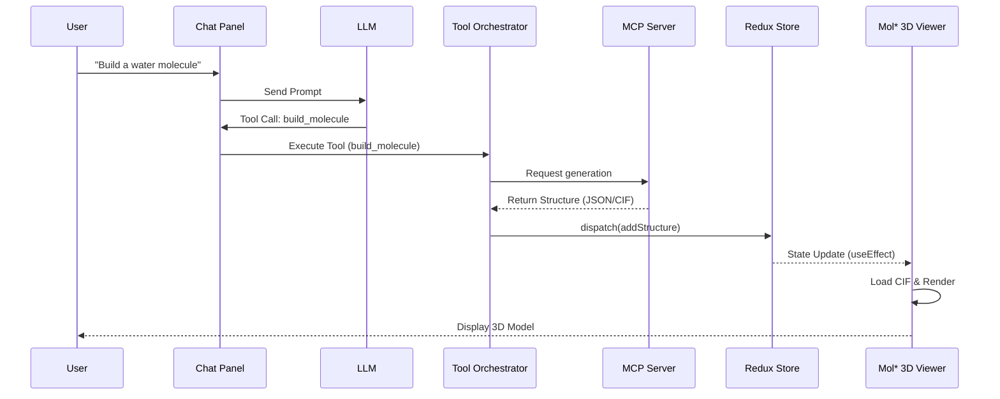
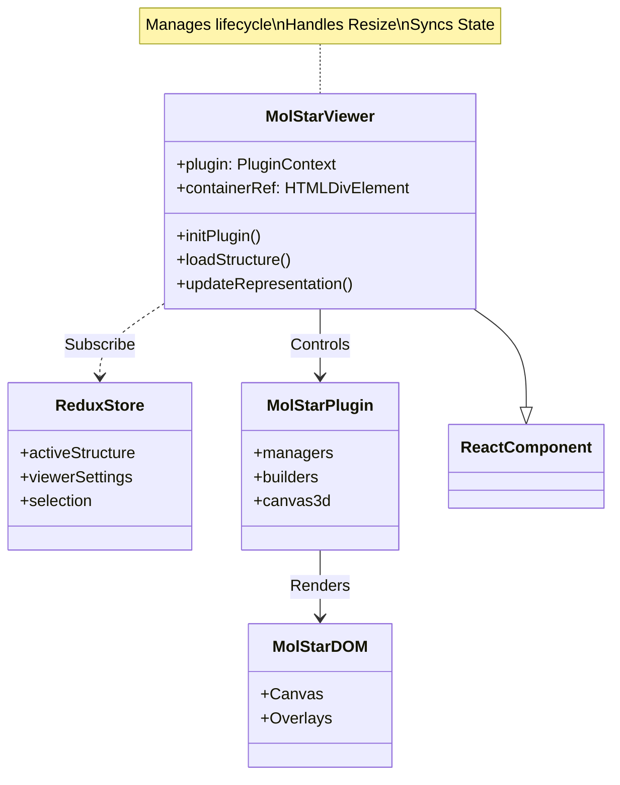

# Crystal GUI Web - Visual Documentation

## 1. System Architecture

```mermaid
graph TD
    subgraph Client [Browser Client (React/Vite)]
        App[App.tsx]
        toolbar[Toolbar]
        chat[Chat Panel]
        viewer[3D Viewer (Mol*)]
        editor[2D Editor (Kekule)]
        
        App --> toolbar
        App --> chat
        App --> viewer
        App --> editor
        
        subgraph State [Redux Store]
            mcpSlice[MCP State]
            structureSlice[Structure State]
            chatSlice[Chat State]
        end
        
        chat --> chatSlice
        viewer --> structureSlice
        viewer --> mcpSlice
    end

    subgraph Bridges [Communication Layers]
        MCP[MCP Client (TS)]
        LLM[LLM Client (Ollama)]
        Bridge[Python Bridge Server]
    end

    subgraph Backend [Backend Services]
        Ollama[Ollama Service]
        MCPServer[Crystal MCP Server (Python)]
    end

    App --> MCP
    App --> LLM
    MCP <--> Bridge
    Bridge <--> MCPServer
    LLM <--> Ollama
```

## 2. Data Flow: Structure Generation



## 3. Mol* Viewer Architecture



## 4. File Dependencies

```mermaid
graph LR
    main[main.tsx] --> App[App.tsx]
    
    subgraph Components
        App --> Chat[ChatPanel/]
        App --> Viewers[Viewers/]
        App --> Toolbar[Toolbar/]
        App --> Status[StatusBar/]
        
        Viewers --> MolStar[MolStarViewer.tsx]
        Viewers --> Kekule[KekuleEditor.tsx]
    end
    
    subgraph Services
        App --> ServiceIndex[services/index.ts]
        ServiceIndex --> MCP[mcp.ts]
        ServiceIndex --> LLM[llm.ts]
        ServiceIndex --> Tool[tools.ts]
    end
    
    subgraph Store
        App --> StoreHook[store/hooks.ts]
        StoreHook --> Store[store/index.ts]
        Store --> Slices[slices/*.ts]
    end
```

## 5. Directory Structure Map

```mermaid
graph TD
    src[src/]
    
    src --> components[components/]
    components --> ChatPanel
    components --> Viewers
    components --> Toolbar
    components --> StatusBar
    
    src --> services[services/]
    services --> mcp[mcp.ts (Bridge)]
    services --> llm[llm.ts (Ollama)]
    
    src --> store[store/]
    store --> redux[Redux Config]
    
    src --> types[types/]
    types --> mcp_types[mcp.ts]
    types --> struct_types[structure.ts]
    
    src --> bridge[bridge/]
    bridge --> python[server.py]
```
