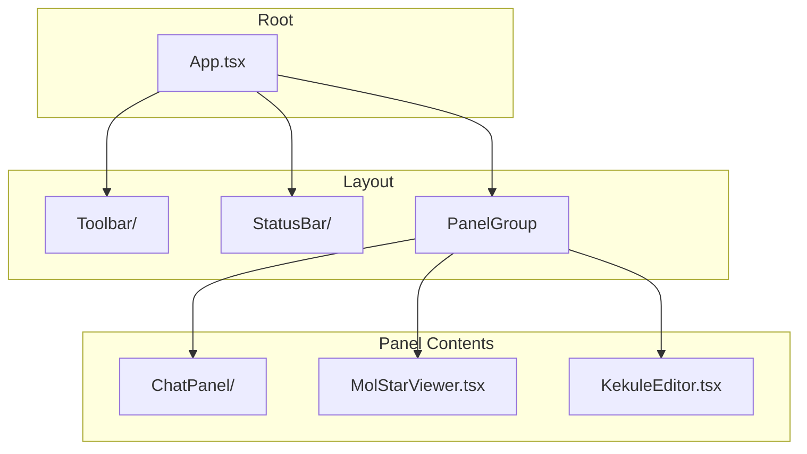
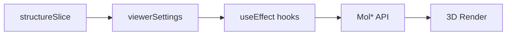
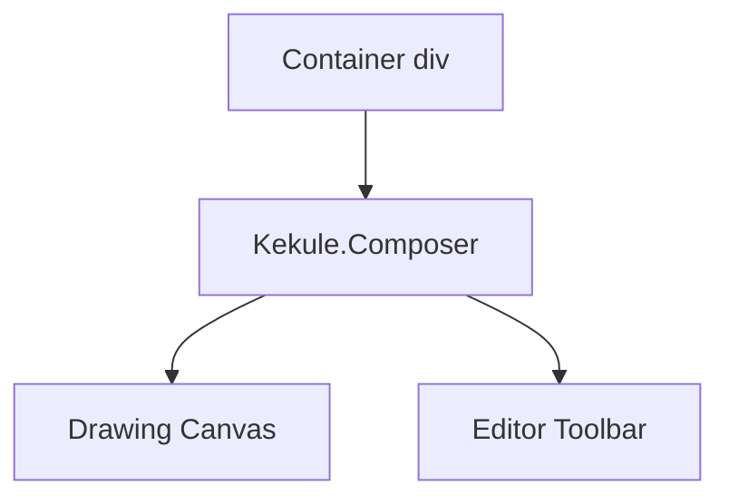
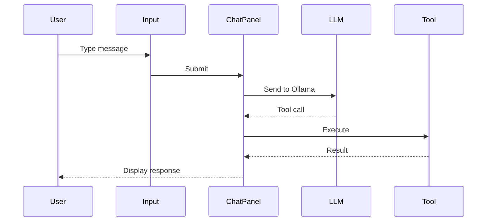

# Components Documentation

> Detailed documentation for UI components in `crystal-gui-web`.

---

## Component Map

---

## MolStarViewer

**File:** `components/Viewers/MolStarViewer.tsx`

### Purpose
Professional 3D molecular visualization using the Mol* library.

### Features

| Feature | Implementation |
|---------|---------------|
| Structure Loading | CIF format via `loadStructure()` |
| Representations | Ball-stick, spacefill, cartoon, etc. |
| Unit Cell | Toggle via `toggleUnitCell()` |
| Coloring | Element, chain, uniform schemes |
| Selection | Click-to-select atoms |
| Export | Screenshot as PNG |

### State Flow

### Key Functions

| Function | Purpose |
|----------|---------|
| `loadStructure(structure)` | Load and display CIF |
| `updateRepresentation(mode)` | Change visual style |
| `toggleUnitCell(show)` | Show/hide unit cell |
| `exportScreenshot()` | Save PNG image |

---

## KekuleEditor

**File:** `components/Viewers/KekuleEditor.tsx`

### Purpose
2D molecular structure editing using Kekule.js.

### Features

| Feature | Description |
|---------|-------------|
| Draw molecules | Interactive canvas |
| Push to 3D | Send to Mol* viewer |
| Clear | Reset canvas |
| Import/Export | MOL, SMILES formats |

### Architecture

---

## ChatPanel

**File:** `components/ChatPanel/ChatPanel.tsx`

### Purpose
LLM-powered chat interface with tool visualization.

### Features

| Feature | Description |
|---------|-------------|
| Messages | User and assistant display |
| Tool Calls | Visual feedback during execution |
| Streaming | Real-time response display |
| History | Scroll through conversation |

### Message Flow

---

## Toolbar

**File:** `components/Toolbar/Toolbar.tsx`

### Purpose
Top navigation bar with controls.

### Elements

| Element | Purpose |
|---------|---------|
| Logo | App branding |
| Model Selector | Choose Ollama model |
| Settings | Configuration options |

---

## StatusBar

**File:** `components/StatusBar/StatusBar.tsx`

### Purpose
Bottom status information.

### Displays

| Info | Description |
|------|-------------|
| Connection | MCP/Ollama status |
| Errors | Error messages |
| Activity | Current operations |
