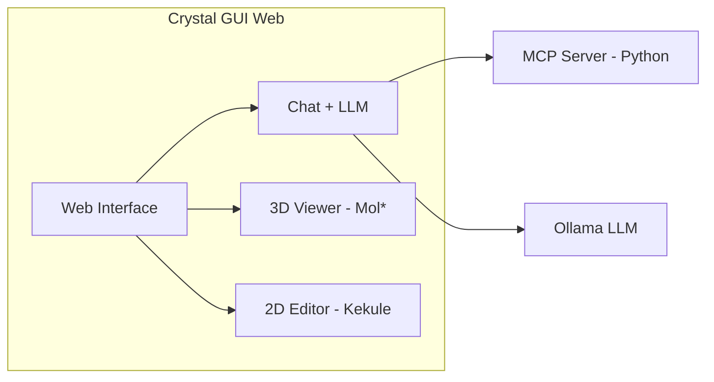
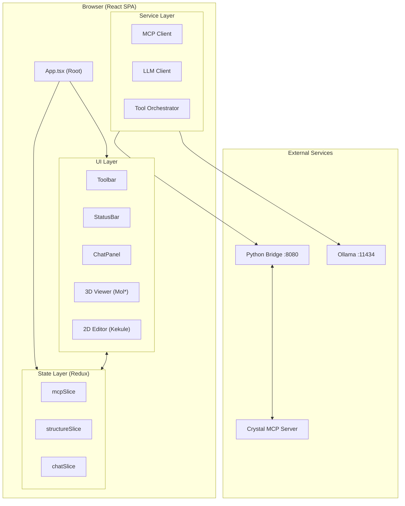
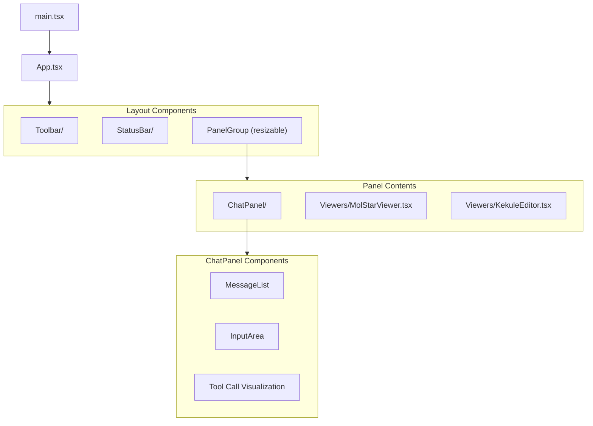
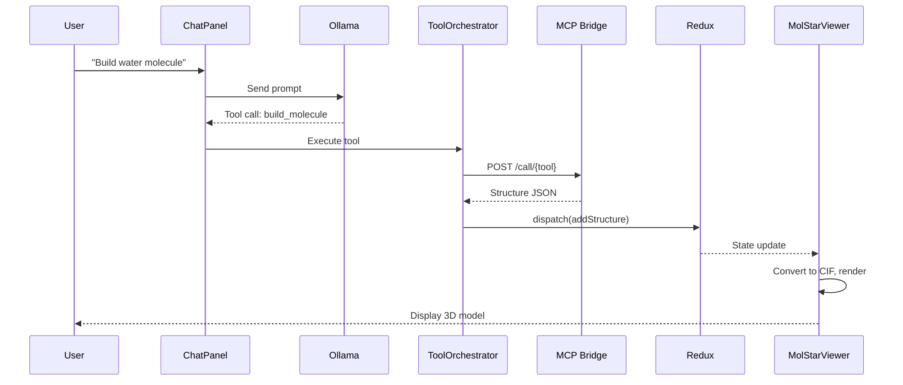
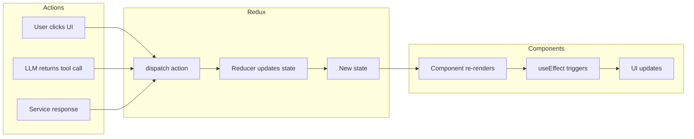
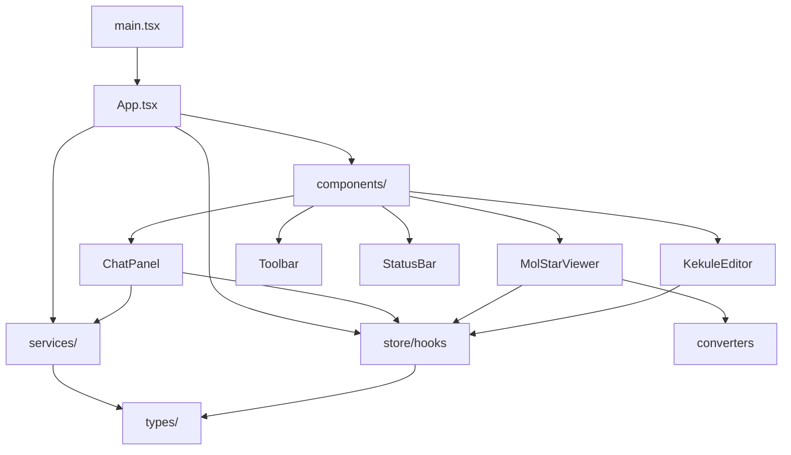
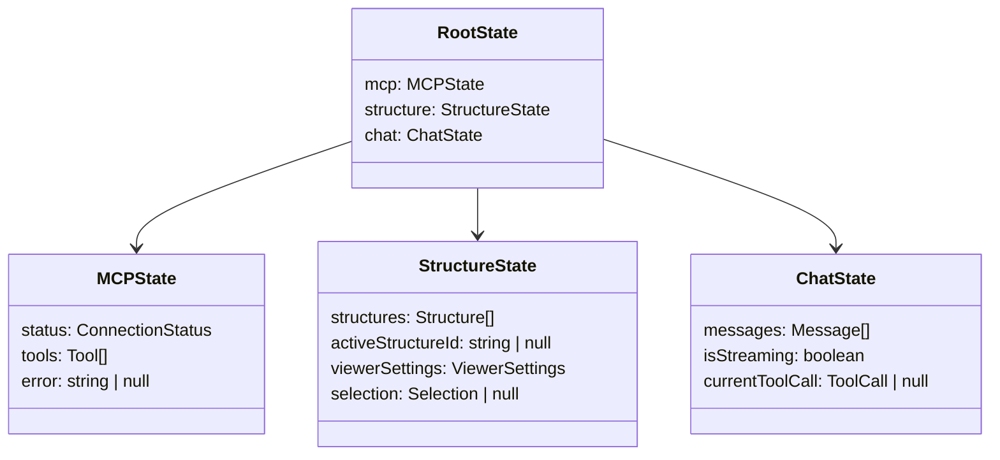
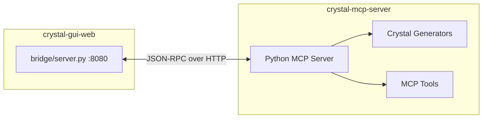
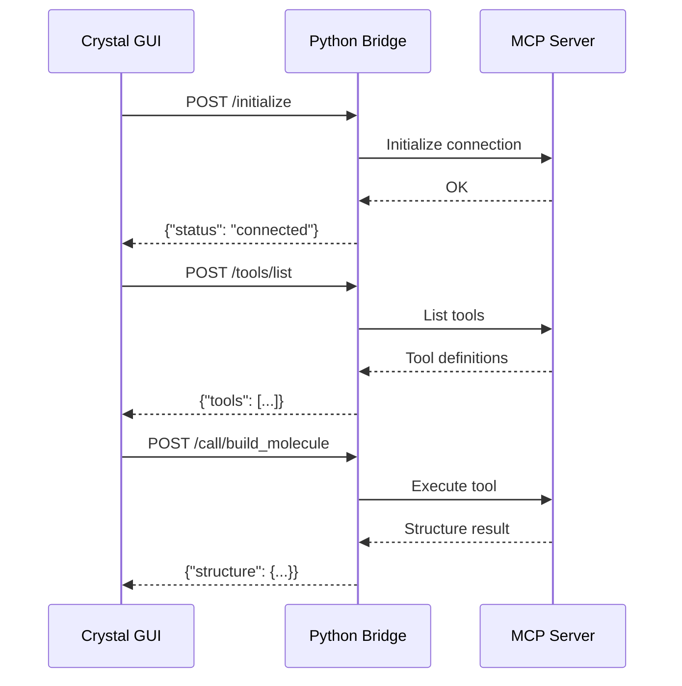
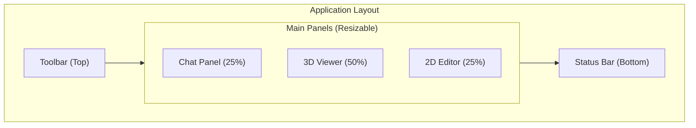

# Crystal GUI Web - Complete Module Documentation

> **Visual-First Documentation** for the `crystal-gui-web` module.  
> This document provides comprehensive coverage of architecture, data flow, file dependencies, usage, and integration with the broader `crystal-mcp-server` codebase.

---

## Table of Contents
1. [Module Overview](#module-overview)
2. [System Architecture](#system-architecture)
3. [Component Hierarchy](#component-hierarchy)
4. [Data Flow](#data-flow)
5. [File Dependencies](#file-dependencies)
6. [State Management (Redux)](#state-management-redux)
7. [External Connections](#external-connections)
8. [How to Use](#how-to-use)
9. [Development Guide](#development-guide)

---

## Module Overview

The **Crystal GUI Web** is a React-based web application that provides an interactive interface for:
- Generating molecular and crystal structures via natural language
- Visualizing structures in 3D using Mol*
- Editing molecules in 2D using Kekule.js
- Interacting with an LLM-powered assistant



---

## System Architecture

### High-Level Architecture



### Technology Stack

| Layer | Technology | Purpose |
|-------|------------|---------|
| UI Framework | React 18 + TypeScript | Component-based UI |
| State | Redux Toolkit | Global state management |
| 3D Viewer | Mol* | Molecular visualization |
| 2D Editor | Kekule.js | 2D structure editing |
| Styling | Tailwind CSS | Utility-first CSS |
| Build | Vite | Fast development builds |
| Communication | HTTP/JSON | Service integration |

---

## Component Hierarchy



### Component Responsibilities

| Component | File | Responsibility |
|-----------|------|----------------|
| **App** | `App.tsx` | Root layout, panel management, service initialization |
| **Toolbar** | `Toolbar/` | Top navigation, model selection |
| **StatusBar** | `StatusBar/` | Connection status, errors |
| **ChatPanel** | `ChatPanel/` | LLM interaction, message display |
| **MolStarViewer** | `Viewers/MolStarViewer.tsx` | 3D structure visualization |
| **KekuleEditor** | `Viewers/KekuleEditor.tsx` | 2D structure editing |

---

## Data Flow

### Structure Generation Flow



### State Update Flow



---

## File Dependencies

### Directory Structure

```
crystal-gui-web/
├── src/
│   ├── main.tsx           # Entry point
│   ├── App.tsx            # Root component
│   ├── index.css          # Global styles
│   │
│   ├── components/        # UI Components
│   │   ├── ChatPanel/     # Chat interface
│   │   ├── Viewers/       # 3D/2D viewers
│   │   ├── Toolbar/       # Top toolbar
│   │   └── StatusBar/     # Bottom status
│   │
│   ├── services/          # External communication
│   │   ├── mcp.ts         # MCP Bridge client
│   │   ├── llm.ts         # Ollama client
│   │   ├── tools.ts       # Tool orchestrator
│   │   └── index.ts       # Service exports
│   │
│   ├── store/             # Redux state
│   │   ├── index.ts       # Store configuration
│   │   ├── hooks.ts       # Typed hooks
│   │   ├── mcpSlice.ts    # MCP state
│   │   ├── structureSlice.ts # Structure state
│   │   └── chatSlice.ts   # Chat state
│   │
│   ├── types/             # TypeScript types
│   │   ├── mcp.ts         # MCP types
│   │   └── structure.ts   # Structure types
│   │
│   └── converters/        # Data conversion
│       └── index.ts       # Structure to CIF
│
├── bridge/                # Python HTTP bridge
│   └── server.py          # Flask server
│
└── docs/                  # Documentation
    └── web-gui/           # This documentation
```

### Import Dependency Graph



---

## State Management (Redux)

### Store Structure



### Key Redux Actions

| Slice | Action | Purpose |
|-------|--------|---------|
| `mcp` | `setConnectionStatus` | Update connection state |
| `mcp` | `setTools` | Store available tools |
| `structure` | `addStructure` | Add generated structure |
| `structure` | `setActiveStructure` | Select structure for viewing |
| `structure` | `updateViewerSettings` | Change representation, coloring |
| `chat` | `addMessage` | Add chat message |
| `chat` | `setCurrentToolCall` | Track tool execution |

---

## External Connections

### Connection to Crystal MCP Server



### Service Endpoints

| Service | Endpoint | Purpose |
|---------|----------|---------|
| MCP Bridge | `http://localhost:8080` | Crystal structure tools |
| Ollama | `http://localhost:11434` | LLM inference |

### Bridge Protocol



---

## How to Use

### Starting the Application

```bash
# Terminal 1: Start MCP Bridge
cd crystal-gui-web/bridge
python server.py

# Terminal 2: Start Ollama (if not running)
ollama serve

# Terminal 3: Start Web GUI
cd crystal-gui-web
npm run dev
```

### User Interface Guide



### Common Workflows

| Task | Steps |
|------|-------|
| **Generate Structure** | Type in chat -> LLM calls tool -> Structure appears in 3D |
| **Change Representation** | Use dropdown in 3D viewer toolbar |
| **Toggle Unit Cell** | Click "Cell" button in viewer |
| **Export Screenshot** | Click "IMG" button in viewer |
| **Resize Panels** | Drag the separator bars between panels |

---

## Development Guide

### Adding a New Component

1. Create file in `src/components/`
2. Import and use Redux hooks if needed
3. Add to appropriate panel in `App.tsx`

### Adding a New Service

1. Create file in `src/services/`
2. Export from `src/services/index.ts`
3. Initialize in `App.tsx` useEffect

### Adding State

1. Create slice in `src/store/`
2. Add to store configuration
3. Use with `useAppSelector` / `useAppDispatch`

### Testing

```bash
npm run dev      # Development server
npm run build    # Production build
npm run lint     # Type checking
```

---

## Summary

The **Crystal GUI Web** module is a complete React application that:
- Provides a resizable 3-panel layout for Chat, 3D Viewer, and 2D Editor
- Connects to external services (MCP Bridge, Ollama) for structure generation
- Uses Redux for centralized state management
- Integrates Mol* for professional molecular visualization
- Supports keyboard shortcuts, export, and interactive selection

For issues or contributions, see the main repository documentation.
