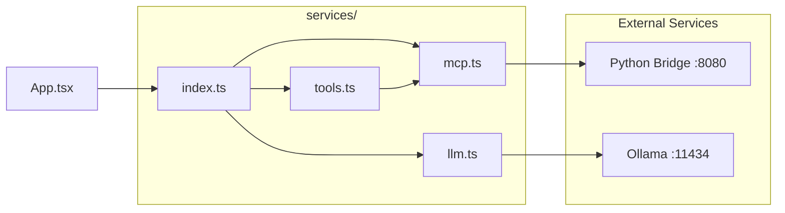
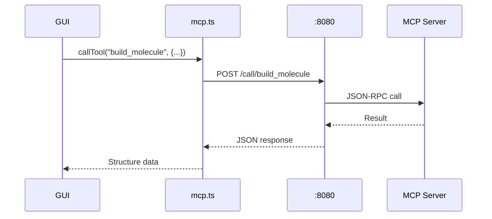
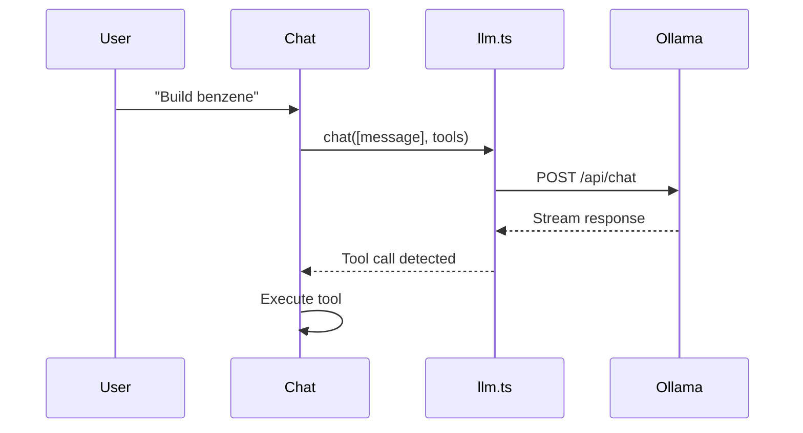
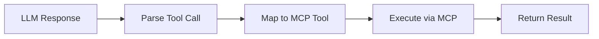

# Services Documentation

> Detailed documentation for the service layer in `crystal-gui-web`.

---

## Overview



---

## MCP Client (`mcp.ts`)

Handles communication with the Crystal MCP Server via the Python bridge.

### API

| Method | Purpose |
|--------|---------|
| `initialize()` | Establish connection to MCP |
| `listTools()` | Fetch available tools |
| `callTool(name, params)` | Execute a tool |
| `checkConnection()` | Verify bridge is accessible |

### Communication Flow



---

## LLM Client (`llm.ts`)

Handles communication with Ollama for natural language processing.

### API

| Method | Purpose |
|--------|---------|
| `checkConnection()` | Verify Ollama is running |
| `chat(messages, tools)` | Send chat with tool definitions |
| `streamChat(messages, callback)` | Streaming responses |

### Message Flow



---

## Tool Orchestrator (`tools.ts`)

Bridges LLM tool calls with MCP execution.

### API

| Method | Purpose |
|--------|---------|
| `setTools(tools)` | Register available tools |
| `executeTool(name, params)` | Execute via MCP |
| `formatToolsForLLM()` | Format for Ollama |

### Orchestration Flow



---

## Usage Example

```typescript
import { mcpClient, llmClient, toolOrchestrator } from './services';

// Initialize
await mcpClient.initialize();
const tools = await mcpClient.listTools();
toolOrchestrator.setTools(tools);

// Execute tool from LLM response
const result = await toolOrchestrator.executeTool('build_molecule', { 
  formula: 'H2O' 
});
```
