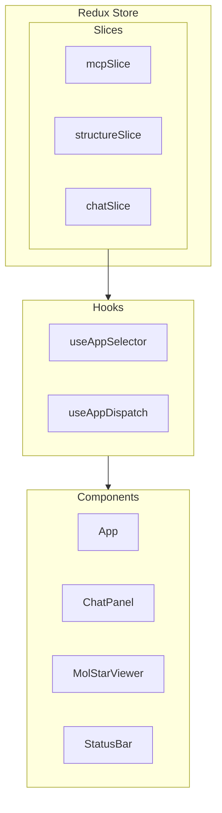
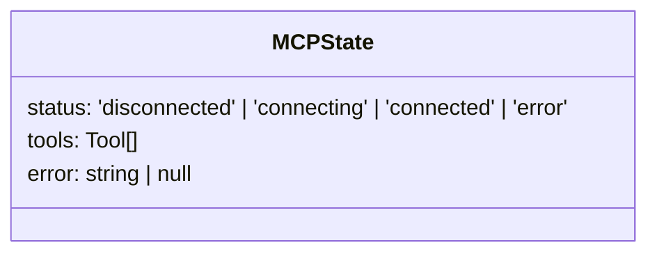
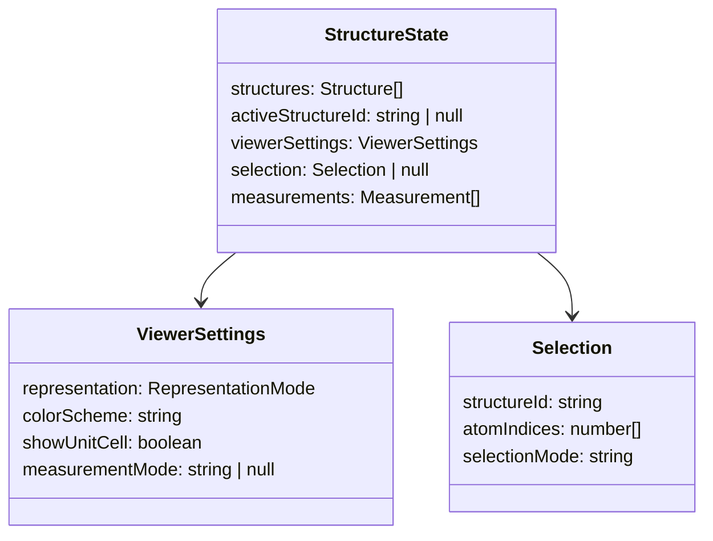
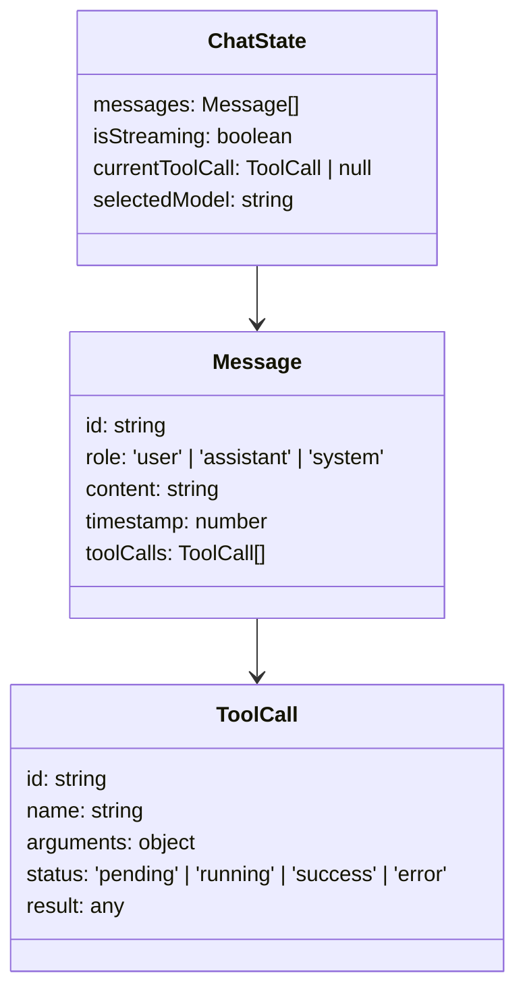
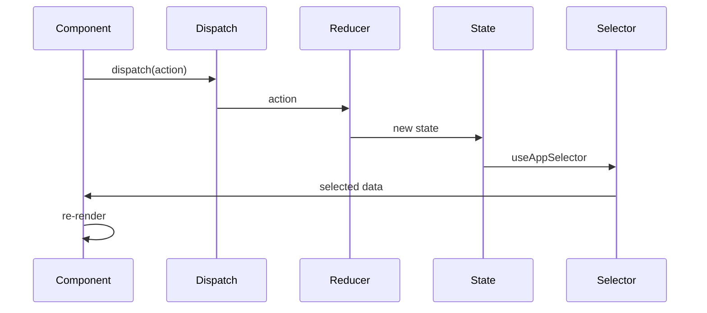

# State Management Documentation

> Redux state architecture for `crystal-gui-web`.

---

## Store Architecture



---

## Slice Details

### mcpSlice

**File:** `store/mcpSlice.ts`



| Action | Payload | Effect |
|--------|---------|--------|
| `setConnectionStatus` | status string | Update connection state |
| `setTools` | Tool[] | Store available tools |
| `setError` | string | Set error message |

---

### structureSlice

**File:** `store/structureSlice.ts`



| Action | Purpose |
|--------|---------|
| `addStructure` | Add new structure |
| `setActiveStructure` | Select for viewing |
| `updateViewerSettings` | Change representation/coloring |
| `setSelection` | Update selected atoms |
| `deleteAtoms` | Remove atoms from structure |
| `addMeasurement` | Add distance/angle measurement |

---

### chatSlice

**File:** `store/chatSlice.ts`



---

## Data Flow



---

## Usage Examples

### Reading State

```typescript
import { useAppSelector } from '../store/hooks';

function MyComponent() {
  const { structures, activeStructureId } = useAppSelector(
    state => state.structure
  );
  const activeStructure = structures.find(s => s.id === activeStructureId);
  // ...
}
```

### Dispatching Actions

```typescript
import { useAppDispatch } from '../store/hooks';
import { addStructure, setActiveStructure } from '../store/structureSlice';

function MyComponent() {
  const dispatch = useAppDispatch();
  
  const handleNewStructure = (structure: Structure) => {
    dispatch(addStructure(structure));
    dispatch(setActiveStructure(structure.id));
  };
}
```
