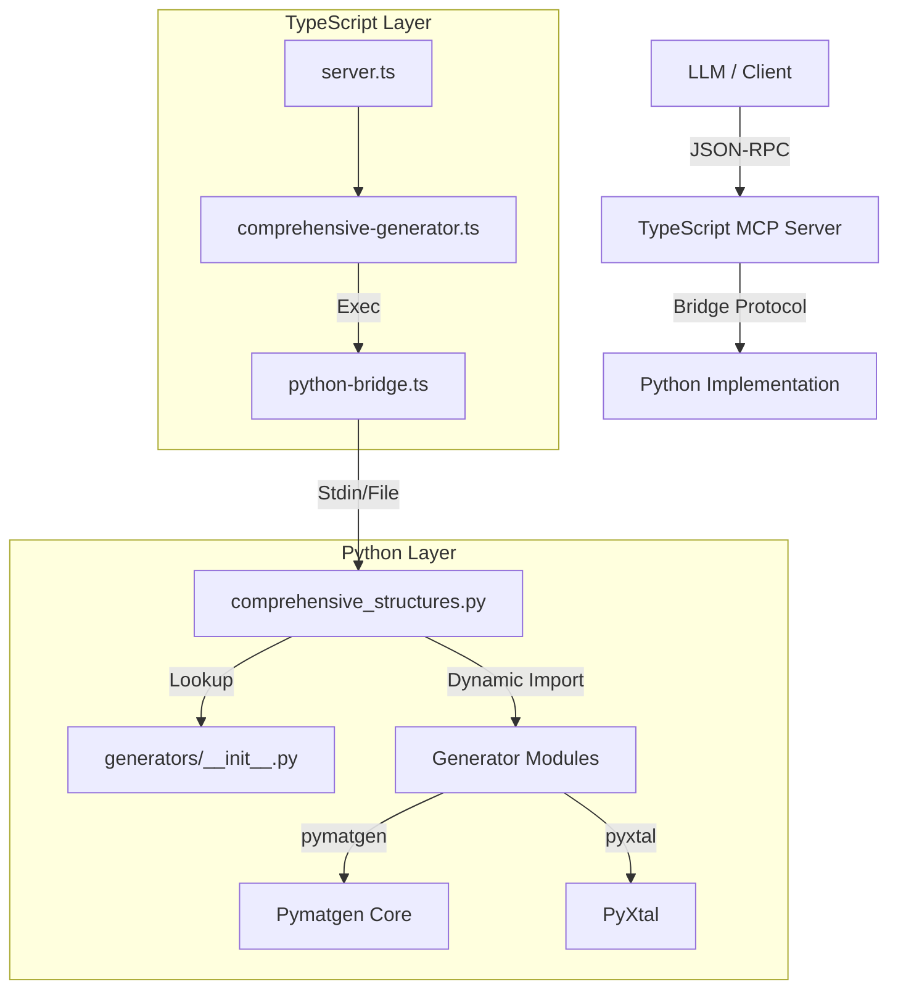
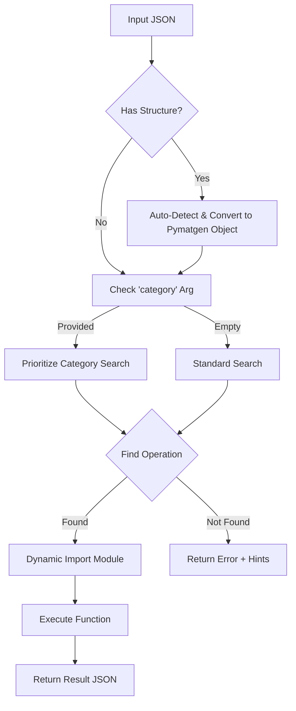
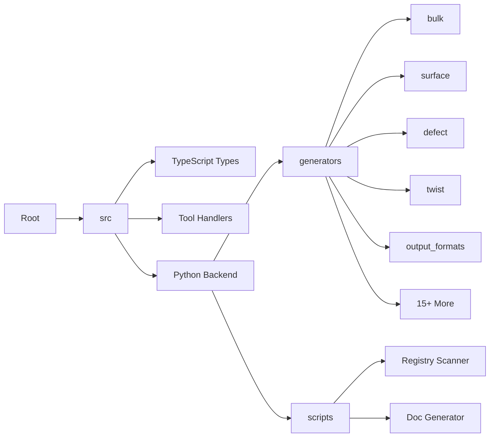

# System Architecture

## Overview
The Crystal MCP Server is a hybrid TypeScript/Python system designed to provide comprehensive crystal structure generation capabilities to LLMs via the Model Context Protocol (MCP).

## Unified Router Logic
The heart of the system is the **Unified Router** (`comprehensive_structures.py`), which enables a single MCP tool to access 228+ operations.

## Directory Structure
The codebase is organized to separate concerns while maintaining a flat, discoverable registry for generators.

