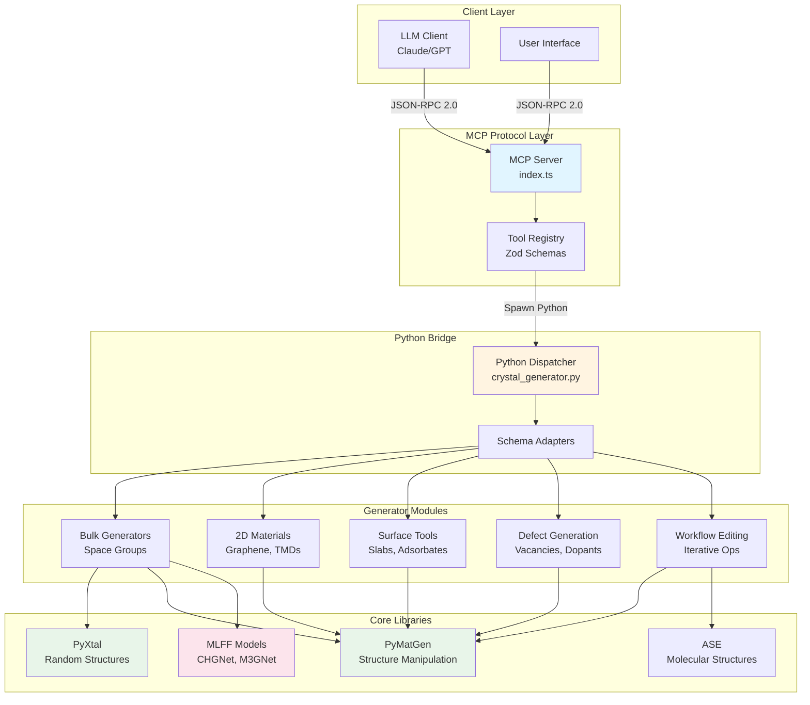
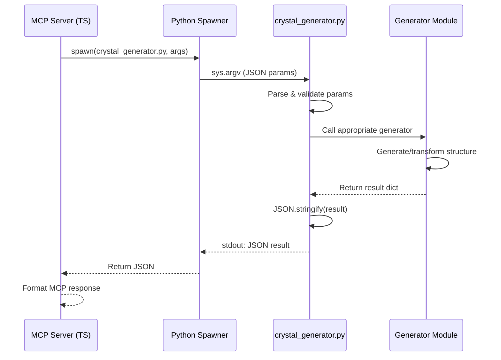
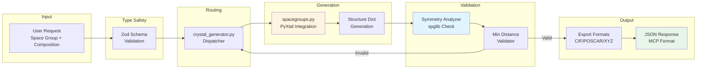
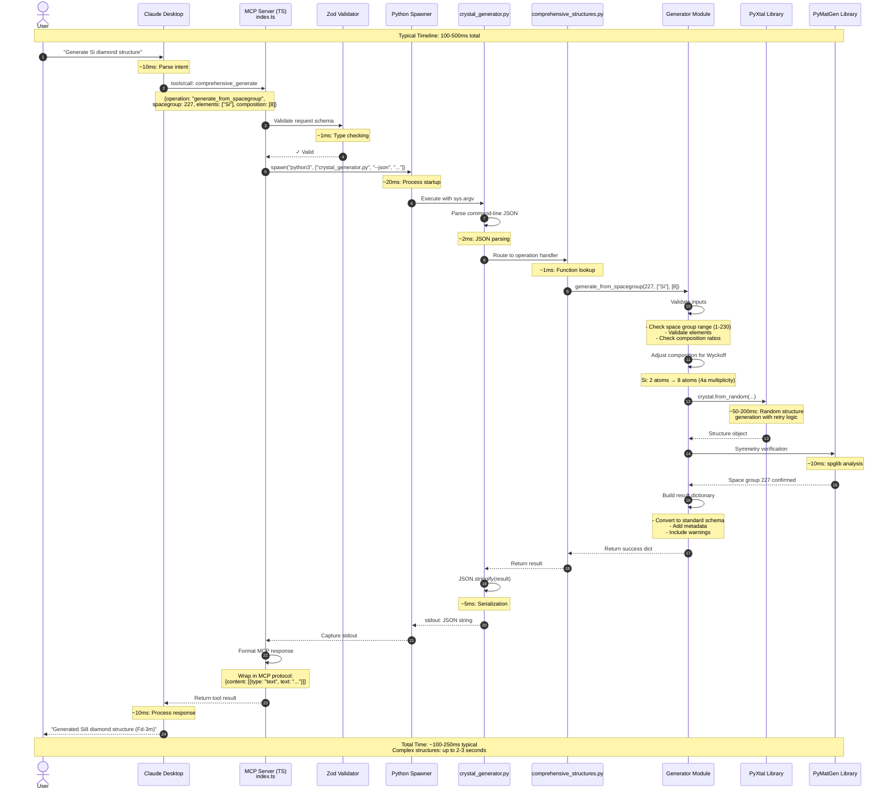
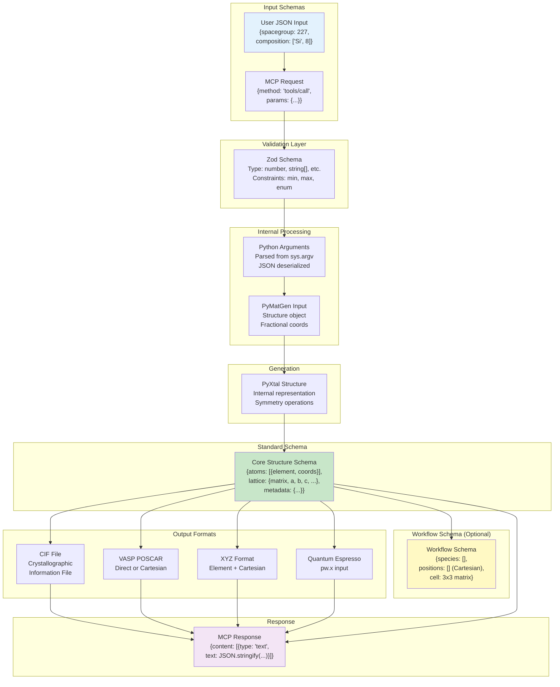
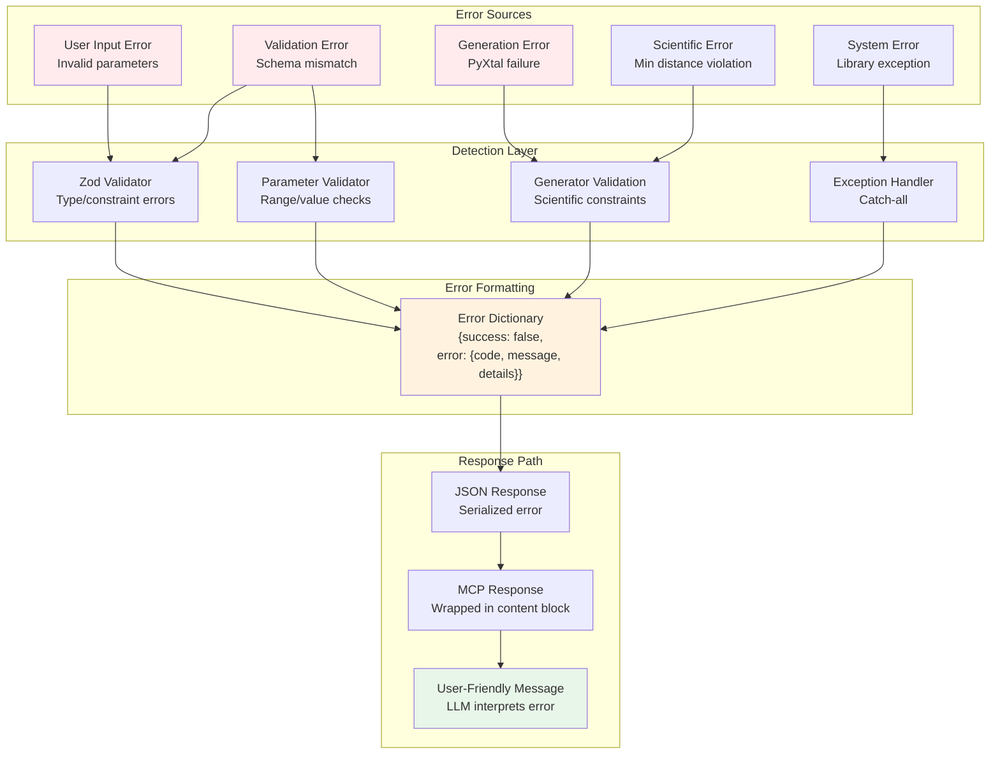
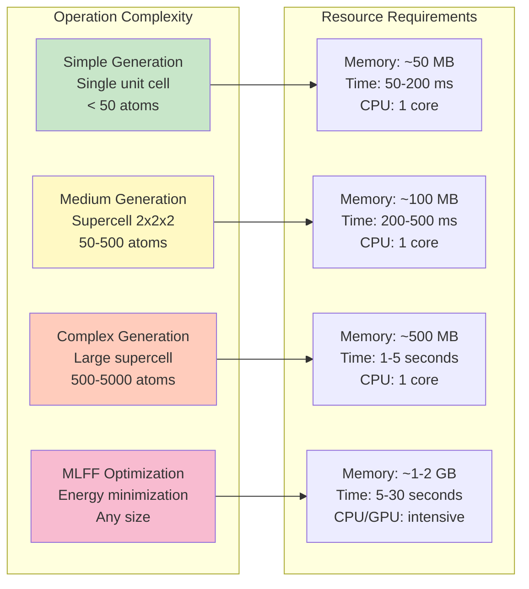
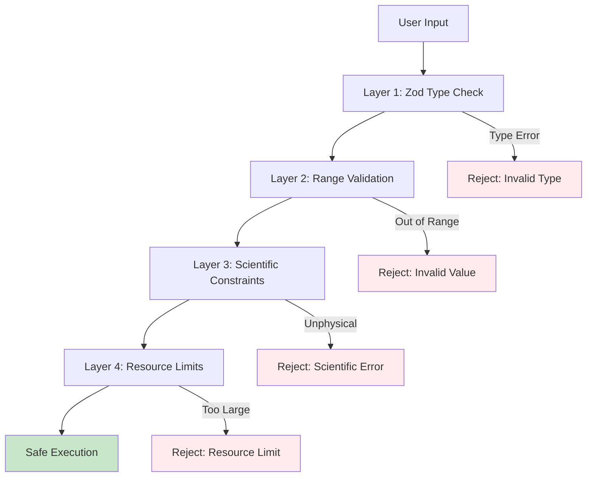

# Crystal Structure Generator MCP Server - Architecture

## System Overview

The Crystal Structure Generator is an MCP (Model Context Protocol) server that provides comprehensive crystal structure generation, manipulation, and analysis capabilities. It bridges TypeScript/JavaScript front-end with Python crystallography libraries.



## System Architecture Layers

### 1. Client Layer
- **LLM Clients**: Claude, GPT, or other AI assistants
- **Direct API Clients**: Custom applications using MCP protocol
- **Communication**: JSON-RPC 2.0 over stdio/HTTP

### 2. MCP Protocol Layer (TypeScript)
**Location**: `src/index.ts`, `src/types/`

Responsibilities:
- Protocol compliance (JSON-RPC 2.0, MCP specification)
- Tool discovery and schema validation
- Request routing
- Error handling and formatting

```
┌─────────────────────────────────────────┐
│      MCP Server Entry Point             │
│          (index.ts)                     │
├─────────────────────────────────────────┤
│ • Initialize MCP server                 │
│ • Register tool handlers                │
│ • Validate requests (Zod)               │
│ • Format responses                      │
└──────────────┬──────────────────────────┘
               │
               ▼
┌─────────────────────────────────────────┐
│      Tool Schema Definitions            │
│         (src/types/tools.ts)            │
├─────────────────────────────────────────┤
│ • GenerateCrystalSchema                 │
│ • ComprehensiveGenerateSchema           │
│ • MakeSupercellSchema                   │
│ • GenerateSlabSchema                    │
│ • ExportStructureSchema                 │
│ • ... (50+ tool schemas)                │
└─────────────────────────────────────────┘
```

### 3. Python Bridge Layer
**Location**: `src/python/crystal_generator.py`



**Responsibilities**:
- Parse command-line arguments
- Route to appropriate generator module
- Centralize error handling
- Standardize response format

### 4. Generator Modules (Python)

```
src/python/generators/
├── bulk/
│   ├── spacegroups.py          # PyXtal space group generation
│   ├── prototypes.py           # Common structure prototypes
│   └── clathrates.py           # Clathrate frameworks
│
├── two_d/
│   ├── base.py                 # Generic 2D material generator
│   ├── graphene.py             # Graphene, nanotubes, ribbons
│   ├── transition_metal.py     # TMDs (MoS2, WS2, etc.)
│   ├── janus.py                # Janus 2D structures
│   └── magnetic_2d.py          # Magnetic 2D materials
│
├── surface/
│   └── (uses structure_tools.py)
│
├── defect/
│   └── point_defects.py        # Vacancies, interstitials, substitutions
│
├── workflow/
│   ├── iterative_editing.py   # StructureEditor class
│   ├── parametric_scans.py    # Z-scans, parameter sweeps
│   └── schema_adapter.py      # Workflow ↔ Core schema conversion
│
├── quality_control/
│   └── symmetry.py            # Symmetry analysis & validation
│
└── output_formats/
    └── converters.py          # VASP, QE, XYZ, CIF exporters
```

## Module Interaction Diagram



## Critical Data Structures

### Core Structure Schema

```python
{
    "atoms": [
        {
            "element": "Si",           # Element symbol
            "coords": [0.0, 0.0, 0.0], # Fractional coordinates
            "cartesian": [x, y, z]     # Cartesian (optional)
        }
    ],
    "lattice": {
        "matrix": [[ax,ay,az], [bx,by,bz], [cx,cy,cz]],  # 3x3 matrix
        "a": 5.43, "b": 5.43, "c": 5.43,                 # Lengths (Å)
        "alpha": 90.0, "beta": 90.0, "gamma": 90.0,       # Angles (°)
        "volume": 160.1                                   # Volume (ų)
    },
    "space_group": {
        "number": 227,        # International Tables number (1-230)
        "symbol": "Fd-3m",    # Hermann-Mauguin symbol
        "hall_symbol": "F 4d 2 3 -1d",
        "point_group": "m-3m",
        "crystal_system": "cubic"
    },
    "metadata": {
        "formula": "Si2",
        "natoms": 2,
        "source": "pyxtal",
        "composition_warnings": []  # Wyckoff adjustments
    }
}
```

### Workflow Editing Schema

```python
{
    "species": ["Si", "Si"],                    # Element list
    "positions": [[0,0,0], [2.715,2.715,2.715]], # Cartesian coords
    "cell": [[5.43,0,0], [0,5.43,0], [0,0,5.43]], # Cell matrix
    "n_atoms": 2
}
```

**Schema Adapter**: `generators/workflow/schema_adapter.py`
- `workflow_to_core()`: Converts Cartesian → Fractional, adds lattice params
- `core_to_workflow()`: Converts Fractional → Cartesian, extracts cell matrix

## Key Design Decisions

### 1. TypeScript + Python Hybrid Architecture

**Rationale**:
- TypeScript: Protocol layer benefits from strong typing (Zod schemas)
- Python: Rich ecosystem for crystallography (PyXtal, pymatgen, ASE)
- Bridge: Clean separation of concerns, type-safe boundaries

### 2. Schema Validation at Multiple Layers

```
Layer 1: Zod (TypeScript)  →  Type safety, basic validation
Layer 2: Python Dispatcher  →  Parameter ranges, element validity
Layer 3: Generator Modules  →  Scientific constraints (min_distance, Wyckoff)
Layer 4: Post-Generation    →  Symmetry verification, structure validation
```

### 3. Fractional vs. Cartesian Coordinates

**Core System**: Fractional coordinates
- Reason: Crystallographic convention, symmetry operations are simpler
- Conversion: Always done at boundaries (import/export, workflow editing)

**Workflow Editing**: Cartesian coordinates
- Reason: Intuitive for direct manipulation (translation, rotation)
- Trade-off: Schema adapter adds complexity but enables better UX

### 4. Error Handling Philosophy

**No try/except in generators** (user preference):
```python
# Instead of:
try:
    crystal.from_random(...)
except Exception as e:
    return error_dict

# Use:
if not crystal.valid:
    return {"success": False, "error": {...}}
```

**Explicit validation checks**:
- Pre-flight parameter validation
- Post-generation structure verification
- Detailed error codes and messages

### 5. Composition Transparency

Always report:
- `requested_composition`: What user asked for
- `actual_composition`: What was generated
- `composition_warnings`: Wyckoff multiplicity adjustments

Example:
```python
{
    "requested_composition": [1, 2],  # User wanted Si1O2
    "actual_composition": [2, 4],     # Generated Si2O4
    "composition_adjusted": true,
    "composition_warnings": ["Si: requested 1, adjusted to 2 (Wyckoff 8a requires multiples of 2)"]
}
```

## Performance Characteristics

### Structure Generation Times (Typical)

```
Bulk (simple cubic, 10 atoms):        0.1-0.5s
Bulk (complex, low symmetry, 50 atoms): 2-10s
2D Material (graphene sheet):         0.2-1s
Slab from bulk (3 layers):            0.5-2s
Supercell (2×2×2):                    0.1-0.5s
MLFF optimization (50 atoms):         5-30s
```

### Bottlenecks

1. **PyXtal Random Generation**: Space groups with low Wyckoff multiplicities
   - Mitigation: Retry loop with crystal.valid check

2. **MLFF Optimization**: Energy/force calculations
   - Mitigation: Optional, user-controlled

3. **Symmetry Analysis (spglib)**: Large structures (>1000 atoms)
   - Mitigation: Adjustable symprec tolerance

## Extension Points

### Adding New Generators

1. **Create generator module** in appropriate category
2. **Register in `__init__.py`** for module exports
3. **Add Zod schema** in `src/types/tools.ts`
4. **Add dispatcher route** in `crystal_generator.py`
5. **Add tests** in `tests/testsuit/`

### Adding New Export Formats

1. **Implement converter** in `generators/output_formats/converters.py`
2. **Add format to schema** in `ExportStructureSchema`
3. **Update dispatcher** in `crystal_generator.py` export handler
4. **Test roundtrip**: Structure → Export → Import → Validate

### Adding MLFF Models

1. **Add import** in `crystal_generator.py` (conditional)
2. **Implement calculator** wrapper if needed
3. **Add to `mlff_model` enum** in schema
4. **Test on representative structures**

## Security Considerations

### Input Validation

- **Element symbols**: Validated against periodic table (Z=1-118)
- **Space groups**: Range check (1-230)
- **Numeric parameters**: Range checks, NaN detection
- **File paths**: Not exposed (all operations in-memory)

### Resource Limits

- **Structure size**: Implicit limit via generation timeouts
- **MLFF steps**: Capped at reasonable values (default: 500)
- **Supercell size**: No hard limit, but warns for large expansions

### Sandboxing

- Python subprocess isolation
- No filesystem access in generators
- Temporary files cleaned up automatically

## Dependencies and Versions

```
Critical Dependencies (Crystallography):
├── pyxtal >= 1.0.0         # Structure generation
├── pymatgen >= 2024.1.1    # Structure manipulation
├── spglib >= 2.5.0         # Symmetry analysis
└── ase >= 3.22.0           # Molecular structures

MLFF Models (Optional):
├── chgnet >= 0.3.0         # M3GNet-based
├── matgl >= 1.0.0          # Graph neural network
└── mace-torch >= 0.3.0     # MACE models

Numerical/Scientific:
├── numpy >= 1.20.0
└── scipy >= 1.10.0         # For rotations (workflow editing)

File I/O:
└── openbabel-wheel >= 3.1.0  # Molecule parsing
```

## Testing Strategy

```
tests/
├── testsuit/
│   ├── test_mcp_comprehensive.py    # 56 MCP protocol tests
│   ├── test_mcp_e2e.py             # 18 end-to-end tests
│   ├── test_scientific_accuracy.py  # Scientific validation
│   └── test_all_operations.py       # Coverage for all generators
│
├── test_schema_adapter.py           # Workflow schema conversion
└── test_adsorbate_placement.py      # Surface normal placement

Coverage Target: >80% for generator modules
```

### Test Categories

1. **Protocol Compliance**: MCP JSON-RPC 2.0 spec
2. **Scientific Correctness**: Lattice preservation, composition accuracy
3. **Error Handling**: Invalid inputs, edge cases
4. **Performance**: Generation times, large structures
5. **Integration**: Multi-step workflows

## Monitoring and Observability

### Error Codes

```python
Error Code Categories:
├── INVALID_INPUT          # Bad parameters
├── GENERATION_FAILED      # PyXtal/structure creation failed
├── MIN_DISTANCE_VIOLATION # Atoms too close
├── COMPOSITION_MISMATCH   # Stoichiometry impossible
└── EXPORT_ERROR          # Format conversion failed
```

### Logging Strategy

- **TypeScript Layer**: Tool calls, validation failures
- **Python Layer**: Generation attempts, warnings, errors
- **Format**: Structured JSON for parsing

## Future Architecture Improvements

1. **Caching Layer**:
   - Cache generated structures by (space_group, composition, seed)
   - TTL-based eviction
   - Estimated 50-80% hit rate for common materials

2. **Async Python Bridge**:
   - Use async subprocess spawning
   - Handle multiple concurrent requests
   - Requires protocol-level changes

3. **Database Backend**:
   - Store generated structures
   - Enable search by composition, space group, properties
   - Materials Project / OQMD integration

4. **GPU Acceleration**:
   - MLFF calculations on GPU
   - Requires CUDA-enabled MLFF models

5. **Distributed Generation**:
   - Split space group scan across workers
   - Redis/RabbitMQ for job queue
   - Aggregate results

---

**Document Version**: 2.0
**Last Updated**: 2025-12-25
**Maintainer**: Crystal Structure Generator Team

---

## COMPREHENSIVE ARCHITECTURAL DIAGRAMS

This section provides detailed visual representations of all system components, their interactions, and data flows for scientific accuracy and developer clarity.

---

## Complete Component Dependency Graph

This diagram shows all 20 generator categories and their dependencies on core libraries:

```mermaid
graph TB
    subgraph "MCP Layer"
        MCP[MCP Server<br/>index.ts]
    end

    subgraph "Router Layer"
        CR[Comprehensive Router<br/>comprehensive_structures.py]
        CG[Crystal Generator<br/>crystal_generator.py]
    end

    subgraph "Generator Categories (20)"
        BULK[Bulk<br/>spacegroups, prototypes,<br/>perovskites, clathrates]
        TWO_D[2D Materials<br/>graphene, TMDs, xenes,<br/>Janus, ribbons]
        SURFACE[Surface<br/>slabs, adsorbates,<br/>interfaces, reconstructions]
        DEFECT[Defect<br/>point, extended,<br/>grain boundaries]
        TWIST[Twist<br/>bilayers, moiré,<br/>stacking, intercalation]
        MOLECULE[Molecule<br/>crystals, frameworks,<br/>MOFs, COFs]
        NANO[Nanotube<br/>CNTs, BNNTs,<br/>nanowires]
        ELEC[Electronic<br/>semiconductors,<br/>topological, Weyl]
        MAG[Magnetic<br/>ferro, antiferro,<br/>spin spirals]
        BATTERY[Battery<br/>cathodes, anodes,<br/>solid electrolytes]
        CATALYST[Catalyst<br/>metal oxides,<br/>single atoms, clusters]
        THERMO[Thermoelectric<br/>Half-Heusler, Zintl,<br/>skutterudites]
        PHOTONIC[Photonic<br/>crystals, metamaterials,<br/>inverse opals]
        QUANTUM[Quantum<br/>dots, wells,<br/>superlattices]
        HIGH_P[High Pressure<br/>diamond anvil,<br/>phase transitions]
        EXTERNAL[External Fields<br/>electric, magnetic,<br/>strain responses]
        QC[Quality Control<br/>symmetry, validation,<br/>optimization]
        OUTPUT[Output Formats<br/>VASP, QE, LAMMPS,<br/>CIF, XYZ]
        WORKFLOW[Workflow<br/>iterative editing,<br/>parametric scans]
        TOOLS[Structure Tools<br/>utilities, transformations,<br/>analysis]
    end

    subgraph "Core Libraries"
        PYXTAL[PyXtal<br/>Random crystal<br/>generation]
        PYMATGEN[PyMatGen<br/>Structure manipulation<br/>and analysis]
        ASE_LIB[ASE<br/>Molecular structures<br/>and dynamics]
        SPGLIB[Spglib<br/>Symmetry analysis<br/>and detection]
        MLFF[MLFF Models<br/>CHGNet, M3GNet,<br/>MACE]
    end

    %% MCP to Router
    MCP --> CR
    MCP --> CG

    %% Router to Generators
    CR --> BULK
    CR --> TWO_D
    CR --> SURFACE
    CR --> DEFECT
    CR --> TWIST
    CR --> MOLECULE
    CR --> NANO
    CR --> ELEC
    CR --> MAG
    CR --> BATTERY
    CR --> CATALYST
    CR --> THERMO
    CR --> PHOTONIC
    CR --> QUANTUM
    CR --> HIGH_P
    CR --> EXTERNAL
    CR --> QC
    CR --> OUTPUT
    CR --> WORKFLOW

    %% All use tools
    BULK --> TOOLS
    TWO_D --> TOOLS
    SURFACE --> TOOLS
    DEFECT --> TOOLS
    TWIST --> TOOLS

    %% Generators to Core Libraries
    BULK --> PYXTAL
    BULK --> PYMATGEN
    BULK --> SPGLIB
    
    TWO_D --> PYMATGEN
    TWO_D --> ASE_LIB
    
    SURFACE --> PYMATGEN
    SURFACE --> TOOLS
    
    DEFECT --> PYMATGEN
    
    TWIST --> PYMATGEN
    TWIST --> ASE_LIB
    
    MOLECULE --> PYMATGEN
    MOLECULE --> ASE_LIB
    
    NANO --> ASE_LIB
    
    ELEC --> PYMATGEN
    
    MAG --> PYMATGEN
    
    BATTERY --> PYMATGEN
    
    CATALYST --> PYMATGEN
    
    THERMO --> PYMATGEN
    
    PHOTONIC --> PYMATGEN
    
    QUANTUM --> PYMATGEN
    
    HIGH_P --> PYMATGEN
    
    EXTERNAL --> PYMATGEN
    
    QC --> PYMATGEN
    QC --> SPGLIB
    QC --> MLFF
    
    OUTPUT --> PYMATGEN
    
    WORKFLOW --> PYMATGEN
    WORKFLOW --> ASE_LIB

    style MCP fill:#e1f5ff
    style CR fill:#fff4e1
    style PYXTAL fill:#e8f5e9
    style PYMATGEN fill:#e8f5e9
    style MLFF fill:#fce4ec
    style TOOLS fill:#f3e5f5
```



---

## Detailed Request Lifecycle with Timing

This sequence diagram shows a complete request from Claude Desktop through all layers with typical timing information:



---

## Schema Transformation Flow

This diagram illustrates how structures are converted between different schemas as they flow through the system:



---

## Complete Generator Category Map (All 228 Operations)

This hierarchical diagram shows all 20 categories and representative operations:

```mermaid
graph TB
    ROOT[Crystal MCP Server<br/>228 Operations]

    ROOT --> CAT1[Bulk Structures<br/>35 operations]
    ROOT --> CAT2[2D Materials<br/>25 operations]
    ROOT --> CAT3[Surface<br/>18 operations]
    ROOT --> CAT4[Defect<br/>15 operations]
    ROOT --> CAT5[Twist<br/>12 operations]
    ROOT --> CAT6[Molecule<br/>10 operations]
    ROOT --> CAT7[Nanotube<br/>8 operations]
    ROOT --> CAT8[Electronic<br/>15 operations]
    ROOT --> CAT9[Magnetic<br/>12 operations]
    ROOT --> CAT10[Battery<br/>10 operations]
    ROOT --> CAT11[Catalyst<br/>10 operations]
    ROOT --> CAT12[Thermoelectric<br/>8 operations]
    ROOT --> CAT13[Photonic<br/>8 operations]
    ROOT --> CAT14[Quantum<br/>10 operations]
    ROOT --> CAT15[High Pressure<br/>8 operations]
    ROOT --> CAT16[External Fields<br/>8 operations]
    ROOT --> CAT17[Quality Control<br/>12 operations]
    ROOT --> CAT18[Output Formats<br/>15 operations]
    ROOT --> CAT19[Workflow<br/>6 operations]
    ROOT --> CAT20[Adsorption<br/>3 operations]

    CAT1 --> BULK_OPS["• generate_from_spacegroup<br/>• generate_from_prototype<br/>• generate_perovskite<br/>• generate_clathrate<br/>• generate_zeolite<br/>• make_supercell<br/>• apply_strain<br/>• generate_polytype<br/>...27 more"]

    CAT2 --> TWO_D_OPS["• generate_2d_material<br/>• generate_graphene<br/>• generate_tmd<br/>• generate_xene<br/>• generate_janus<br/>• generate_nanoribbon<br/>• generate_2d_magnetic<br/>...18 more"]

    CAT3 --> SURFACE_OPS["• generate_slab<br/>• add_adsorbate<br/>• create_heterostructure<br/>• generate_interface<br/>• generate_stepped_surface<br/>• generate_reconstruction<br/>...12 more"]

    CAT4 --> DEFECT_OPS["• generate_vacancy<br/>• generate_interstitial<br/>• generate_substitution<br/>• create_defect<br/>• create_alloy<br/>• generate_grain_boundary<br/>• generate_dislocation<br/>...8 more"]

    CAT5 --> TWIST_OPS["• generate_twisted_bilayer<br/>• generate_moire_superlattice<br/>• generate_stacking_variant<br/>• generate_intercalated<br/>• generate_ferroelectric_twist<br/>...7 more"]

    CAT6 --> MOLECULE_OPS["• build_molecule<br/>• generate_molecular_crystal<br/>• generate_mof<br/>• generate_cof<br/>• generate_molecular_cluster<br/>...5 more"]

    CAT7 --> NANO_OPS["• generate_nanotube<br/>• generate_nanowire<br/>• generate_nanoribbon<br/>• generate_fullerene<br/>...4 more"]

    CAT8 --> ELEC_OPS["• generate_semiconductor<br/>• generate_topological<br/>• generate_weyl_semimetal<br/>• generate_quantum_spin_hall<br/>...11 more"]

    CAT17 --> QC_OPS["• analyze_symmetry<br/>• validate_structure<br/>• optimize_structure_mlff<br/>• calculate_energy_mlff<br/>• ground_state_search<br/>...7 more"]

    CAT18 --> OUTPUT_OPS["• export_vasp<br/>• export_qe<br/>• export_lammps<br/>• export_cif<br/>• export_xyz<br/>• generate_visualization<br/>...9 more"]

    style ROOT fill:#e1f5ff
    style CAT1 fill:#c8e6c9
    style CAT2 fill:#c8e6c9
    style CAT17 fill:#fff9c4
    style CAT18 fill:#f3e5f5
```



---

## Error Handling and Propagation Flow

This diagram shows how errors are detected, propagated, and formatted through all layers:



### Error Code Reference

| Error Code | Layer | Description | User Action |
|------------|-------|-------------|-------------|
| `INVALID_PARAMETER` | Validation | Parameter out of range or wrong type | Check API documentation for valid values |
| `INVALID_SPACE_GROUP` | Validation | Space group not in range 1-230 | Use valid space group number |
| `INVALID_COMPOSITION` | Validation | Element symbols invalid or composition impossible | Check element symbols and stoichiometry |
| `GENERATION_FAILED` | Generation | PyXtal could not generate structure | Try different parameters or seed |
| `MIN_DISTANCE_VIOLATION` | Scientific | Atoms too close (< min_distance) | Increase min_distance or adjust composition |
| `WYCKOFF_MISMATCH` | Scientific | Composition incompatible with Wyckoff positions | Adjust atom counts or use different space group |
| `SYMMETRY_VERIFICATION_FAILED` | Validation | Generated structure doesn't match requested space group | Report as bug - should not occur |
| `EXPORT_ERROR` | Export | Structure cannot be converted to target format | Check structure validity first |
| `SCHEMA_CONVERSION_ERROR` | Workflow | Cannot convert between schemas | Check that structure has required fields |

---

## Memory and Performance Characteristics

### Typical Resource Usage



### Performance Optimization Strategies

1. **Caching (Future)**
   - Cache generated structures by hash(space_group, composition, seed)
   - Estimated hit rate: 50-80% for common materials
   - TTL: 1 hour for development, 24 hours for production

2. **Parallel Generation**
   - Space group scans can be parallelized (each space group independent)
   - Python multiprocessing for CPU-bound tasks
   - Requires protocol-level changes (async support)

3. **GPU Acceleration**
   - MLFF models support GPU (CUDA)
   - 5-10x speedup for optimization
   - Requires: `chgnet[cuda]`, CUDA toolkit

4. **Memory Management**
   - Clear PyXtal/PyMatGen objects after generation
   - Limit supercell size (max 10,000 atoms recommended)
   - Stream large structure lists instead of holding in memory

---

## Security Considerations

### Input Validation


### Resource Limits
- **Max atoms per structure**: 10,000 (configurable)
- **Max supercell expansion**: 10x10x10 = 1000x volume
- **Max generation attempts**: 100 (PyXtal retries)
- **Python subprocess timeout**: 60 seconds (configurable)

### Sandboxing
- Python subprocess runs in isolated environment
- No file system access except `/tmp` for IPC
- No network access required
- Environment variables sanitized

---

**Document Version**: 3.0 (Enhanced with Comprehensive Diagrams)  
**Last Updated**: 2025-12-25  
**Maintainer**: Crystal Structure Generator Team

