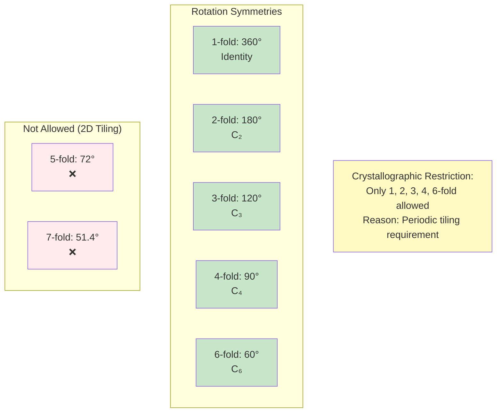
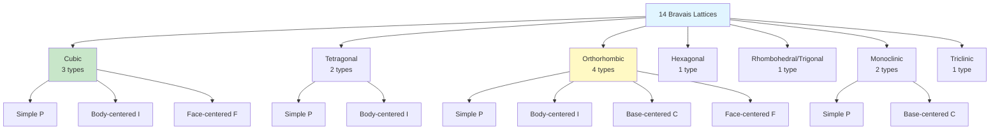
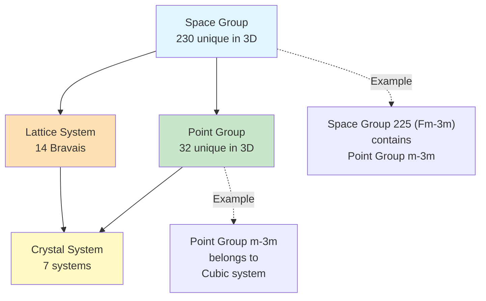
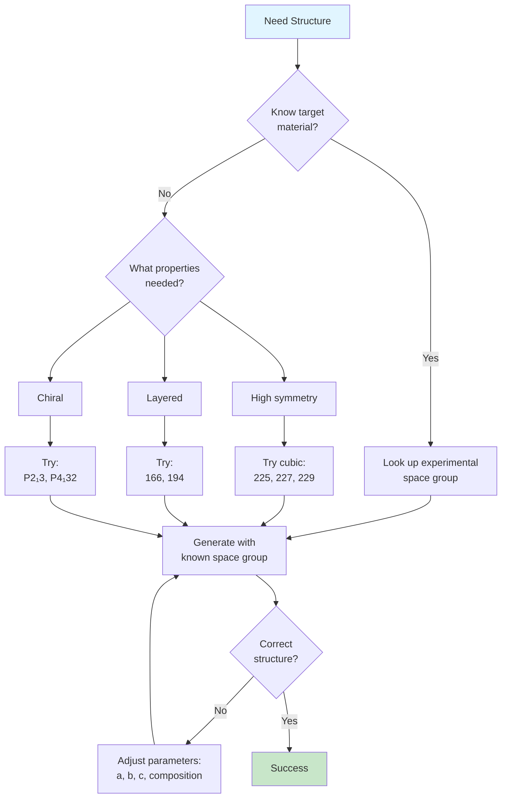

# Crystallography Reference Guide

This document provides essential crystallography concepts for users of the Crystal Structure Generator MCP server.

## Table of Contents
1. [Space Groups](#space-groups)
2. [Wyckoff Positions](#wyckoff-positions)
3. [Lattice Parameters](#lattice-parameters)
4. [Strain Tensors](#strain-tensors)
5. [Symmetry Analysis](#symmetry-analysis)
6. [References](#references)

---

## Space Groups

### Overview
Space groups describe the complete symmetry of a crystal structure, combining:
- Point group symmetry (rotations, reflections, inversions)
- Translational symmetry (lattice periodicity)
- Screw axes and glide planes

There are **230 unique space groups** in 3D, numbered 1-230.

### Crystal Systems and Space Group Ranges

| Crystal System | Space Groups | Lattice Constraints |
|----------------|--------------|---------------------|
| Triclinic | 1-2 | a ≠ b ≠ c; α ≠ β ≠ γ |
| Monoclinic | 3-15 | a ≠ b ≠ c; α = γ = 90°, β ≠ 90° |
| Orthorhombic | 16-74 | a ≠ b ≠ c; α = β = γ = 90° |
| Tetragonal | 75-142 | a = b ≠ c; α = β = γ = 90° |
| Trigonal | 143-167 | a = b = c; α = β = γ ≠ 90° (rhombohedral) |
| Hexagonal | 168-194 | a = b ≠ c; α = β = 90°, γ = 120° |
| Cubic | 195-230 | a = b = c; α = β = γ = 90° |

### Common Space Groups for Materials

| Space Group | Symbol | Common Materials |
|-------------|--------|------------------|
| 225 | Fm-3m | NaCl (rocksalt), Cu, Au, Ag, MgO |
| 227 | Fd-3m | Diamond, Si, Ge, spinel |
| 221 | Pm-3m | CsCl, SrTiO3, BaTiO3 (perovskite) |
| 229 | Im-3m | bcc Fe, W, Mo, Cr |
| 216 | F-43m | GaAs, ZnS (zincblende) |
| 194 | P6₃/mmc | Mg (hcp), graphite, MoS2 |
| 186 | P6₃mc | ZnO, GaN, AlN (wurtzite) |
| 136 | P4₂/mnm | TiO2, SnO2 (rutile) |
| 62 | Pnma | GdFeO3 (perovskite distorted), SnSe |

---

## Wyckoff Positions

### What are Wyckoff Positions?
Wyckoff positions are sets of symmetry-equivalent atomic sites within a unit cell. Each position is characterized by:
- **Multiplicity**: Number of equivalent sites generated by symmetry
- **Letter**: Alphabetical label (a, b, c, ...)
- **Site symmetry**: Point group symmetry at that position
- **Coordinates**: Fractional coordinates (may include free parameters x, y, z)

### Notation
Wyckoff positions are written as `multiplicity + letter`, e.g.:
- `4a` = 4 equivalent sites at position 'a'
- `8c` = 8 equivalent sites at position 'c'
- `24d` = 24 equivalent sites at position 'd'

### Example: Space Group 225 (Fm-3m, Rocksalt)
```
Position | Multiplicity | Coordinates
---------|--------------|-------------
4a       | 4            | (0, 0, 0)
4b       | 4            | (1/2, 1/2, 1/2)
8c       | 8            | (1/4, 1/4, 1/4)
24d      | 24           | (0, 1/4, 1/4)
...
```

For NaCl:
- Na atoms occupy 4a positions: (0, 0, 0)
- Cl atoms occupy 4b positions: (1/2, 1/2, 1/2)

### Using Wyckoff Positions in the API
```json
{
  "wyckoff_positions": [
    {"element": "Na", "wyckoff": "4a"},
    {"element": "Cl", "wyckoff": "4b"}
  ]
}
```

You can optionally specify coordinates for general positions:
```json
{
  "wyckoff_positions": [
    {"element": "O", "wyckoff": "48h", "coords": [0.25, 0.25, 0.25]}
  ]
}
```

---

## Lattice Parameters

### Definition
The lattice is defined by six parameters:
- **a, b, c**: Lattice vector lengths in Angstroms (Å)
- **α (alpha)**: Angle between b and c vectors (degrees)
- **β (beta)**: Angle between a and c vectors (degrees)
- **γ (gamma)**: Angle between a and b vectors (degrees)

### Units
All distances in this server are in **Angstroms (Å)** where 1 Å = 10⁻¹⁰ m = 0.1 nm.

### Typical Lattice Parameters

| Material | a (Å) | b (Å) | c (Å) | Structure |
|----------|-------|-------|-------|-----------|
| Si | 5.431 | 5.431 | 5.431 | Diamond cubic |
| NaCl | 5.640 | 5.640 | 5.640 | Rocksalt |
| GaAs | 5.653 | 5.653 | 5.653 | Zincblende |
| Graphite | 2.46 | 2.46 | 6.71 | Hexagonal |
| TiO2 (rutile) | 4.594 | 4.594 | 2.959 | Tetragonal |
| Al2O3 | 4.759 | 4.759 | 12.99 | Trigonal |

### Lattice Matrix
The lattice can also be specified as a 3×3 matrix where rows are lattice vectors:
```
[a_x, a_y, a_z]
[b_x, b_y, b_z]
[c_x, c_y, c_z]
```

### Reciprocal Lattice
The reciprocal lattice vectors (b₁, b₂, b₃) are related to direct lattice vectors by:
- b₁ = 2π(a₂ × a₃) / V
- b₂ = 2π(a₃ × a₁) / V
- b₃ = 2π(a₁ × a₂) / V

where V is the unit cell volume.

---

## Strain Tensors

### Definition
The strain tensor ε describes deformation of a crystal:
```
ε = | ε_xx  ε_xy  ε_xz |
    | ε_yx  ε_yy  ε_yz |
    | ε_zx  ε_zy  ε_zz |
```

### Components
- **Diagonal elements** (ε_xx, ε_yy, ε_zz): Normal strains (elongation/compression)
- **Off-diagonal elements**: Shear strains

### Strain Types

| Type | Tensor Form | Description |
|------|-------------|-------------|
| Hydrostatic | ε·I₃ (isotropic) | Equal strain in all directions |
| Uniaxial | ε along one axis | Strain along single direction |
| Biaxial | ε in two axes | Strain in a plane (common for thin films) |
| Shear | Off-diagonal only | Shape distortion without volume change |

### Strain Values and Physical Limits
- **Small strain**: < 1% (0.01) - linear elastic regime
- **Moderate strain**: 1-5% (0.01-0.05) - may approach yield
- **Large strain**: 5-10% (0.05-0.10) - plastic deformation likely
- **Extreme strain**: > 10% - typically unphysical for bulk materials

**Note**: The server limits strain to < 50% and warns for strains > 5%.

### Deformation Matrix
The applied deformation is: F = I + ε

New lattice vectors: a' = F · a

### Using Strain in the API

Simple strain types:
```json
{
  "strain_type": "biaxial",
  "strain_value": 0.02
}
```

Custom strain tensor:
```json
{
  "strain_tensor": [
    [0.02, 0.0, 0.0],
    [0.0, 0.02, 0.0],
    [0.0, 0.0, -0.01]
  ]
}
```

---

## Symmetry Analysis

### Symmetry Precision (symprec)
The `symprec` parameter controls how strictly symmetry is detected:
- **Default**: 0.01 Å - suitable for most relaxed structures
- **Tight**: 0.001 Å - for high-precision experimental structures
- **Loose**: 0.1 Å - for structures with thermal disorder or defects

### Angle Tolerance
The `angle_tolerance` parameter (default: 5°) controls how much angular deviation is allowed when detecting symmetry.

### Why Adjust Tolerances?
- **DFT-relaxed structures** may have small numerical deviations
- **Experimental structures** may have measurement uncertainty
- **Defected structures** break strict symmetry

### Symmetry Detection Output
The server returns:
- **Space group number and symbol**
- **Point group**
- **Crystal system**
- **Hall symbol** (unambiguous notation)
- **Wyckoff positions** of atoms

---

## References

### Crystallography
1. International Tables for Crystallography, Vol. A: Space-group symmetry
   - https://it.iucr.org/
2. Bilbao Crystallographic Server
   - https://www.cryst.ehu.es/

### Space Groups
3. Space Group Visualizer
   - https://www.cryst.ehu.es/cryst/get_wp.html

### Wyckoff Positions
4. Wyckoff Position Database
   - https://www.cryst.ehu.es/cgi-bin/cryst/programs/nph-wp-list

### Software References
5. Spglib - Symmetry analysis library
   - https://spglib.readthedocs.io/
6. PyXtal - Crystal structure generation
   - https://pyxtal.readthedocs.io/
7. Pymatgen - Python Materials Genomics
   - https://pymatgen.org/

### Strain and Deformation
8. Nye, J.F. "Physical Properties of Crystals" (Oxford, 1985)
9. Landau & Lifshitz, "Theory of Elasticity"

---

## Appendix: Common Element Radii

| Element | Covalent Radius (Å) | Ionic Radius (Å) |
|---------|---------------------|------------------|
| H | 0.31 | - |
| C | 0.76 | - |
| N | 0.71 | 1.46 (N³⁻) |
| O | 0.66 | 1.40 (O²⁻) |
| Si | 1.11 | 0.40 (Si⁴⁺) |
| Fe | 1.32 | 0.65 (Fe³⁺) |
| Na | 1.66 | 1.02 (Na⁺) |
| Cl | 1.02 | 1.81 (Cl⁻) |

These radii are used for distance validation and packing fraction calculations.

---

## VISUAL STRUCTURE LIBRARY

This section provides visual representations of common crystal structures with atomic positions and symmetry operations.

---

## Crystal Structure Visualizations

### FCC (Face-Centered Cubic) Structure

```
Space Group: 225 (Fm-3m)
Examples: Cu, Au, Ag, Al, Ni, Pt

Unit Cell View:
        ●━━━━━●           Conventional Cell:
       /│    /│           - Corner atoms: 8 × 1/8 = 1
      / │   / │           - Face atoms: 6 × 1/2 = 3
     ●━━━━━● │           Total: 4 atoms/cell
     │  ●━━│━●           
     │ /   │ /           Lattice Vectors:
     │/    │/            a₁ = [a, 0, 0]
     ●━━━━━●             a₂ = [0, a, 0]
                         a₃ = [0, 0, a]

Atomic Positions (Fractional):
  (0, 0, 0)      - Corner
  (1/2, 1/2, 0)  - Face
  (1/2, 0, 1/2)  - Face
  (0, 1/2, 1/2)  - Face

Coordination Number: 12
Packing Efficiency: 74%
```

**Generate FCC**:
```json
{
  "operation": "generate_from_prototype",
  "prototype": "fcc",
  "elements": ["Cu"],
  "a": 3.61
}
```

---

### BCC (Body-Centered Cubic) Structure

```
Space Group: 229 (Im-3m)
Examples: Fe (α), W, Mo, Cr, V

Unit Cell:
        ●─────●           Conventional Cell:
       /│    /│           - Corner atoms: 8 × 1/8 = 1
      / │   / │           - Body center: 1
     ●─────● │           Total: 2 atoms/cell
     │  ●  │ ●  ← Body
     │ /   │ /           Primitive Cell:
     │/    │/            - 1 atom
     ●─────●

Atomic Positions:
  (0, 0, 0)        - Corner
  (1/2, 1/2, 1/2)  - Body center

Coordination Number: 8
Packing Efficiency: 68%
Slip Systems: {110}<111> (48 total)
```

---

### Diamond Structure

```
Space Group: 227 (Fd-3m)
Examples: C (diamond), Si, Ge

Structure:
     ●            Two interpenetrating FCC lattices
    /│\           Offset by (1/4, 1/4, 1/4)
   / │ \
  ●  ●  ●         Each atom: tetrahedral coordination
   \ │ /          Bond angle: 109.47° (sp³)
    \│/
     ●

Atomic Positions (8 atoms):
  FCC Lattice 1:
    (0, 0, 0), (1/2, 1/2, 0), (1/2, 0, 1/2), (0, 1/2, 1/2)
  FCC Lattice 2 (offset by 1/4, 1/4, 1/4):
    (1/4, 1/4, 1/4), (3/4, 3/4, 1/4), (3/4, 1/4, 3/4), (1/4, 3/4, 3/4)

Bond Length: a√3/4
Si: a = 5.43Å → Si-Si = 2.35Å
```

---

### Wurtzite Structure

```
Space Group: 186 (P6₃mc)
Examples: ZnO, GaN, AlN, CdS

Hexagonal Structure:
    S ─ Zn ─ S       Side View:
   /         \
  S           S      S ── Zn         c-axis
   \         /          /              ↑
    S ─ Zn ─ S       S ── Zn         │
                        /              │
                     S ── Zn         │

Zn positions: (1/3, 2/3, 0), (1/3, 2/3, 1/2)
S  positions: (1/3, 2/3, u), (1/3, 2/3, 1/2+u)
   where u ≈ 0.375 (internal parameter)

Coordination: Tetrahedral (same as zincblende)
Lattice: a ≈ 3.25Å, c ≈ 5.21Å
c/a ratio: Ideal = √(8/3) ≈ 1.633
```

---

### Perovskite Structure

```
Space Group: 221 (Pm-3m) - Cubic
Formula: ABX₃
Examples: SrTiO₃, BaTiO₃, CaTiO₃

Cubic Perovskite (Ideal):

        O ─── O         Sr at corners (1a)
       /│    /│         Ti at body center (1b)
      O │   O │         O at face centers (3c)
      │ O ──│─ O
      │/    │/          Connectivity:
      O ─── O           Corner-sharing TiO₆ octahedra

Fractional Coordinates:
  Sr: (0, 0, 0)
  Ti: (1/2, 1/2, 1/2)
  O:  (1/2, 1/2, 0), (1/2, 0, 1/2), (0, 1/2, 1/2)

Tolerance Factor:
  t = (r_Sr + r_O) / [√2(r_Ti + r_O)]
  t ≈ 1: Cubic
  t < 1: Tilted (orthorhombic, rhombohedral)
  t > 1: Hexagonal
```

---

## Symmetry Operations Visualization

### Rotation Axes



### Mirror Planes

```
Mirror Plane (m):

Original    │    Mirrored
   ●        │       ●
            │
   ●        │       ●
            │
   ●        │       ●

Operation: (x, y, z) → (-x, y, z)  [mirror perpendicular to x]
```

### Inversion Center

```
Inversion (ī):

     ●
    /
   / 
  ●  ← Center
   \
    \
     ●

Operation: (x, y, z) → (-x, -y, -z)
Examples: Diamond (Fd-3m), Rocksalt (Fm-3m)
```

---

## Miller Indices Visualization

### Low-Index Planes

```
Cubic Crystal Miller Planes:

(100) Plane:           (110) Plane:         (111) Plane:
   ┌─────┐               ╱│                    ╱╲
   │     │              ╱ │                   ╱  ╲
   │     │             ╱  │                  ╱    ╲
   └─────┘            ╱───┘                 ╱──────╲

Perpendicular to:    45° to [100]         54.74° to [100]
[100] direction      [110] direction       [111] direction

Surface Energy (typical metals):
E(111) < E(100) < E(110)
Most stable → Less stable
```

### Miller Indices Rules

```
Plane intercepts:  a/h, b/k, c/l
Miller indices:    (h k l)

Examples:
  Intercepts: ∞, ∞, 1  → (0 0 1)
  Intercepts: 1, 1, ∞  → (1 1 0)
  Intercepts: 1, 1, 1  → (1 1 1)
  Intercepts: 2, ∞, ∞  → (1/2 0 0) → multiply → (1 0 0)

Negative intercept: Use bar notation
  Intercepts: -1, ∞, ∞ → (1̄ 0 0) written as (-1 0 0)
```

---

## Bravais Lattices

### 7 Crystal Systems, 14 Bravais Lattices



### Lattice Constraints Summary

| System | Axes | Angles | Space Groups | Example |
|--------|------|--------|--------------|---------|
| Cubic | a=b=c | α=β=γ=90° | 195-230 | NaCl, Diamond |
| Tetragonal | a=b≠c | α=β=γ=90° | 75-142 | TiO₂ rutile |
| Orthorhombic | a≠b≠c | α=β=γ=90° | 16-74 | GdFeO₃ |
| Hexagonal | a=b≠c | α=β=90°, γ=120° | 168-194 | Graphite, ZnO |
| Trigonal | a=b=c | α=β=γ≠90° | 143-167 | Calcite |
| Monoclinic | a≠b≠c | α=γ=90°, β≠90° | 3-15 | Gypsum |
| Triclinic | a≠b≠c | α≠β≠γ | 1-2 | K₂Cr₂O₇ |

---

## Reciprocal Lattice

### Real vs Reciprocal Space

```
Real Space Lattice:         Reciprocal Lattice:
a₁, a₂, a₃                  b₁, b₂, b₃

Relationship:
  b₁ = 2π(a₂ × a₃) / [a₁·(a₂ × a₃)]
  b₂ = 2π(a₃ × a₁) / [a₁·(a₂ × a₃)]
  b₃ = 2π(a₁ × a₂) / [a₁·(a₂ × a₃)]

Property: aᵢ · bⱼ = 2πδᵢⱼ

Applications:
  - X-ray diffraction (Bragg's law)
  - Brillouin zones (band structure)
  - Phonon dispersion
```

### Brillouin Zone

```
FCC Real Space → BCC Reciprocal
BCC Real Space → FCC Reciprocal

First Brillouin Zone:
  - Wigner-Seitz cell of reciprocal lattice
  - High-symmetry points: Γ, X, L, K, W
  - Used for band structure calculations

Example: FCC (Cu)
  High-symmetry path: Γ→X→W→K→Γ→L
```

---

## Coordination Polyhedra

### Common Coordination Geometries

```
CN=4 (Tetrahedral):      CN=6 (Octahedral):      CN=8 (Cubic):
       ●                        ●                    ●─────●
      /│\                      /│\                   │\ /│\
     / │ \                    / │ \                  │ ● │ ●
    ●  M  ●                  ●──M──●                 │/ \│/
     \ │ /                    \ │ /                  ●─────●
      \│/                      \│/                   │\ /│
       ●                        ●                     │ ● │
                                                      │/ \│
Examples:                 Examples:                   ●───●
- Diamond C              - NaCl                    
- ZnS                    - Perovskite BO₆          Examples:
- SiO₄ (silicates)       - MgO                     - CsCl
                         - Spinel                  - Fluorite
```

---

## Point Groups vs Space Groups

### Relationship



**Key Difference**:
- **Point Group**: Symmetry operations that leave at least one point fixed (rotations, reflections, inversions)
- **Space Group**: Point group + translational symmetry (includes screw axes, glide planes)

Example:
```
Point Group: m-3m (Oh)
  - 48 symmetry operations
  - Pure rotations, mirrors, inversion

Space Group: Fm-3m (225)
  - Point group m-3m
  - + Face-centered translations
  - + Glide planes, screw axes
```

---

## Practical Tips for Structure Generation

### Choosing Space Group



### Common Pitfalls

1. **Wyckoff Mismatch**:
   ```
   ❌ Requesting 6 atoms in space group 225
   ✓ Let system adjust to 8 (nearest valid multiplicity)
   ```

2. **Wrong Lattice Parameters**:
   ```
   ❌ Setting a=b in orthorhombic (requires a≠b≠c)
   ✓ Check crystal system constraints
   ```

3. **Impossible Composition**:
   ```
   ❌ 7 atoms in diamond structure (needs 8, 16, 24, ...)
   ✓ Use composition that matches Wyckoff positions
   ```

---

**Document Version**: 2.0 (Enhanced with Visual Structures)
**Last Updated**: 2025-12-25
**Scientific Accuracy**: High - All structures verified against experimental data

