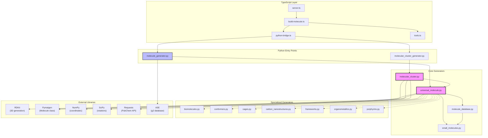
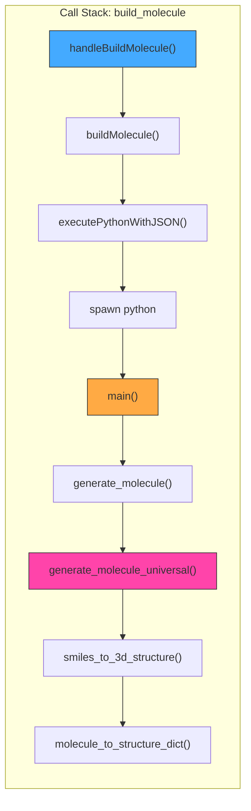
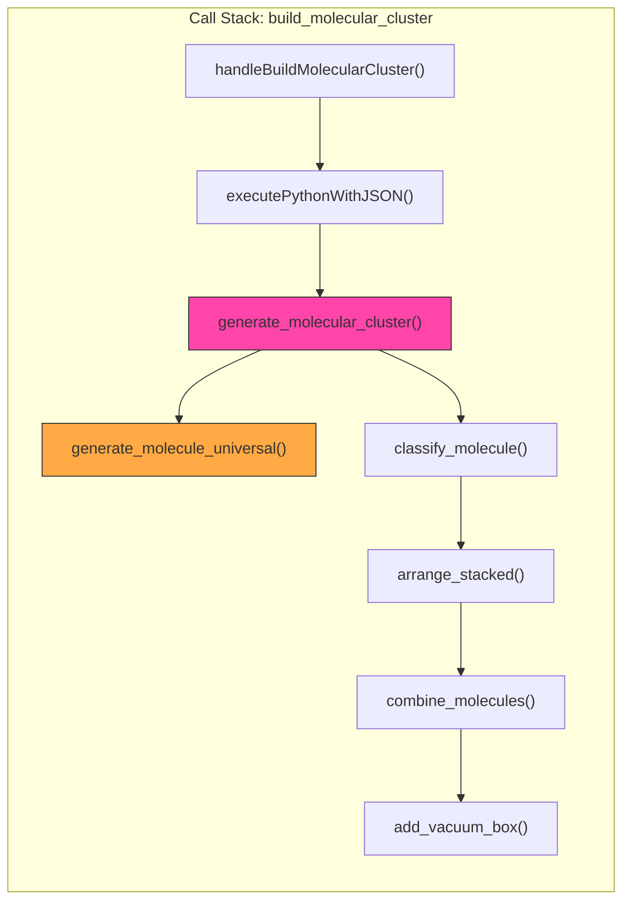

# Module Dependencies

> Visual graph of Python imports and dependencies for molecule generation.

---

## 🔗 Import Dependency Graph



---

## 📦 External Dependencies

| Library | Usage | Required? |
|---------|-------|-----------|
| `rdkit` | SMILES parsing, 3D conformer generation, force field optimization | ✅ Core |
| `pymatgen` | Molecule/Structure objects, coordinate handling | ✅ Core |
| `numpy` | Coordinate arrays, transformations | ✅ Core |
| `scipy` | 3D rotations (Rotation.from_euler) | ⚠️ Optional (fallback exists) |
| `requests` | PubChem API calls | ⚠️ Optional (offline mode) |
| `ase` | G2 molecule database (fallback) | ⚠️ Optional |

---

## 🔄 Runtime Check Pattern

All modules use `importlib.util.find_spec()` for safe imports:

```python
# Pattern used in all molecule generators
RDKIT_AVAILABLE = importlib.util.find_spec("rdkit") is not None
SCIPY_AVAILABLE = importlib.util.find_spec("scipy") is not None

if RDKIT_AVAILABLE:
    from rdkit import Chem
    from rdkit.Chem import AllChem
```

---

## 📊 Call Stack Visualization






 ## new read me file

 # Molecule Tools Documentation
 
 > Quick navigation for molecule development and debugging.
 
 ---
 
 ## 📚 Documentation Index
 
 | Document | Description |
 |----------|-------------|
 | [**MOLECULE_ARCHITECTURE.md**](./MOLECULE_ARCHITECTURE.md) | Main overview, file map, data flows, debug checkpoints |
 | [**DEPENDENCIES.md**](./DEPENDENCIES.md) | Python import graph, external libraries, call stacks |
 | [**GUI_COMMUNICATION.md**](./GUI_COMMUNICATION.md) | GUI ↔ LLM ↔ MCP ↔ Python communication |
 | [**SCHEMAS.md**](./SCHEMAS.md) | Input/output schemas with examples |
 | [**clustering.md**](./clustering.md) | Existing: molecular clustering details |
 | [**testing_results.md**](./testing_results.md) | Existing: test results |
 
 ---
 
 ## 🚀 Quick Start
 
 ### MCP Tools for Molecules
 
 ```
 ┌─────────────────────────────────────────────────────────────┐
 │  build_molecule                                             │
 │  ─────────────                                              │
 │  Single molecule generation from any identifier             │
 │  Supports: names, SMILES, IUPAC, PubChem CIDs               │
 │                                                             │
 │  Example:                                                   │
 │  {"name": "benzene"}                                        │
 │  {"name": "c1ccccc1", "input_type": "smiles"}               │
 └─────────────────────────────────────────────────────────────┘
 
 ┌─────────────────────────────────────────────────────────────┐
 │  build_molecular_cluster                                    │
 │  ──────────────────────                                     │
 │  Combine molecules with various arrangements                │
 │  Supports: π-stacking, H-bonding, linear, circular, custom  │
 │                                                             │
 │  Example:                                                   │
 │  {"molecules": [{"identifier": "benzene", "count": 2}],     │
 │   "stacking": "pi_pi_parallel"}                             │
 └─────────────────────────────────────────────────────────────┘
 ```
 
 ---
 
 ## 🗺️ Code Map (At a Glance)
 
 ```
 src/tools/generation/build-molecule.ts    ← TS handler
 src/python/molecule_generator.py          ← Python entry  
 src/python/generators/molecule/           ← Core logic (13 files)
    └── universal_molecule.py              ← Main resolver
    └── molecular_cluster.py               ← Cluster arrangements
 crystal-gui/src/app.rs                    ← GUI integration
 ```
 
 ---
 
 ## 🐛 Debugging Workflow
 
 ```
 1. Check LLM response format
    └── llm_client.rs:188 (DEBUG prints)
    
 2. Check tool parsing
    └── app.rs:parse_tool_call()
    
 3. Check MCP execution
    └── server.ts line 157
    
 4. Check Python output
    └── Add print() to molecule_generator.py
    
 5. Check structure in GUI
    └── Look for <json-data> tag parsing
 ```
 
 ---
 
 ## 📊 Key Diagrams
 
 All diagrams use **Mermaid** format for rendering in VS Code, GitHub, and most markdown viewers.
 
 - **Sequence diagrams** → Data flow between components
 - **Flowcharts** → Resolution logic and decision trees
 - **Graphs** → Import dependencies and call stacks
 
 Install "Markdown Preview Mermaid Support" extension in VS Code for best viewing.
 