# GUI ↔ Backend Communication

> Complete data flow through GUI (Rust), LLM (Ollama), MCP Server (TypeScript), and Python backend.

---

## 🖥️ System Components

```mermaid
graph TB
    subgraph GUI["🖥️ Crystal GUI (Rust)"]
        APP["app.rs<br/>CrystalApp"]
        CHAT["render_chat_panel()"]
        VIEWER["CrystalViewer"]
        LLM_C["LlmClient"]
        MCP_C["McpClient"]
    end
    
    subgraph OLLAMA["🤖 Ollama"]
        LLM["Local LLM<br/>(qwen2.5:7b)"]
    end
    
    subgraph MCP["📡 MCP Server (TypeScript)"]
        SRV["server.ts"]
        TOOLS["Tool Handlers"]
        BRIDGE["python-bridge.ts"]
    end
    
    subgraph PYTHON["🐍 Python Backend"]
        ENTRY["molecule_generator.py"]
        CORE["generators/molecule/"]
    end
    
    APP --> CHAT
    APP --> VIEWER
    CHAT --> LLM_C
    CHAT --> MCP_C
    
    LLM_C <-->|HTTP /api/chat| LLM
    MCP_C <-->|JSON-RPC stdio| SRV
    
    SRV --> TOOLS
    TOOLS --> BRIDGE
    BRIDGE -->|subprocess| ENTRY
    ENTRY --> CORE
    
    style APP fill:#f96,stroke:#333,stroke-width:2px
    style SRV fill:#69f,stroke:#333,stroke-width:2px
    style ENTRY fill:#9f6,stroke:#333,stroke-width:2px
```



---

## 📨 Message Flow Detail


---

## 🔧 Key Code Locations

### Rust GUI

| Function | File | Line | Purpose |
|----------|------|------|---------|
| `send_chat_message()` | app.rs | 133 | Orchestrates LLM → Tool flow |
| `parse_tool_call()` | app.rs | 266 | Extract tool from LLM response |
| `call_tool()` | app.rs | 322 | Execute tool via MCP |
| `chat_with_tools()` | llm_client.rs | 138 | Send to Ollama with tool schemas |
| `call_tool()` | mcp_client.rs | - | JSON-RPC to MCP server |

### TypeScript MCP Server

| Location | File | Line | Purpose |
|----------|------|------|---------|
| Tool routing | server.ts | 157 | `case "build_molecule":` |
| Schema validation | tools.ts | 626 | `BuildMoleculeSchema` |
| Python execution | python-bridge.ts | - | `executePythonWithJSON()` |

### Python Backend

| Function | File | Purpose |
|----------|------|---------|
| `main()` | molecule_generator.py | CLI entry, JSON I/O |
| `generate_molecule()` | molecule_generator.py | Dispatch to universal |
| `generate_molecule_universal()` | universal_molecule.py | All-source resolver |

---

## 📦 Data Formats

### LLM → GUI Tool Call Format

```json
{
  "message": {
    "tool_calls": [
      {
        "function": {
          "name": "build_molecule",
          "arguments": {
            "name": "benzene",
            "optimize": true
          }
        }
      }
    ]
  }
}
```

### GUI → MCP Request

```json
{
  "jsonrpc": "2.0",
  "method": "tools/call",
  "params": {
    "name": "build_molecule",
    "arguments": {
      "name": "benzene",
      "optimize": true,
      "vacuum": 10.0
    }
  },
  "id": 1
}
```

### Python → MCP Response

```json
{
  "success": true,
  "structure": {
    "lattice": {
      "a": 15.2, "b": 15.2, "c": 10.0,
      "alpha": 90.0, "beta": 90.0, "gamma": 90.0,
      "matrix": [[15.2,0,0], [0,15.2,0], [0,0,10.0]]
    },
    "atoms": [
      {"element": "C", "coords": [0.33, 0.33, 0.5], "cartesian": [5.0, 5.0, 5.0]},
      ...
    ],
    "metadata": {
      "formula": "C6H6",
      "natoms": 12
    }
  },
  "source": "rdkit"
}
```

### MCP → GUI Response (with embedded JSON)

```
### Molecule Built: C6H6

- **Atoms**: 12
- **Box Size**: 15.20 x 15.20 x 10.00 Å

*Structure data is available in the response.*

<json-data>
{"success": true, "structure": {...}}
</json-data>
```

---

## 🐛 Common Debug Points

```
┌──────────────────────────────────────────────────────────────────┐
│ ISSUE: LLM returns text instead of tool_calls                   │
│ CHECK: llm_client.rs:chat_with_tools() - format must be None    │
│ CHECK: Ollama model supports function calling                    │
├──────────────────────────────────────────────────────────────────┤
│ ISSUE: Tool call fails                                           │
│ CHECK: app.rs:call_tool() error handling                         │
│ CHECK: MCP server running? (npm run dev)                         │
├──────────────────────────────────────────────────────────────────┤
│ ISSUE: Python error                                              │
│ CHECK: stderr output in terminal                                 │
│ CHECK: Python dependencies installed                             │
├──────────────────────────────────────────────────────────────────┤
│ ISSUE: Structure not rendering                                   │
│ CHECK: <json-data> tag present in response                       │
│ CHECK: crystal_viewer.rs parse logic                             │
└──────────────────────────────────────────────────────────────────┘
```
