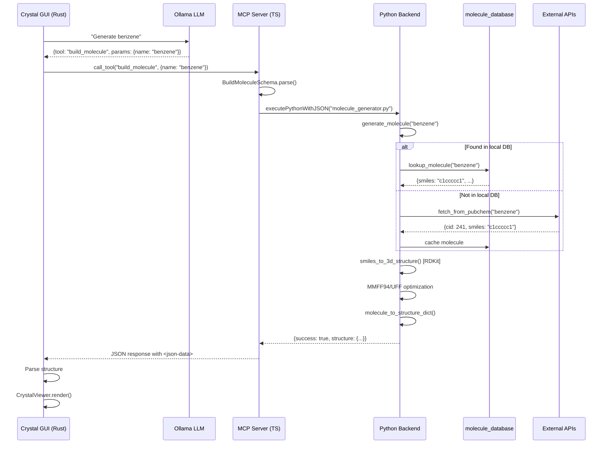
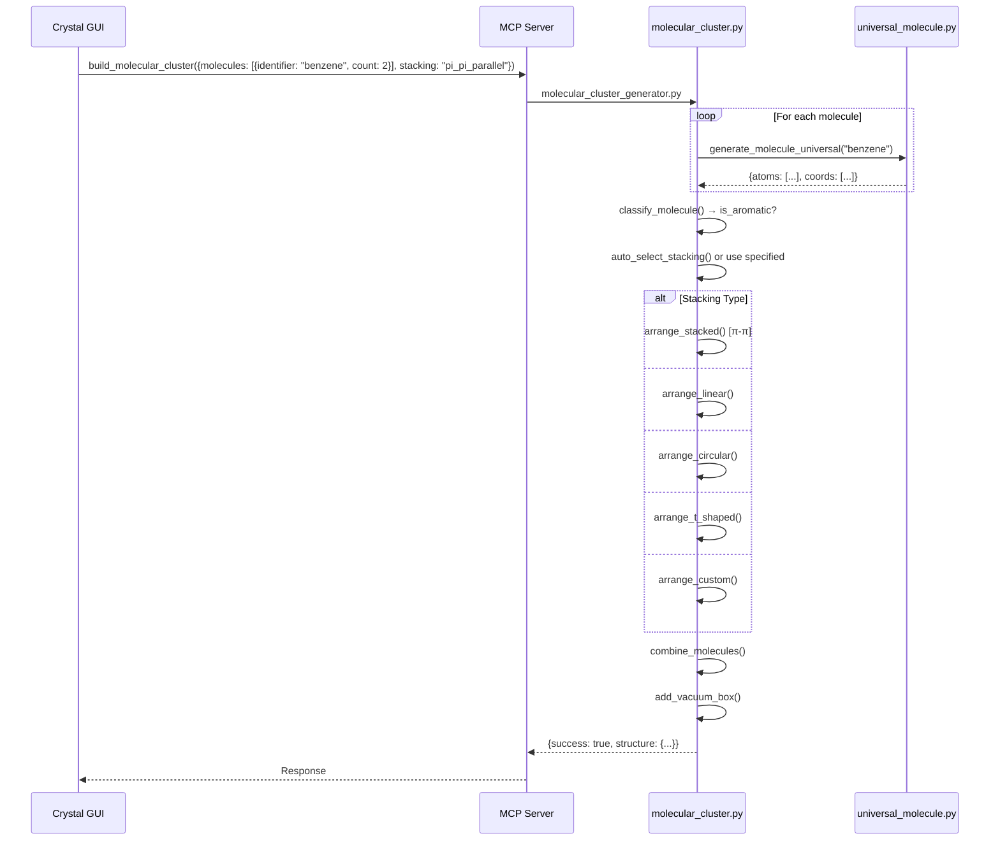
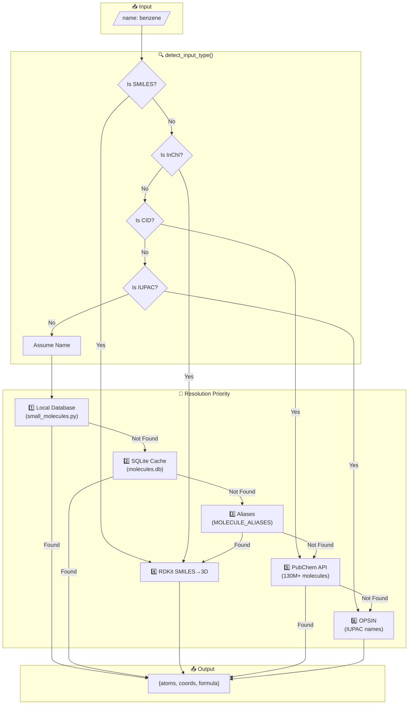
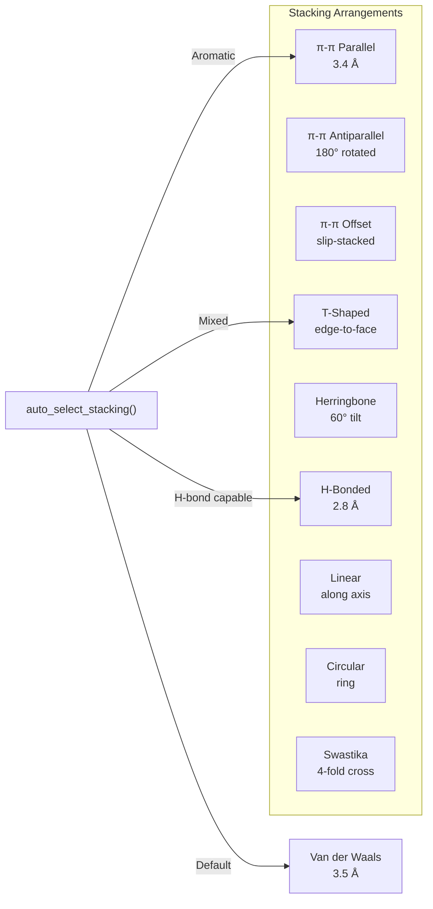

# Molecule Tools Architecture

> **Quick Reference for Debugging** – All molecule-related files and data flows.

---

## 🗂️ File Map

```
crystal-mcp-server/
│
├── src/
│   ├── server.ts                          ← MCP Server (tool routing)
│   │
│   ├── tools/generation/
│   │   └── build-molecule.ts              ← TypeScript tool handler
│   │
│   ├── types/
│   │   └── tools.ts                       ← Schemas (BuildMoleculeSchema, BuildMolecularClusterSchema)
│   │
│   ├── utils/
│   │   └── python-bridge.ts               ← Python subprocess executor
│   │
│   ├── python/
│   │   ├── molecule_generator.py          ← Python entry point (build_molecule)
│   │   ├── molecular_cluster_generator.py ← Python entry point (build_molecular_cluster)
│   │   │
│   │   └── generators/molecule/           ← Core generation logic
│   │       ├── universal_molecule.py      🔑 Main resolver (130M+ molecules)
│   │       ├── molecular_cluster.py       🔑 Cluster arrangements
│   │       ├── molecule_database.py       ← SQLite database manager
│   │       ├── small_molecules.py         ← Built-in molecule coords
│   │       ├── biomolecules.py            ← Amino acids, DNA bases
│   │       ├── conformers.py              ← Conformer generation
│   │       ├── cages.py                   ← Cage molecules
│   │       ├── carbon_nanostructures.py   ← C60, nanotubes
│   │       ├── frameworks.py              ← MOFs, COFs
│   │       ├── organometallics.py         ← Metal complexes
│   │       └── porphyrins.py              ← Porphyrin rings
│   │
│   └── data/molecule/
│       └── molecules.db                   ← SQLite cache
│
├── crystal-gui/src/                       ← Rust GUI
│   ├── app.rs                             ← Main app (chat, tool calls)
│   ├── llm_client.rs                      ← Ollama integration
│   ├── mcp_client.rs                      ← MCP communication
│   └── crystal_viewer.rs                  ← 3D visualization
│
└── tests/
    └── end_to_end_test.py                 ← E2E testing
```

---

## 🔄 Data Flow: Single Molecule (`build_molecule`)



---

## 🔄 Data Flow: Molecular Cluster (`build_molecular_cluster`)



---

## 📊 Molecule Resolution Priority



---

## 🏗️ Cluster Stacking Types



---

## 🔧 Key Functions Reference

| File | Function | Purpose |
|------|----------|---------|
| `molecule_generator.py` | `generate_molecule()` | Entry point for single molecules |
| `universal_molecule.py` | `generate_molecule_universal()` | Main resolver (all sources) |
| `universal_molecule.py` | `detect_input_type()` | Auto-detect SMILES/name/CID |
| `universal_molecule.py` | `smiles_to_3d_structure()` | RDKit 3D generation |
| `universal_molecule.py` | `fetch_from_pubchem()` | External API lookup |
| `molecular_cluster.py` | `generate_molecular_cluster()` | Cluster assembly |
| `molecular_cluster.py` | `arrange_stacked()` | π-stacking arrangement |
| `molecular_cluster.py` | `rotate_molecule()` | 3D rotation utility |
| `molecule_database.py` | `lookup_molecule()` | SQLite cache lookup |

---

## 🐛 Debug Checkpoints

```
┌─────────────────────────────────────────────────────────────────┐
│  1. GUI → LLM                                                   │
│     Check: app.rs:send_chat_message() line 133                  │
│     Debug: [DEBUG] LLM REQUEST printed to stderr                │
├─────────────────────────────────────────────────────────────────┤
│  2. LLM → Tool Parse                                            │
│     Check: app.rs:parse_tool_call() line 266                    │
│     Issue: LLM returns text instead of tool_calls array         │
├─────────────────────────────────────────────────────────────────┤
│  3. Tool → MCP                                                  │
│     Check: app.rs:call_tool() line 322                          │
│     Check: mcp_client.rs:call_tool()                            │
├─────────────────────────────────────────────────────────────────┤
│  4. MCP → Python                                                │
│     Check: server.ts case "build_molecule" line 157             │
│     Check: python-bridge.ts:executePythonWithJSON()             │
├─────────────────────────────────────────────────────────────────┤
│  5. Python Resolution                                           │
│     Check: molecule_generator.py:generate_molecule()            │
│     Check: universal_molecule.py:generate_molecule_universal()  │
│     Debug: Add logging.info() statements                        │
├─────────────────────────────────────────────────────────────────┤
│  6. Response → GUI                                              │
│     Check: <json-data> tag in response                          │
│     Check: crystal_viewer.rs structure parsing                  │
└─────────────────────────────────────────────────────────────────┘
```

---

## 📁 Quick Links

| What | Where |
|------|-------|
| MCP Tool Schema | [tools.ts#L626](file:///home/niel/git/crystal-mcp-server/src/types/tools.ts#L626) |
| TS Handler | [build-molecule.ts](file:///home/niel/git/crystal-mcp-server/src/tools/generation/build-molecule.ts) |
| Python Entry | [molecule_generator.py](file:///home/niel/git/crystal-mcp-server/src/python/molecule_generator.py) |
| Universal Resolver | [universal_molecule.py](file:///home/niel/git/crystal-mcp-server/src/python/generators/molecule/universal_molecule.py) |
| Cluster Generator | [molecular_cluster.py](file:///home/niel/git/crystal-mcp-server/src/python/generators/molecule/molecular_cluster.py) |
| GUI App | [app.rs](file:///home/niel/git/crystal-mcp-server/crystal-gui/src/app.rs) |
| LLM Client | [llm_client.rs](file:///home/niel/git/crystal-mcp-server/crystal-gui/src/llm_client.rs) |
