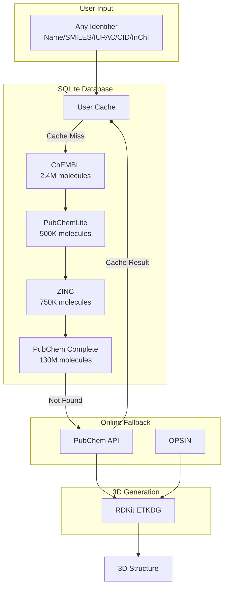

# Molecule Database System

Complete documentation for the universal molecule database system in Crystal MCP Server.

## Overview

The molecule database system provides:

- **Universal lookup** for any molecule identifier (name, SMILES, IUPAC, CID, InChI, ChEMBL ID)
- **Offline-first** architecture with SQLite storage
- **Scalable** - from a few hundred to 130M+ molecules
- **Plug-and-play** - downloaded databases are auto-detected and imported
- **Caching** - online lookups are cached for future offline use
- **[Molecular Clustering](clustering.md)** - Generate dimers, trimers, n-mers with various stackings


## Architecture



### Lookup Priority

1. **Local Database (small_molecules.py)** - ~35 hand-crafted molecules with accurate geometries
2. **SQLite Database** - ChEMBL, PubChem, ZINC, and cached lookups
3. **RDKit** - Direct SMILES to 3D conversion
4. **PubChem API** - Online lookup (result cached automatically)
5. **OPSIN** - IUPAC name resolution (result cached automatically)

---

## Quick Start

```bash
# Navigate to Python source
cd src/python

# Check current database status
python3 -m generators.molecule.db_manager status

# Download ChEMBL database (~2.4M bioactive molecules)
python3 -m generators.molecule.db_manager download chembl

# Search for a molecule
python3 -m generators.molecule.db_manager search "aspirin"
```

---

## Available Databases

| Database | Molecules | Compressed Size | Extracted Size | Use Case |
|----------|-----------|-----------------|----------------|----------|
| **ChEMBL 34** | ~2.4M | ~1.5GB | ~4GB | Bioactive molecules, drug discovery |
| **PubChemLite** | ~500K | ~50MB | ~200MB | Environmental, metabolomics, curated subset |
| **PubChem Complete** | ~130M | **~15GB** | ~50GB+ | ALL known compounds (comprehensive) |
| **ZINC Drug-like** | ~750K | ~100MB | ~500MB | Purchasable compounds for screening |

---

## Download Instructions

### Automatic Downloads (Recommended)

The CLI handles downloading, extraction, and import automatically:

```bash
cd src/python

# ChEMBL - Bioactive molecules (~2.4M)
python3 -m generators.molecule.db_manager download chembl

# PubChemLite - Curated subset (~500K)
python3 -m generators.molecule.db_manager download pubchemlite

# PubChem Complete - ALL molecules (~130M, 15GB download!)
python3 -m generators.molecule.db_manager download pubchem-complete
```

---

### Manual Downloads

If you prefer to download manually or have the files already:

#### ChEMBL 34

1. **Download URL**: https://ftp.ebi.ac.uk/pub/databases/chembl/ChEMBLdb/releases/chembl_34/chembl_34_sqlite.tar.gz
2. **Size**: ~1.5GB compressed, ~4GB extracted
3. **Extract** the `.tar.gz` file
4. **Place** the `chembl_34.db` file in: `data/molecule/downloads/`
5. **Auto-import**: The system detects and imports it on next startup

#### PubChemLite

1. **Download URL**: https://zenodo.org/records/14251246/files/PubChemLite_CCSbase.csv
2. **Size**: ~50MB
3. **Place** the file in: `data/molecule/downloads/`
4. **Auto-import**: Detected and imported automatically

#### PubChem Complete (15GB - Full Database)

> ⚠️ **Warning**: This is a very large download (~15GB compressed, ~50GB+ when imported). Only download if you need access to ALL ~130 million PubChem compounds and have sufficient disk space.

1. **Download URL**: https://ftp.ncbi.nlm.nih.gov/pubchem/Compound/Extras/CID-SMILES.gz
2. **Alternative HTTP URL**: ftp://ftp.ncbi.nlm.nih.gov/pubchem/Compound/Extras/CID-SMILES.gz
3. **Size**: ~15GB compressed
4. **Place** the file in: `data/molecule/downloads/`
5. **Import**: Run `python3 -m generators.molecule.db_manager import data/molecule/downloads/CID-SMILES.gz`

**Important Notes for PubChem Complete**:
- Import can take several hours due to ~130M molecules
- SQLite database will grow to ~50GB+
- Ensure sufficient disk space before importing
- Import is done in batches of 100,000 molecules to manage memory

#### ZINC Database

ZINC requires manual download due to licensing:

1. **Visit**: https://zinc.docking.org/tranches/download
2. **Select** subsets (e.g., "Drug-like", "Lead-like", "Fragment-like")
3. **Download** SMILES format files
4. **Import**: `python3 -m generators.molecule.db_manager import /path/to/zinc_file.smi`

---

## Plug-and-Play System

The database system is designed for **zero-configuration plug-and-play**:

### How It Works

1. **Download** any supported database file
2. **Place** it in `data/molecule/downloads/` directory
3. **Start** the MCP server or run any molecule generation
4. **Auto-detection**: The system scans for new files
5. **Auto-import**: New databases are imported automatically
6. **Ready to use**: Molecules are immediately searchable

### File Detection Patterns

| File Pattern | Database Type |
|--------------|---------------|
| `chembl_*.db` | ChEMBL SQLite database |
| `*smiles*.gz` | PubChem CID-SMILES (gzipped) |
| `pubchemlite*.csv` | PubChemLite CSV |
| `*.csv` | Generic CSV with SMILES column |
| `*.smi` | SMILES file |

### Directory Structure

```
crystal-mcp-server/
└── data/
    └── molecule/
        ├── molecules.db          # Main SQLite database (auto-created)
        └── downloads/            # Place downloaded files here
            ├── chembl_34.db      # ChEMBL database
            ├── CID-SMILES.gz     # PubChem complete (15GB)
            ├── PubChemLite.csv   # PubChemLite
            └── zinc_druglike.smi # ZINC subset
```

---

## Supported Identifier Formats

The system accepts **any** of these identifier formats:

| Format | Example | Auto-detected |
|--------|---------|---------------|
| **Common Name** | `aspirin`, `caffeine`, `PTCDA`, `benzene` | ✅ |
| **Abbreviation** | `DMSO`, `THF`, `DMF`, `ATP` | ✅ |
| **SMILES** | `c1ccccc1`, `CCO`, `CC(=O)O` | ✅ |
| **IUPAC Name** | `2-acetoxybenzoic acid`, `perylene-3,4,9,10-tetracarboxylic dianhydride` | ✅ |
| **InChI** | `InChI=1S/C6H6/c1-2-4-6-5-3-1/h1-6H` | ✅ |
| **InChIKey** | `UHOVQNZJYSORNB-UHFFFAOYSA-N` | ✅ |
| **PubChem CID** | `2244` (aspirin) | ✅ |
| **ChEMBL ID** | `CHEMBL25` (aspirin) | ✅ |

### Examples of Accepted Names

```python
# All these work for aspirin:
"aspirin"
"Aspirin"
"ASPIRIN"
"acetylsalicylic acid"
"2-acetoxybenzoic acid"
"CC(=O)OC1=CC=CC=C1C(=O)O"  # SMILES
"2244"  # PubChem CID
"CHEMBL25"  # ChEMBL ID

# Common abbreviations:
"DMSO"  # Dimethyl sulfoxide
"THF"   # Tetrahydrofuran
"DMF"   # Dimethylformamide
"PTCDA" # Perylene-3,4,9,10-tetracarboxylic dianhydride
```

---

## MCP Tool Schema

### build_molecule Tool

The `build_molecule` MCP tool uses this system. Input schema:

```json
{
  "name": {
    "type": "string",
    "description": "Molecule identifier (name, SMILES, IUPAC, CID, InChI, ChEMBL ID)"
  },
  "input_type": {
    "type": "string",
    "enum": ["auto", "name", "smiles", "iupac", "cid"],
    "default": "auto",
    "description": "Type hint for the identifier"
  },
  "optimize": {
    "type": "boolean",
    "default": true,
    "description": "Optimize 3D geometry with force field"
  },
  "vacuum": {
    "type": "number",
    "default": 10.0,
    "description": "Vacuum padding in Angstroms"
  }
}
```

### Example MCP Requests

```json
// By common name
{"name": "build_molecule", "arguments": {"name": "aspirin"}}

// By SMILES
{"name": "build_molecule", "arguments": {"name": "c1ccccc1", "input_type": "smiles"}}

// By PubChem CID
{"name": "build_molecule", "arguments": {"name": "2244"}}

// By ChEMBL ID
{"name": "build_molecule", "arguments": {"name": "CHEMBL25"}}

// By IUPAC name
{"name": "build_molecule", "arguments": {"name": "perylene-3,4,9,10-tetracarboxylic dianhydride"}}
```

---

## Python API

### Quick Lookup

```python
from generators.molecule import lookup_molecule, generate_molecule_universal

# Simple lookup (returns dict with SMILES, formula, etc.)
result = lookup_molecule("aspirin")
print(result["smiles"])  # CC(=O)OC1=CC=CC=C1C(=O)O

# Generate 3D structure
mol = generate_molecule_universal("PTCDA")
print(f"Atoms: {mol['n_atoms']}, Source: {mol['source']}")
```

### Full Database Access

```python
from generators.molecule import MoleculeDatabase, get_molecule_database

# Get global database instance
db = get_molecule_database()

# Add a molecule
db.add_molecule(
    smiles="c1ccccc1",
    name="benzene",
    category="aromatic",
    aliases=["benzol", "cyclohexatriene"]
)

# Search
results = db.search("caff", limit=10)
for mol in results:
    print(f"{mol.name}: {mol.smiles}")

# Get statistics
stats = db.stats()
print(f"Total molecules: {stats['total_molecules']}")
print(f"By source: {stats['by_source']}")
```

### Import Custom Database

```python
db = get_molecule_database()

# Import CSV with SMILES column
count = db.import_database("/path/to/my_molecules.csv")
print(f"Imported {count} molecules")
```

---

## CLI Reference

```bash
# Show database status and available downloads
python3 -m generators.molecule.db_manager status

# Download a database
python3 -m generators.molecule.db_manager download <source>
# Sources: chembl, pubchemlite, pubchem-complete

# Import a local file
python3 -m generators.molecule.db_manager import <file_path>

# List available download sources
python3 -m generators.molecule.db_manager list

# Search for molecules
python3 -m generators.molecule.db_manager search <query> [-n limit]
```

---

## Database Schema

The SQLite database uses this schema:

```sql
-- Main molecules table
CREATE TABLE molecules (
    id INTEGER PRIMARY KEY AUTOINCREMENT,
    name TEXT,                    -- Common name
    smiles TEXT NOT NULL,         -- Canonical SMILES
    inchi TEXT,                   -- InChI string
    inchikey TEXT,                -- InChIKey (for deduplication)
    formula TEXT,                 -- Molecular formula
    molecular_weight REAL,        -- Molecular weight
    source TEXT,                  -- 'chembl', 'pubchem', 'user_cache', etc.
    category TEXT,                -- 'drug', 'solvent', 'aromatic', etc.
    pubchem_cid INTEGER,          -- PubChem compound ID
    chembl_id TEXT,               -- ChEMBL ID
    created_at TIMESTAMP          -- When added
);

-- Aliases for flexible name lookup
CREATE TABLE aliases (
    alias TEXT UNIQUE,            -- Alternative name (case-insensitive)
    molecule_id INTEGER           -- References molecules(id)
);

-- Track imported database sources
CREATE TABLE sources (
    name TEXT UNIQUE,             -- File name
    version TEXT,                 -- Database version
    molecule_count INTEGER,       -- Number of molecules imported
    imported_at TIMESTAMP         -- Import timestamp
);
```

---

## Caching Behavior

### Automatic Caching

Every successful online lookup is automatically cached:

1. **First lookup** of unknown molecule → PubChem API call (~500ms)
2. **Automatic cache** → Molecule saved to local SQLite database
3. **Subsequent lookups** → Local database query (~5ms)

### Cache Sources

Cached molecules are marked with their source:
- `pubchem_cache` - Cached from PubChem API
- `opsin_cache` - Cached from OPSIN IUPAC resolution
- `user_cache` - Manually added by user

---

## Troubleshooting

### Database is empty

Download a database:
```bash
python3 -m generators.molecule.db_manager download chembl
```

### Download failed

1. Check network connection
2. Try manual download using URLs listed above
3. Place file in `data/molecule/downloads/` directory

### Import failed

1. Ensure file format is correct (CSV needs `smiles` column)
2. Check disk space (especially for large imports)
3. Check logs for detailed error messages

### Slow lookups

Rebuild indexes:
```python
db = get_molecule_database()
db._create_schema()  # Recreates indexes
```

### PubChem Complete import hangs

The 15GB file takes hours to import. Monitor progress in logs:
```bash
# Check import progress
tail -f /path/to/logs
```

---

## GUI Integration

The database system is designed for future GUI integration:

### Settings Panel
- List of available/downloaded databases
- Download buttons with progress indicators
- Database status (molecule count, size)

### Search Widget
- Real-time molecule search
- Results with SMILES, formula, source
- Click to generate 3D structure

### Auto-detection
- Downloaded files appear automatically
- No restart required (hot-reload capability)

---

## Advanced Capabilities

The molecule generation system goes beyond simple organics:

### Complex & Inorganic Molecules
- **Transition Metal Complexes**: Correctly generates coordination complexes like **Ferrocene** (Sandwich compound), **Cisplatin** (Square planar), and **Ruthenium Tris(bipyridine)**.
- **Macrocycles**: Handles large molecules like **Vancomycin** (176 atoms) and **Paclitaxel**.
- **Strained Rings**: Generates strained systems like **Cubane** and **Fullerene C60**.

### Molecular Clusters
- **Hetero-dimers**: Create specific pairs like **Adenine-Thymine** with H-bonding.
- **Stacks**: Generate columns of molecules (e.g., **9 Benzene Stack**, **Cisplatin Stack**).
- **Lattices**: Arrange ions or molecules in grids (e.g., **Ionic Crystal** of Na/Cl, **C60 Crystal**).
- **H-Bonded Systems**: Accurately simulates hydrogen-bonded clusters (Water, Alcohols) with physical distances (O-O ~2.8Å).

### Robustness
- **2D Fallback**: If 3D embedding fails (common for large or complex connectivity), the system robustly falls back to 2D coordinate generation, ensuring a valid structure is always returned.
- **Fuzzy Matching**: Handles loose stacking descriptions (e.g., "hydrogen bonding" vs "h_bonded") intelligently.

---

## Known Limitations

### ASCII Visualization
**"Why do molecules look far apart in ASCII?"**
When generating H-bonded clusters (e.g., Water Trimer), the system places molecules at the physically correct distance (e.g., **O-O = 2.8 Å**). However, the ASCII visualizer only draws lines for covalent bonds (< 1.3 Å).
*   **Physical Reality**: 2.8 Å separation (Correct).
*   **Visual Output**: No line drawn (Looks like a gap).
This is a **visualization artifact**, not a simulation error. The molecules are interacting correctly.

