# Molecule Tools Schema Reference

> Input/output schemas for `build_molecule` and `build_molecular_cluster` MCP tools.

---

## 🧪 build_molecule

### Input Parameters


| Parameter | Type | Required | Default | Description |
|-----------|------|----------|---------|-------------|
| `name` | string | ✅ | - | Molecule identifier (name, SMILES, IUPAC, CID) |
| `input_type` | enum | ❌ | `"auto"` | Hint for identifier type |
| `optimize` | bool | ❌ | `true` | Optimize 3D geometry with MMFF94/UFF |
| `vacuum` | number | ❌ | `10.0` | Vacuum padding in Å |

### Examples

```json
// Common name
{"name": "benzene"}

// SMILES
{"name": "c1ccccc1", "input_type": "smiles"}

// PubChem CID
{"name": "2244", "input_type": "cid"}

// IUPAC
{"name": "2-acetoxybenzoic acid", "input_type": "iupac"}
```

### Output Structure

```mermaid
graph TB
    subgraph OUTPUT["build_molecule Output"]
        SUCCESS["success: boolean"]
        STRUCT["structure"]
        SOURCE["source: string"]
        META["metadata"]
    end
    
    subgraph STRUCT_DETAIL["structure object"]
        LAT["lattice: {a, b, c, α, β, γ, matrix}"]
        ATOMS["atoms: [{element, coords, cartesian}]"]
        SG["space_group: {number: 1, symbol: 'P1'}"]
        META2["metadata: {formula, natoms, pbc}"]
    end
    
    STRUCT --> LAT
    STRUCT --> ATOMS
    STRUCT --> SG
    STRUCT --> META2
```



---

## 🧬 build_molecular_cluster

### Input Parameters


### Stacking Types


### Default Distances

| Stacking Type | Distance (Å) | Notes |
|--------------|--------------|-------|
| π-π parallel | 3.4 | Face-to-face aromatics |
| π-π antiparallel | 3.4 | + 180° rotation |
| π-π offset | 3.4 | + 1.5 Å lateral slip |
| T-shaped | 5.0 | Edge-to-face |
| Herringbone | 5.5 | + 60° tilt |
| H-bonded | 2.8 | O-O in water |
| Van der Waals | 3.5 | Generic contact |
| Linear | 5.0 | Along axis |

### Examples

```json
// Benzene dimer (auto-detect π-stacking)
{
  "molecules": [{"identifier": "benzene", "count": 2}],
  "stacking": "auto"
}

// Water trimer (H-bonded ring)
{
  "molecules": [{"identifier": "water", "count": 3}],
  "stacking": "circular"
}

// Benzene-water hetero-dimer (custom positions)
{
  "molecules": [
    {"identifier": "benzene"},
    {"identifier": "water"}
  ],
  "stacking": "custom",
  "positions": [
    {"x": 0, "y": 0, "z": 0},
    {"x": 0, "y": 0, "z": 3.5}
  ]
}

// Linear along x-axis
{
  "molecules": [{"identifier": "naphthalene", "count": 4}],
  "stacking": "linear",
  "axis": "x",
  "intermolecular_distance": 6.0
}
```

---

## 📐 Output Schema Visual

```mermaid
graph TB
    subgraph RESPONSE["MCP Response"]
        SUCCESS["success: true"]
        CONTENT["content: [text, json-data]"]
    end
    
    subgraph JSON_DATA["<json-data> embedded"]
        STRUCT["structure"]
    end
    
    subgraph STRUCTURE["structure object"]
        LATTICE["lattice"]
        ATOMS["atoms/sites: array"]
        SG["space_group"]
        METADATA["metadata"]
    end
    
    subgraph LATTICE_D["lattice"]
        A["a, b, c: Å"]
        ANGLES["alpha, beta, gamma: degrees"]
        MATRIX["matrix: 3x3 array"]
        VOL["volume: ų"]
    end
    
    subgraph ATOM["each atom"]
        EL["element: 'C'"]
        FRAC["coords: [fx, fy, fz]"]
        CART["cartesian: [x, y, z]"]
        SPEC["species: [{element, occupation}]"]
    end
    
    CONTENT --> JSON_DATA
    JSON_DATA --> STRUCT
    STRUCT --> LATTICE --> LATTICE_D
    STRUCT --> ATOMS --> ATOM
```


