# Arrangement Adapter Graph

This document contains the graphical representation of the `arrangement_adapter.py` module's architecture and control flow.

```mermaid
graph RL;
    subgraph "External User/Client"
        direction LR
        UserInput["User Request (e.g., molecules, stacking, formulas)"];
    end

    subgraph "arrangement_adapter.py"
        direction TB
        %% Main entry point
        MainFunc["<b>generate_molecular_cluster()</b><br><i>Primary API Function</i>"];

        %% Decision logic
        NeedsNewEngine{"{_needs_new_engine()}<br><i>Advanced features requested?</i>"};

        %% New Engine Path
        subgraph "New Engine Workflow"
            direction TB
            style NewEnginePath fill:#f0f7ff,stroke:#84a9d4,stroke-width:2px
            GenerateMols["_generate_molecules()"];
            ArrangeNew["_arrange_with_new_engine()"];
            FormatResponse["_build_legacy_response()"];
        end

        %% Connections within adapter
        MainFunc --> NeedsNewEngine;
        NeedsNewEngine -- "Yes" --> GenerateMols;
        GenerateMols --> ArrangeNew;
        ArrangeNew --> FormatResponse;
        

        %% Convenience Functions
        subgraph "Convenience Functions"
            style ConvenienceFunctions fill:#e8f5e9,stroke:#a5d6a7
            CreateDimer["create_dimer()"];
            CreateStack["create_stack()"];
            CreateFormula["create_arrangement_from_formula()"];
            CreateConstraint["create_arrangement_with_constraints()"];
        end
        CreateDimer --> MainFunc;
        CreateStack --> MainFunc;
        CreateFormula --> MainFunc;
        CreateConstraint --> MainFunc;
    end

    %% Dependencies (Other Project Modules)
    subgraph "Dependencies (Other Python Modules)"
        direction LR
        LegacyEngine["<b>molecular_cluster.py</b><br>(Legacy Engine)"];
        MoleculeGen["<b>universal_molecule.py</b><br>(Molecule Generator)"];
        NewEngine["<b>molecular_arrangement.py</b><br>(New Unified Engine)"];
    end

    %% Connections from Adapter to Dependencies
    NeedsNewEngine -- "No" --> LegacyEngine;
    GenerateMols --> MoleculeGen;
    ArrangeNew --> NewEngine;

    %% Input/Output
    UserInput --> MainFunc;
    FormatResponse --> FinalOutput["✅ Success Response (dict)"];
    LegacyEngine --> FinalOutput;

    %% Styling
    classDef mainFunc fill:#fffbe6,stroke:#ffc107,stroke-width:2px;
    classDef decision fill:#e1f5fe,stroke:#03a9f4,stroke-width:2px;
    classDef dependency fill:#f3e5f5,stroke:#ab47bc,stroke-width:2px,color:#333;
    classDef output fill:#dcedc8,stroke:#689f38,stroke-width:2px;
    
    class MainFunc mainFunc;
    class NeedsNewEngine decision;
    class LegacyEngine,MoleculeGen,NewEngine dependency;
    class FinalOutput output;
```

### Explanation of the Diagram and Key Functions

*   **Entry Point (`generate_molecular_cluster`)**: All external calls start here. This function accepts a wide range of parameters, including both old (e.g., `offset_x`) and new (e.g., `formulas`, `constraints`).
*   **Decision Point (`_needs_new_engine`)**: This is the core of the adapter's logic. It inspects the parameters of the request. If parameters like `formulas`, `constraints`, `use_solver`, or `natural_language` are present, it returns `Yes`, directing the flow to the new engine. Otherwise, it returns `No`, and the request is passed directly to the simpler, legacy engine.
*   **Legacy Path (`molecular_cluster.py`)**: If no advanced features are needed, the adapter calls `_legacy_generate_cluster` from the `molecular_cluster.py` module, which handles the entire process and returns the final structure. This ensures backward compatibility.
*   **New Engine Path (The Blue Box)**: This is a multi-step workflow:
    1.  **`_generate_molecules()`**: Before arrangement, the actual molecules must be created. This function calls `generate_molecule_universal()` from the `universal_molecule.py` dependency to resolve identifiers (like "benzene" or a SMILES string) into 3D structures.
    2.  **`_arrange_with_new_engine()`**: The generated molecules are passed to this function. It lazy-loads and calls the `arrange_molecules()` function from the `molecular_arrangement.py` dependency (the "New Unified Engine"), which performs the complex arrangement logic.
    3.  **`_build_legacy_response()`**: The output from the new engine is slightly different from the old one. This function formats the result to match the legacy dictionary structure, ensuring a consistent output format for the end-user, regardless of which engine was used.
*   **Dependencies (The Purple Boxes)**:
    *   `molecular_cluster.py`: The old, simple arrangement engine for basic stacking.
    *   `universal_molecule.py`: A powerful dependency responsible for creating individual `Molecule` objects from various input types (names, files, SMILES, etc.).
    *   `molecular_arrangement.py`: The new, advanced engine that supports complex, constraint-based, and formula-based arrangements.
*   **Convenience Functions (The Green Box)**: Functions like `create_dimer`, `create_stack`, and `create_arrangement_from_formula` are simple, user-friendly wrappers that call the main `generate_molecular_cluster` function with pre-configured parameters. They provide an easier way to perform common tasks.
