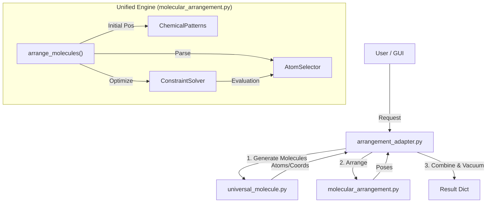
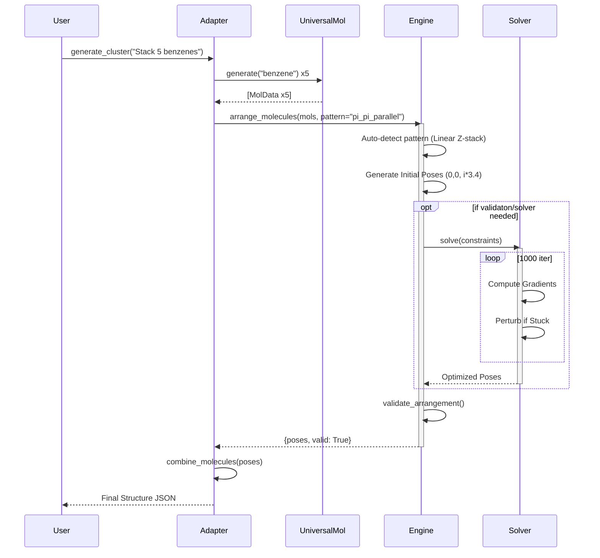

# Molecular Generation & Arrangement Architecture (Current State)
**Date:** 10 Jan 2026
**Status:** Unified & Hardened

## 1. High-Level Architecture
The system follows a **3-Layer Unified Architecture** designed to separate molecule creation from spatial arrangement, while maintaining backward compatibility with legacy APIs.

### The 3 Layers
1. **Facade Layer (Adapter)**: `arrangement_adapter.py` creates a unified entry point (`generate_molecular_cluster`) that handles both legacy parameters (offsets, simple stacking) and new advanced features (NL, formulas, constraints).
2. **Arrangement Engine**: `molecular_arrangement.py` is the core math engine. It positions molecules (represented as rigid bodies or collections of atoms) according to geometric patterns or solved constraints.
3. **Data Source**: `universal_molecule.py` generates the internal structure (atoms, bonds, 3D coordinates) of individual molecules (e.g., calling RDKit or PubChem).

## 2. Component Details

### A. Arrangement Adapter (`arrangement_adapter.py`)
Acts as the **Facade**.
- **Responsibilities**:
  - Validates input ("Does this request need the new engine?").
  - Calls `universal_molecule` to resolve names ("benzene" -> C6H6 coords).
  - Routes logic:
    - **Legacy path**: Calls `molecular_cluster.py` (deprecated but kept for safety).
    - **New path**: Calls `molecular_arrangement.py`.
  - **Post-Processing**: Combines multiple arranged molecules into one structure and places it in a simulator box (`add_vacuum_box`).

### B. Unified Engine (`molecular_arrangement.py`)
The heavy lifter. Completely standalone module containing:
- **Core Data Structures**: `MoleculePose` (Position + Orientation), `MolecularFrame`.
- **AtomSelector DSL**: A query language to select atoms for constraints (e.g., `0:atom(O,0)` = "Oxygen atom 0 of Molecule 0").
  - *Hardened*: Now raises errors for missing atoms.
- **Constraint Solver**: A stochastic gradient-descent optimizer.
  - *Hardened*: Includes perturbation to escape local minima (e.g., parallel -> perpendicular saddle points).
- **Formula Engine**: Evaluates Python-like math strings for positions.
  - *Generic*: Supports `sin`, `cos`, `floor`, `ceil`, `i` (index), `n` (total).
- **Generators**: Pre-defined algorithms for `linear`, `grid`, `spherical` (Fibonacci lattice), `cull_overlaps`.

### C. Universal Molecule (`universal_molecule.py`)
- Provides the "bricks" for the wall.
- Uses RDKit or internal lookup to return clean 3D geometries.

## 3. Data Flow Diagram

## 4. Key Dependencies & Libraries
- **NumPy**: Heavy vector math (rotation matrices, gradients, coordinate transformations).
- **RDKit**: (In `universal_molecule`) Chemical informatics and 3D embedding.
- **Python Standard Library**: `math`, `re` (DSL parsing), `dataclasses`.

## 5. Recent Hardening (Verification Status)
As of 10 Jan 2026, the following components are rigorously audited:
1.  **H-Bond Logic**: Verified mathematically (Solver achieves 170.0° angles).
2.  **Physics Compliance**: Zero-distance overlaps are rejected.
3.  **Pattern offsets**: Generic formula engine verified for periodic logic (`floor(i/2)`).
