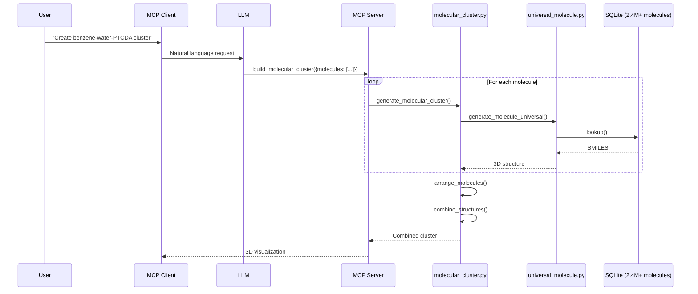

# Molecular Cluster Generation

Generate molecular clusters (dimers, trimers, n-mers) for quantum chemistry calculations.

## Overview

The `build_molecular_cluster` tool creates combinations of molecules with various arrangements:

- **Homo-dimers**: Two identical molecules (e.g., benzene dimer)
- **Hetero-dimers**: Two different molecules (e.g., benzene-water)
- **Trimers, tetramers, n-mers**: Any number of molecules
- **Various stackings**: π-π, T-shaped, H-bonded, herringbone, etc.
- **Custom arrangements**: Full control over positions and rotations

## Architecture



## Quick Start

### Python API

```python
from generators.molecule import (
    generate_molecular_cluster,
    create_dimer,
    create_hetero_dimer,
    create_stack
)

# Benzene homo-dimer (π-π stacked)
result = create_dimer("benzene", stacking="pi_pi_parallel", distance=3.4)

# Water-benzene hetero-dimer
result = create_hetero_dimer("water", "benzene", stacking="auto")

# Custom cluster
result = generate_molecular_cluster(
    molecules=[
        {"identifier": "PTCDA", "count": 1},
        {"identifier": "benzene", "count": 2}
    ],
    stacking="stacked",
    intermolecular_distance=3.5
)
```

### MCP Tool

```json
{
  "name": "build_molecular_cluster",
  "arguments": {
    "molecules": [
      {"identifier": "benzene", "count": 2}
    ],
    "stacking": "pi_pi_parallel",
    "intermolecular_distance": 3.4
  }
}
```

---

## Stacking Types

### Quantum Chemistry Standard Arrangements

| Type | Description | Default Distance | Use Case |
|------|-------------|------------------|----------|
| `auto` | Auto-detect based on molecule types | Varies | Default, smart selection |
| `pi_pi_parallel` | Face-to-face π-stacking | 3.4 Å | Aromatic molecules |
| `pi_pi_antiparallel` | π-stacking with 180° rotation | 3.4 Å | Some PAHs |
| `pi_pi_offset` | Slip-stacked (offset) | 3.4 Å | Graphene-like |
| `t_shaped` | Edge-to-face perpendicular | 5.0 Å | Benzene T-dimer |
| `herringbone` | Alternating tilted | 5.5 Å | Organic crystals |
| `h_bonded` | Hydrogen bonded | 2.8 Å | Water, alcohols |
| `van_der_waals` | General vdW contact | 3.5 Å | Non-specific |
| `linear` | In a line | 5.0 Å | Chain structures |
| `circular` | Ring arrangement | 4.0 Å | Cyclic H-bonded |
| `spherical` | 3D distribution | 5.0 Å | Nanoparticles |
| `swastika` | 4-molecule cross | Variable | Special patterns |
| `custom` | User-defined | User-defined | Custom geometries |

### Visual Representations

**π-π Parallel Stacking**
```
    ═══════════  Molecule 1
         ↑ 3.4Å
    ═══════════  Molecule 2
```

**T-Shaped (Edge-to-Face)**
```
         ║
         ║  Molecule 2 (perpendicular)
         ║
    ═════════════  Molecule 1 (horizontal)
```

**Herringbone**
```
    ╲              ╱
     ╲            ╱
      Mol 1    Mol 2  (alternating tilt)
```

**Circular (H-bonded)**
```
       H₂O
      /    \
   H₂O      H₂O
      \    /
       H₂O
```

---

## Auto-Detection Logic

When `stacking="auto"`:

1. **All aromatic** → `pi_pi_parallel` (3.4 Å)
2. **All H-bond capable** → `h_bonded` (2.8 Å)
3. **Mixed aromatic + polar** → `t_shaped` (5.0 Å)
4. **Otherwise** → `van_der_waals` (3.5 Å)

```python
# Auto-detection examples
# All aromatics → π-stacking
result = generate_molecular_cluster(
    molecules=[{"identifier": "benzene", "count": 2}],
    stacking="auto"
)  # → pi_pi_parallel, 3.4Å

# H-bond capable → H-bonded
result = generate_molecular_cluster(
    molecules=[{"identifier": "water", "count": 3}],
    stacking="auto"
)  # → h_bonded, 2.8Å
```

---

## Rotation Control

### Per-Molecule Rotation

For spiral stacking or custom orientations:

```python
# Spiral stacking (45° increments)
result = generate_molecular_cluster(
    molecules=[{"identifier": "benzene", "count": 4}],
    stacking="stacked",
    rotation_per_molecule=45.0  # degrees
)
```

### Global Rotation

Rotate the entire cluster:

```python
result = generate_molecular_cluster(
    molecules=[{"identifier": "PTCDA", "count": 2}],
    stacking="stacked",
    rotation_x=45.0,  # Tilt cluster
    rotation_z=30.0   # Rotate in-plane
)
```

### Custom Positions and Rotations

For complete control:

```python
result = generate_molecular_cluster(
    molecules=[{"identifier": "benzene", "count": 3}],
    stacking="custom",
    positions=[
        {"x": 0, "y": 0, "z": 0},
        {"x": 5, "y": 0, "z": 0},
        {"x": 2.5, "y": 4.3, "z": 0}  # Triangle
    ],
    rotations=[
        {"x": 0, "y": 0, "z": 0},
        {"x": 0, "y": 0, "z": 60},
        {"x": 0, "y": 0, "z": 120}
    ]
)
```

---

## Examples

### 1. Benzene Homo-Dimer

```json
{
  "molecules": [{"identifier": "benzene", "count": 2}],
  "stacking": "pi_pi_parallel",
  "intermolecular_distance": 3.4
}
```

### 2. Water Trimer (H-bonded ring)

```json
{
  "molecules": [{"identifier": "water", "count": 3}],
  "stacking": "circular",
  "intermolecular_distance": 2.8
}
```

### 3. PTCDA + Benzene Hetero-dimer

```json
{
  "molecules": [
    {"identifier": "PTCDA"},
    {"identifier": "benzene"}
  ],
  "stacking": "stacked",
  "intermolecular_distance": 3.5
}
```

### 4. Drug-Drug Interaction Study

```json
{
  "molecules": [
    {"identifier": "aspirin"},
    {"identifier": "caffeine"}
  ],
  "stacking": "auto"
}
```

### 5. Organic Crystal Herringbone

```json
{
  "molecules": [{"identifier": "pentacene", "count": 4}],
  "stacking": "herringbone",
  "intermolecular_distance": 5.5
}
```

### 6. Custom Swastika Pattern

```json
{
  "molecules": [{"identifier": "anthracene", "count": 4}],
  "stacking": "swastika",
  "intermolecular_distance": 10.0
}
```

---

## Input Schema

```typescript
{
  // Required: list of molecules
  molecules: [
    {
      identifier: string,  // Name, SMILES, CID, ChEMBL ID
      count?: number,      // Default: 1
      input_type?: "auto" | "name" | "smiles" | "cid"
    }
  ],
  
  // Arrangement
  stacking?: string,  // Default: "auto"
  intermolecular_distance?: number,  // Å
  
  // Offsets
  offset_x?: number,  // Å
  offset_y?: number,  // Å
  
  // Global rotation (degrees)
  rotation_x?: number,
  rotation_y?: number,
  rotation_z?: number,
  
  // Per-molecule rotation
  rotation_per_molecule?: number,  // degrees
  
  // Linear arrangement axis
  axis?: "x" | "y" | "z",  // Default: "z"
  
  // Custom positioning
  positions?: [{x, y, z}],
  rotations?: [{x, y, z}],
  
  // Options
  optimize?: boolean,  // Default: false
  vacuum?: number      // Default: 10.0 Å
}
```

---

## Output Structure

```python
{
  "success": True,
  "n_molecules": 2,
  "n_atoms": 24,
  "atoms": ["C", "C", "C", ...],
  "coords": [[x, y, z], ...],
  "formulas": ["C6H6", "C6H6"],
  "stacking_type": "pi_pi_parallel",
  "intermolecular_distance": 3.4,
  "cell": {
    "a": 15.0, "b": 15.0, "c": 20.0,
    "alpha": 90, "beta": 90, "gamma": 90
  },
  "structure": { ... }  # Full structure for visualization
}
```

---

## Integration with Build Molecule

`build_molecular_cluster` uses `build_molecule` internally, so:

- **Same molecule identifiers work**: Names, SMILES, CIDs, ChEMBL IDs
- **Same 2.4M+ molecule database**: All ChEMBL molecules available
- **Same caching**: Online lookups are cached automatically

```python
# All these work in clusters:
molecules = [
    {"identifier": "benzene"},           # Common name
    {"identifier": "CHEMBL25"},          # ChEMBL ID (aspirin)
    {"identifier": "c1ccccc1"},          # SMILES
    {"identifier": "2244"},              # PubChem CID
]
```

---

## Performance Notes

1. **Optimization**: Setting `optimize=True` can be slow for large clusters
2. **Large clusters**: Generating 10+ molecules may take a few seconds
3. **Custom positions**: Most efficient for complex arrangements
4. **Caching**: First molecule lookup may require API call; subsequent lookups are instant
