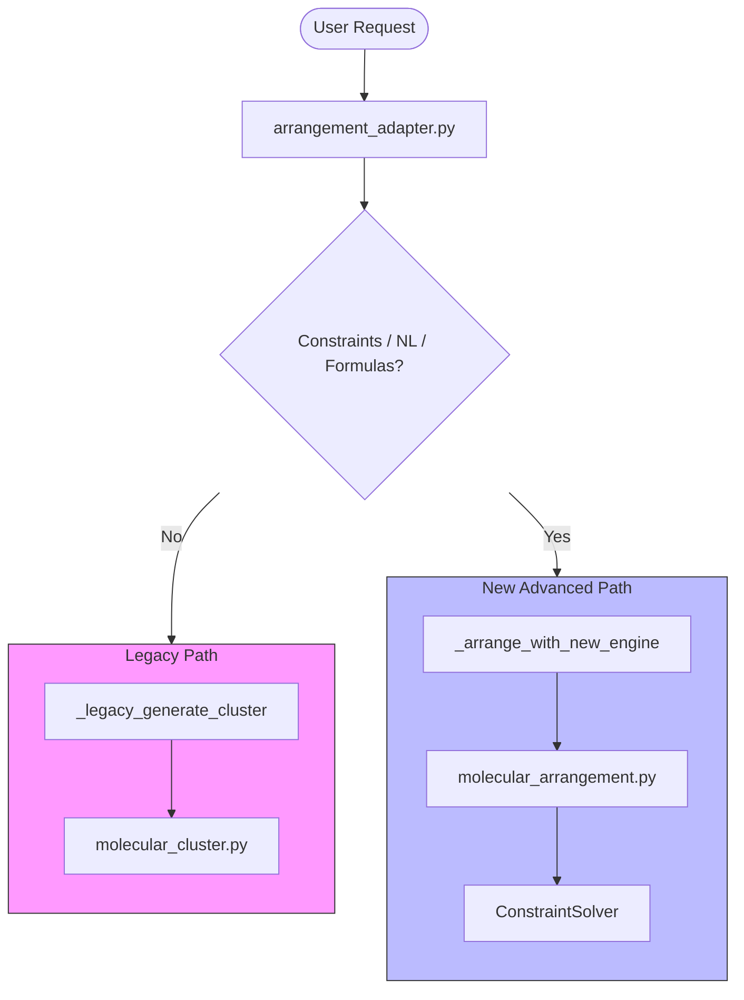
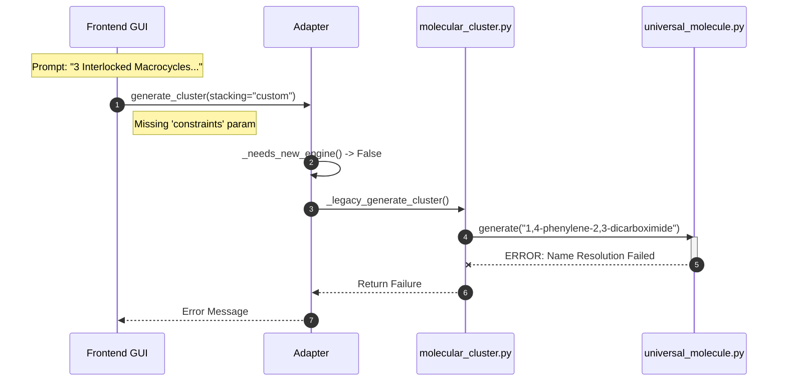
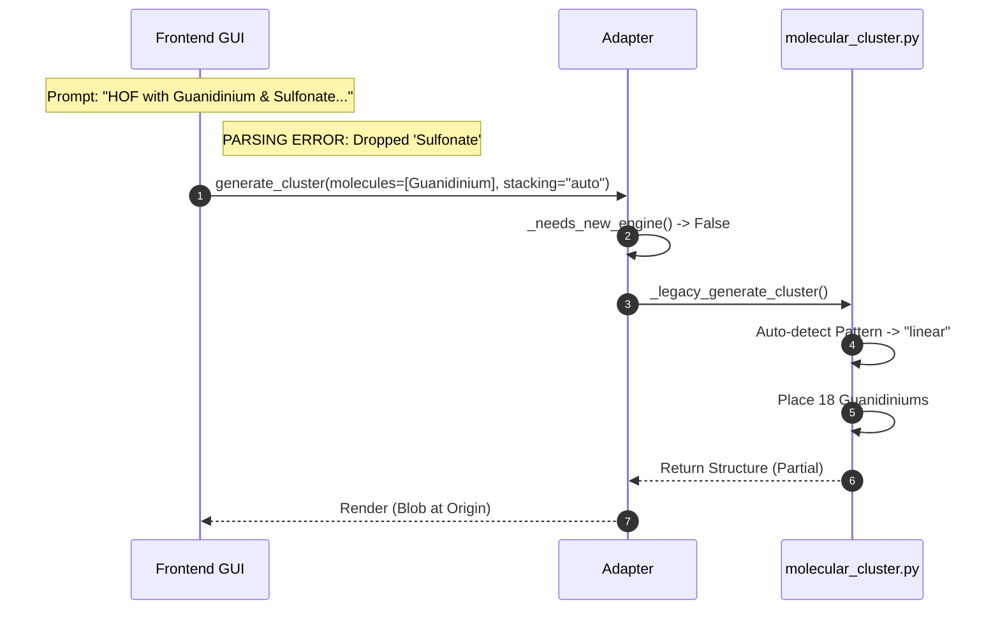
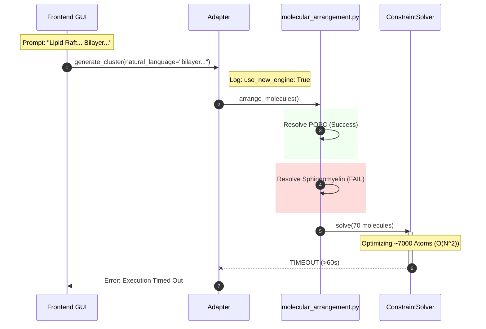

# Molecular Execution Traces & Dependency Analysis
**Date:** 10 Jan 2026
**Status:** Comprehensive Path Analysis (Visual + Forensic Text)

## 1. System Routing Logic (The "Brain")
The `arrangement_adapter.py` acts as the Facade, implementing a bifurcated routing strategy that preserves legacy stability while enabling new capabilities.

**Key Logic**:
- If the request contains **Natural Language**, **Constraints**, or **Formulas**, `_needs_new_engine()` returns `True`, activating the `NewRoute`.
- If the request defines simple parameters (e.g. `stacking="custom"`) without advanced features, it defaults to the `LegacyRoute` (using `molecular_cluster.py`).

---

## 2. Trace: Polycatenane (Level 1)
**Status:** ❌ FAILED (Legacy Fallback + Name Error)

### Forensic Analysis
1.  **Frontend Failure**: The LLM parsed the prompt but failed to translate the complex topological requirement ("interlocked") into mathematical `constraints`. It passed `stacking="custom"` without any coordinate formulas.
2.  **Routing**: Because no advanced parameters were detected, `arrangement_adapter` fell back to the **Legacy Route**.
3.  **Backend Failure**: The legacy engine attempted to generate the base molecule. The name `"1,4-phenylene-2,3-dicarboximide"` was not recognized by `universal_molecule` (which relies on internal catalogs or basic RDKit generic names).
4.  **Dependencies Involved**:
    - `molecular_cluster.py` (Active)
    - `universal_molecule.py` (Active)

---

## 3. Trace: HOF Diamondoid (Level 2)
**Status:** ❌ FAILED (Legacy Fallback + Data Missing)

### Forensic Analysis
1.  **Frontend Failure**: The LLM completely **dropped** the second component ("18 sulfonate anions") from the JSON payload effectively silencing half the prompt.
2.  **Routing**: The prompt was passed with `stacking="auto"` and no constraints (the "diamondoid network" requirement was lost). This triggered the **Legacy Route**.
3.  **Backend Behavior**: The legacy engine received a single list of atoms. It auto-detected a "linear" default pattern (or clump) and placed them.
4.  **Dependencies Involved**:
    - `molecular_cluster.py` (Active)

---

## 4. Trace: Lipid Raft (Level 5)
**Status:** ❌ TIMEOUT (New Engine Path)

### Forensic Analysis
1.  **Frontend Success**: The LLM successfully passed the raw prompt in the `natural_language` field.
2.  **Routing**: `arrangement_adapter` detected the `natural_language` parameter and correctly routed to the **New Advanced Route**.
3.  **Backend Performance Failure**: The system attempted to optimize the arrangement of 70 large biomolecules (POPC is ~130 atoms).
    - The `ConstraintSolver` performs pairwise clash detection.
    - O(N_atoms²) for ~7000 atoms is computationally expensive in Python.
    - The operation exceeded the 60-second HTTP timeout.
4.  **Dependencies Involved**:
    - `molecular_arrangement.py` (Active)
    - `ConstraintSolver` Class

---

## 5. Dependency Map
Files currently participating in the Unified System:

| Component | Status | File Path |
|-----------|--------|-----------|
| **Facade** | Active | `src/python/generators/molecule/arrangement_adapter.py` |
| **New Engine** | Active | `src/python/generators/molecule/molecular_arrangement.py` |
| **Legacy Engine** | **Active (Fallback)** | `src/python/generators/molecule/molecular_cluster.py` |
| **Molecule Source** | Active | `src/python/generators/molecule/universal_molecule.py` |
