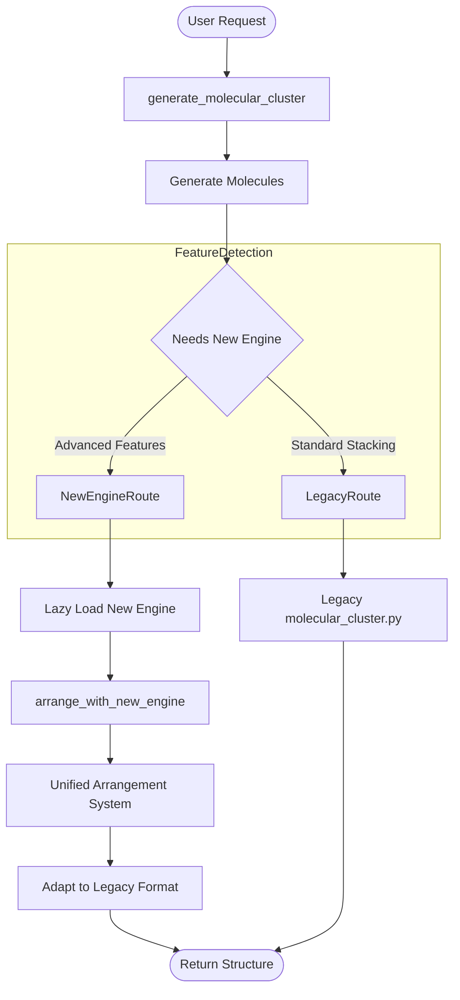
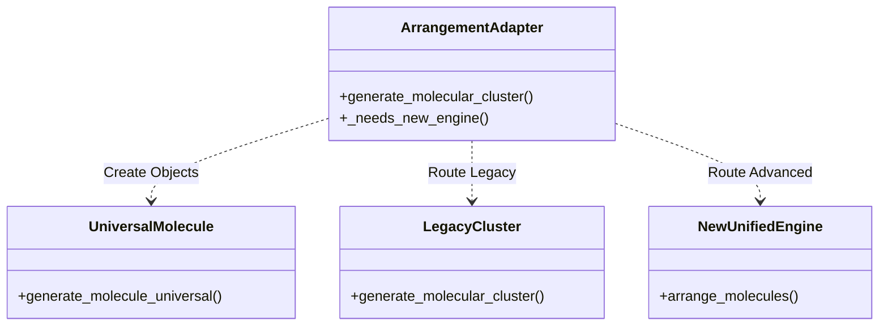

# Arrangement Adapter System
## `arrangement_adapter.py`

This module implements the **Facade Pattern**, serving as the unified entry point for all molecular arrangement requests. Its primary architectural responsibility is to maintain backward compatibility while seamlessly enabling advanced features from the new engine.

### 1. Graphical Overview (Routing Logic)

The adapter intelligently decides which engine to use based on the complexity of the request.

### 2. Key Responsibilities

#### 1. Molecule Generation Abstraction
The adapter abstracts away *how* molecules are created. It calls `universal_molecule.generate_molecule_universal` to instantiate the chemical species (e.g., creating 5 "benzene" objects) before passing them to the arrangement logic. This ensures that neither the legacy nor the new arrangement engine needs to know about molecule generation details (SMILES, PubChem, etc.).

#### 2. Smart Routing (`_needs_new_engine`)
It inspects the arguments to determine the "complexity" of the request:
- **Legacy Path**: If the user asks for simple "stacking" or standard patterns (e.g., a simple dimer), it defaults to the robust and simple `molecular_cluster.py`.
- **Advanced Path**: If the user provides:
    - Mathematical formulas (`x="5*cos(i)"`)
    - Chemical constraints (`distance(...)`)
    - Relative poses
    - Natural language instructions
    ...it routes to the new `unified_molecular_arrangement.py` system.

#### 3. Output Normalization
The new engine produces rich, object-oriented output (Poses, Frames). The adapter's `_build_legacy_response` function flattens this back into the standard dictionary format (`atoms`, `coords`, `cell`) expected by the frontend and other consumers, ensuring that upgrading the engine doesn't break existing client code.

### 3. Dependencies

### 4. Convenience Wrappers

The module also provides user-friendly wrapper functions for common tasks, which internally call the main `generate_molecular_cluster` with the correct parameters:
- `create_dimer(molecule)`
- `create_stack(molecules, ...)`
- `create_arrangement_from_formula(...)`
- `create_arrangement_with_constraints(...)`
- `parse_natural_language(text)`

### 5. Code Quality
- **Pattern**: Facade & Adapter.
- **Lazy Loading**: The new engine (`molecular_arrangement`) is imported only when needed (`_get_arrangement_engine`), improving startup time and avoiding circular dependencies.
- **Safety**: Robust error handling ensures that if the new engine fails or is unavailable, clear error messages are returned (or potential fallback, though currently explicit failure is preferred for clarity).
