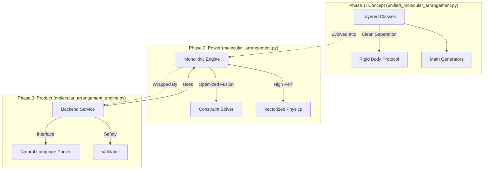
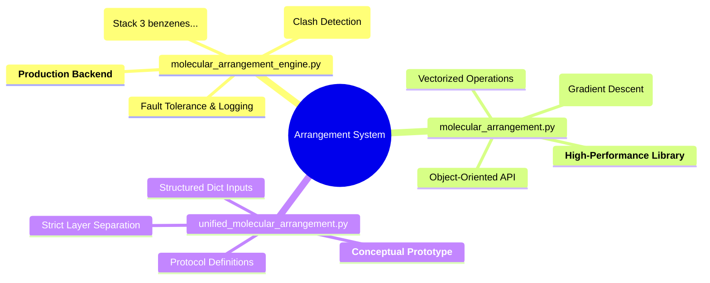

# Comparison: Evolution of the Arrangement System

This document outlines the distinct roles and architectural differences between the three stages of the molecular arrangement system's evolution.

## 1. The Three Layers

| Module | Role | Analogy | Description |
| :--- | :--- | :--- | :--- |
| **`unified_molecular_arrangement.py`** | **The Blueprint / Prototype** | *The Architectural Drawing* | The initial robust implementation that proved the "Layered" concept (Physics + Math + Chem). It separated concerns cleanly but was not optimized for performance or natural language. |
| **`molecular_arrangement.py`** | **The Engine Core** | *The V8 Engine* | The monolithic, high-performance library. It takes the concepts from `unified` and fuses them into a single, high-speed engine, adding specialized solvers. It is the "muscle". |
| **`molecular_arrangement_engine.py`** | **The Production Service** | *The Luxury Car* | The user-facing application. Wraps the Engine Core with Natural Language Processing (NLP), error handling, logging, and safety validators. It is what the generic user interacts with. |

## 2. Graphical comparison

### A. Architectural Evolution

### B. Feature Matrix

## 3. Detailed Differences

| Feature | `unified_...py` (Prototype) | `molecular_arrangement.py` (Core) | `_engine.py` (Product) |
| :--- | :--- | :--- | :--- |
| **Primary Goal** | Prove the architecture | Maximize flexibility & power | Maximize usability & reliability |
| **Architecture** | Component-based (Mix-ins) | Monolithic / Integrated | Service / Facade |
| **Input** | Structured Dictionaries | Python Objects & Classes | **Natural Language Strings** |
| **Constraint Solver** | Basic / None | **Gradient Descent Optimizer** | Uses Core's Optimizer |
| **NLP** | None | None | **Full Heuristic Parser** |
| **Logging** | Print statements (if any) | None (Pure Library) | **Audit Log File** |
| **Validation** | Minimal | Basic Checks | **Full Physical Validation** |

## 4. Code Analogy

*   **`unified_molecular_arrangement.py`** is the **Engineering Schematics**. It defines *how* a car should work (wheels go here, engine goes there). It works for simulations but isn't road-legal.
*   **`molecular_arrangement.py`** is the **High-Performance Engine Block**. It is built from the schematics but fused into a solid block of metal for maximum power. It has no seats or steering wheel.
*   **`molecular_arrangement_engine.py`** is the **Fully Assembled Vehicle**. It takes the Engine Block, adds a chassis, seats, a steering wheel (NLP), and safety sensors (Validation). You just get in and drive.
