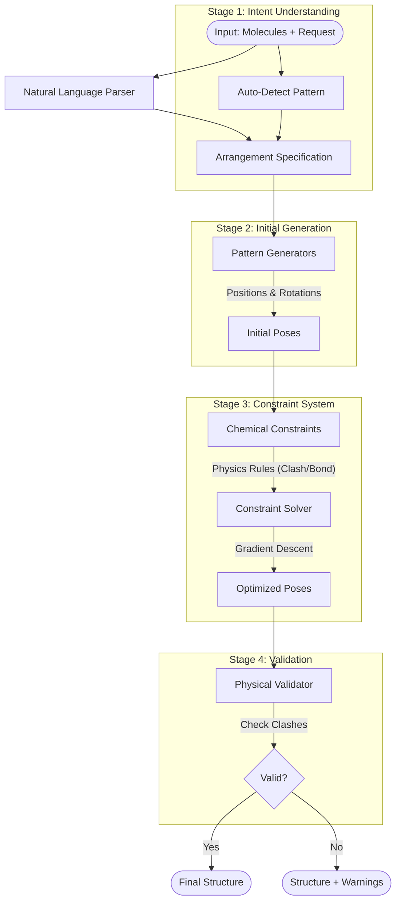
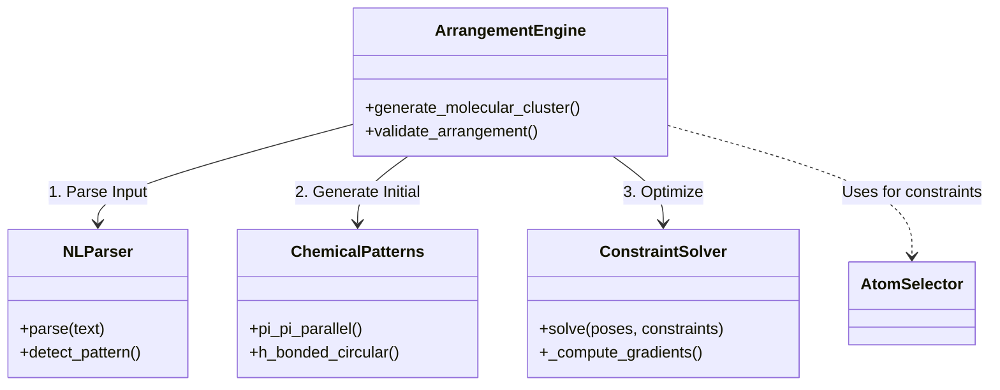

# Molecular Arrangement Engine (Production Backend)
## `molecular_arrangement_engine.py`

This module is the **production-grade** implementation of the molecular arrangement system. It represents the final synthesis of the layered architecture (Rigid Body Physics + Chemical Intelligence + Solvers) into a robust, deployable backend for the MCP server.

It is designed to handle **natural language requests**, **complex chemical constraints**, and **automated validation** in a single, self-contained package.

### 1. Graphical Architecture Overview

The engine processes requests through 5 distinct stages, from raw text understanding to physical coordinate generation.



### 2. Core Subsystems

#### A. Natural Language Parser (`NLArrangementParser`)
A heuristic-based parser that converts user intent into technical specs.
- **Input**: "Stack 3 benzenes with pi-stacking at 3.4 Angstroms"
- **Output**: 
  ```python
  {
      'pattern': 'pi_pi_parallel',
      'n_molecules': 3,
      'distance': 3.4,
      'constraints': ['plane_parallel']
  }
  ```
- **Capabilities**: Recognizes units (`Å`, `nm`), counts (`dimer`, `trimer`, `6`), and chemical synonyms (`cofacial` $\rightarrow$ `pi_stacking`).

#### B. Chemical Intelligence (`AtomSelector`)
The implementation of the domain-specific query language for defining constraints.
- `0:centroid()`: Mass center.
- `0:donor_h(0)`: Detects acidic hydrogens bonded to N/O/F.
- `func_group(amide)`: Locates amide centers dynamically.

#### C. Iterative Constraint Solver (`ConstraintSolver`)
A numerical optimizer that refines the initial geometric placement.
- **Method**: Gradient Descent with adaptive step size.
- **Objective Function**: $E_{total} = \sum w_i \cdot (current - target)^2$
- **Terms**:
    - **Distance**: $E_{dist} = (d_{ij} - d_{target})^2$
    - **Angle**: $E_{angle} = (\theta_{ijk} - \theta_{target})^2$
    - **Clash**: $E_{vdw} = \sum (r_{min} - r_{ij})^2$ if $r_{ij} < r_{min}$

#### D. Validation Engine (`validate_arrangement`)
A final quality control pass that ensures physical plausibility.
- Checks against Van der Waals radii to prevent atomic overlap ("nuclear fusion").
- Flags "very short" contacts that might indicate bad geometry.
- Returns structured warnings/errors to the client.

### 3. Dependencies & Data Flow



### 4. Comparison to Predecessors

| Module | Role | Key Difference in `molecular_arrangement_engine.py` |
| :--- | :--- | :--- |
| `molecular_cluster.py` | Legacy Implementation | No solver, no NLP, fixed enum patterns only. |
| `unified_molecular_arrangement.py` | Prototype / Concept | Separation of layers was strict; Engine merges them for performance/usability. |
| `molecular_arrangement_engine.py` | **Production Backend** | **Includes NLP Parser**, production logging, robust error handling, and integrated validation. |

### 5. Production Features
- **Logging**: Writes to `debug_arrangement.log` for audit trails.
- **Robustness**: Handles heterogeneous molecule lists (resizing based on NL input).
- **Defaults**: Contains a rich database of `INTERACTION_DISTANCES` (e.g., cation-pi = 3.5Å).
