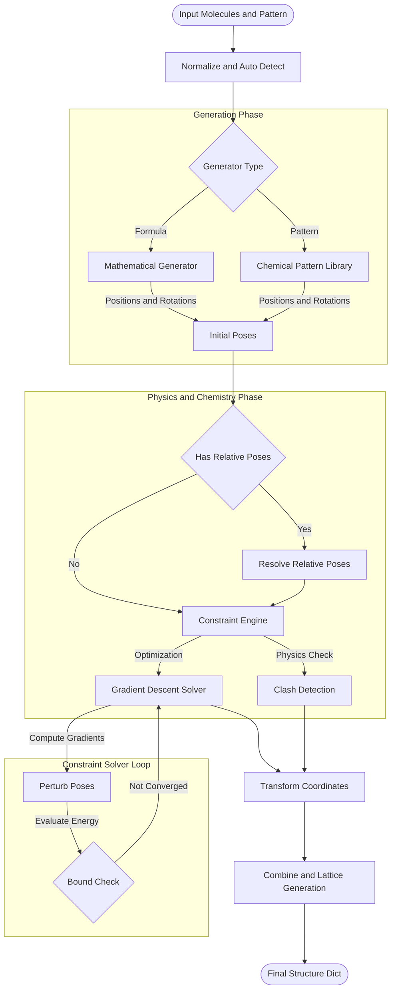
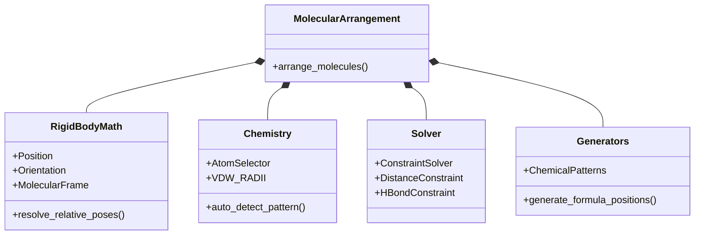

# Molecular Arrangement Engine
## `molecular_arrangement.py`

This module is the monolithic implementation of the next-generation molecular arrangement system. It unifies three previously separate architectural concepts—Chemical Intelligence (K2), Rigid Body Physics (z2), and Mathematical Generation—into a single, self-contained engine.

### 1. Graphical Architecture Overview

The system operates as a linear pipeline that progressively refines a "Specification" into concrete "Coordinates".



### 2. Core Components

#### A. Rigid Body Engine
- **`Position`, `Orientation`**: Data classes implementing vector math and Euler angles/rotation matrices.
- **`MoleculePose`**: Represents the 6-DOF state of a molecule, supporting hierarchical (parent-child) relationships.
- **`frames` / `MolecularFrame`**: Defines local coordinate systems (Using SVD/PCA) to allow logic like "Place B 3Å above the *plane* of A", regardless of how A is rotated in world space.

#### B. Chemical Intelligence (AtomSelector DSL)
A custom query language allows loose coupling between arrangement logic and specific atoms.
- **Syntax**: `mol_idx:target(args)`
- **`0:centroid()`**: Center of mass.
- **`1:ring_center(0)`**: Geometric center of the first aromatic ring.
- **`0:donor_h(0)`**: The specific hydrogen atom participating in a bond.
- This allows constraints like `distance(0:donor_h(0), 1:acceptor(0), 1.8)` to be evaluated dynamically.

#### C. Constraint Solver
A lightweight, numerical optimization engine that relaxes structures to satisfy geometric or chemical rules.
- **Clash Detection**: Penalizes Van der Waals overlaps (prevents "nuclear fusion").
- **Geometry**: Enforces distances, angles, and plane parallelisms.
- **Algorithms**: Uses simple gradient descent with random perturbation for escaping local minima.

#### D. Pattern Library
Pre-coded generators for common motifs:
- **`pi_pi_parallel`**, **`herringbone`**, **`t_shaped`** (Organic crystals)
- **`h_bonded_dimer`**, **`h_bonded_circular`** (Supramolecular assemblies)
- **`helical`** (DNA/Polymer-like structures)

### 3. Dependencies



### 4. Key Differences from Legacy `molecular_cluster.py`
| Feature | `molecular_cluster.py` | `molecular_arrangement.py` |
| :--- | :--- | :--- |
| **Logic** | Hardcoded logic per type side-by-side | Unified Pipeline (Generator $\rightarrow$ Solver $\rightarrow$ Output) |
| **Positioning** | Absolute only | Absolute + Relative (Parent/Child) |
| **Chemistry** | Basic detection | Full AtomSelector DSL + Constraints |
| **Optimization** | None (Static) | Gradient Descent Constraint Solver |
| **Flexibility** | Fixed Enums | Mathematical Formulas + String Patterns |

### 5. Usage Example

```python
# Create a complex, optimized arrangement
result = arrange_molecules(
    molecules=[mol_a, mol_b],
    # 1. Start with a rough initial guess
    pattern="linear",  
    # 2. Define strict Physical/Chemical rules
    constraints=[
        "distance(0:centroid(), 1:centroid(), 3.5)",
        "plane_parallel(0, 1)",
        "h_bond(0, 1)"
    ],
    # 3. Let the solver find the perfect geometry
    optimize=True
)
```
