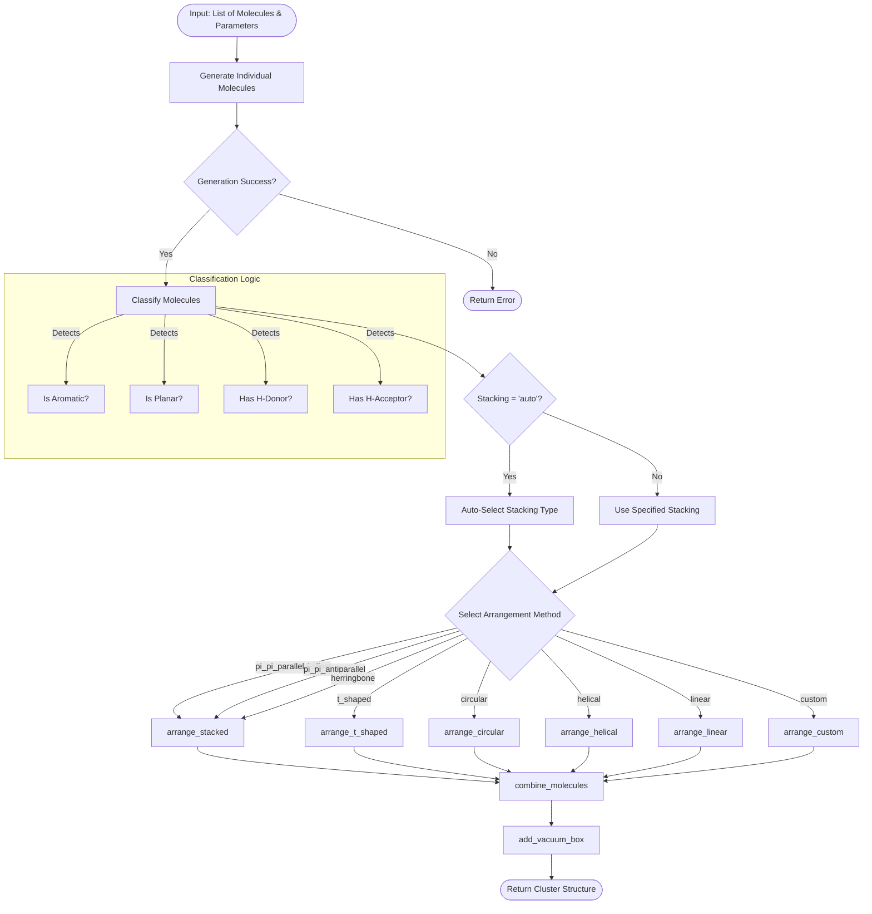
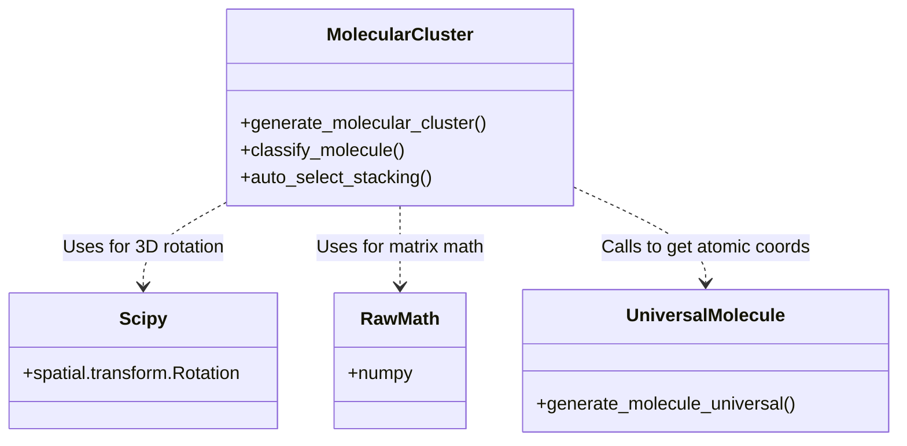

# Molecular Cluster Generation System
## `molecular_cluster.py`

This module provides a high-level interface for generating molecular clusters, focusing on chemically relevant arrangements such as $\pi$-stacking, hydrogen bonding, and standard geometric patterns. It serves as the primary "assembler" that takes individual molecule specifications and arranges them into a cohesive supramolecular structure.

### 1. Graphical Overview

The following diagram illustrates the high-level flow of the `generate_molecular_cluster` function, which is the main entry point of this module.

### 2. Dependencies & external Interaction

This module relies on several internal and external components:

### 3. Key Functions & Logic

#### Core Generation Function
- **`generate_molecular_cluster(...)`**: The master function.
    - **Inputs**: List of molecule specs (names/counts), stacking type (string), geometric parameters (distances, angles).
    - **Logic**: 
        1. Calls `universal_molecule.generate_molecule_universal` for every requested molecule.
        2. If `stacking="auto"`, analyzes chemical properties (aromaticity, H-bonding capability) to pick a physical arrangement.
        3. Dispatches to specific arrangement sub-routines.
        4.  Merges all atoms into one list and adds a simulation box.

#### Arrangement Algorithms
Specific algorithms handle the geometry of placing molecules:

| Function | Description | Key Parameters |
| :--- | :--- | :--- |
| **`arrange_stacked`** | General purpose z-stacking. Handles parallel, antiparallel, offset, and herringbone. | `distance`, `offset_x/y`, `rotation_per_molecule`, `tilt` |
| **`arrange_t_shaped`** | Edge-to-face arrangement (common for benzene). Places one molecule flat, others perpendicular around it. | `distance` |
| **`arrange_circular`** | Ring arrangement. Good for H-bonded cyclic clusters (e.g., water hexamer). | `radius`, `facing` (inward/outward) |
| **`arrange_helical`** | Screw-axis / spiral arrangement. Matches DNA-like or columnar stack packing. | `rotation_per_step`, `pitch`, `radius` |
| **`arrange_swastika`** | 4-fold symmetric cross pattern. Specific for certain planar tetramers. | `arm_length` |

#### Chemical Logic
- **`classify_molecule(atoms, smiles)`**: Determines if a molecule is aromatic, planar, or has H-bond donors/acceptors.
- **`auto_select_stacking(properties)`**:
    - **All Aromatic**: $\rightarrow$ `PI_PI_PARALLEL`
    - **All H-Bond Capable**: $\rightarrow$ `H_BONDED`
    - **Mixed**: $\rightarrow$ `T_SHAPED`
    - **None**: $\rightarrow$ `VAN_DER_WAALS`

#### Coordinate Utilities
Lower-level helpers for 3D manipulation:
- `rotate_molecule`: Rotates coordinates using Euler angles (via Scipy or manual matrix).
- `align_to_z_axis`: Uses Singular Value Decomposition (SVD) to align a molecule's principal plane to the Z-axis, ensuring consistent stacking regardless of input orientation.
- `center_molecule`: Moves centroid to (0,0,0).

### 4. Code Structure Quality

- **Modularity**: Arrangement logic is separated from molecule generation.
- **Robustness**: Fallbacks for missing libraries (manual rotation matrices if Scipy is absent).
- **Extensibility**: New `StackingType` enums can be added with entries in `STACKING_DEFAULTS` without rewriting core logic.
