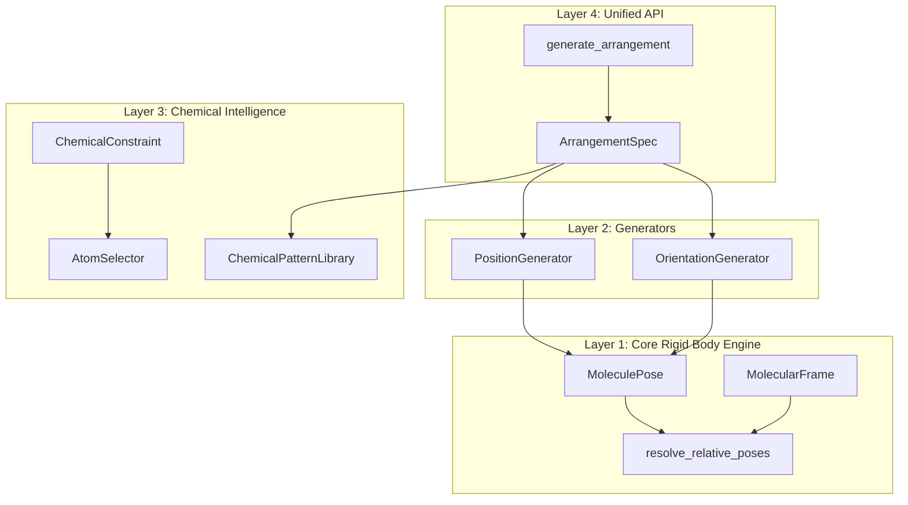
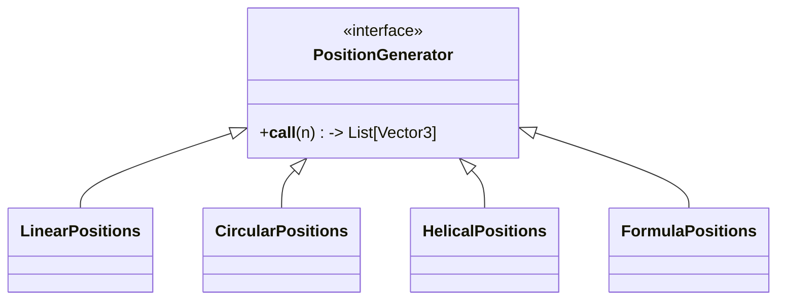
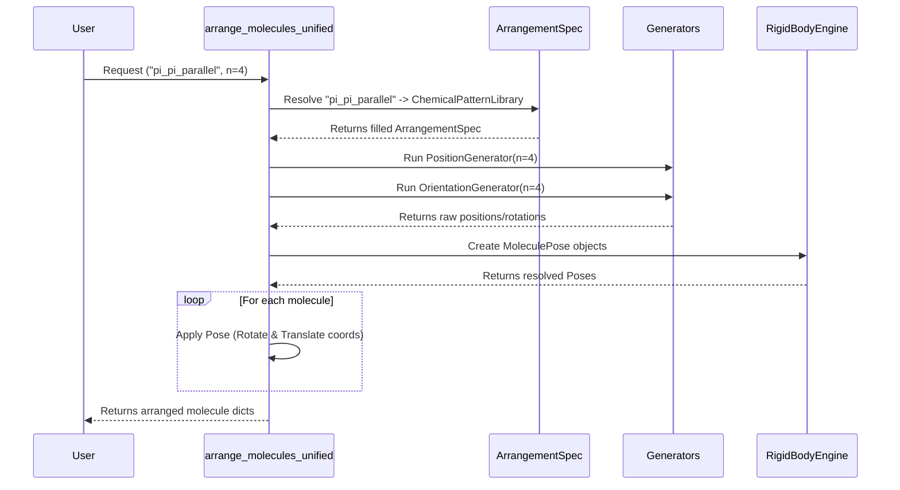

# Unified Molecular Arrangement System
## `unified_molecular_arrangement.py`

This module implements a sophisticated "Rigid Body Engine" for molecular placement. Unlike the simpler `molecular_cluster.py`, this system uses a layered architecture to separate geometry from chemistry, allowing for complex, constraint-based molecular assemblies.

### 1. Graphical Architecture Overview

The system is built on four distinct layers, moving from low-level physics to high-level API.

### 2. Layer Analysis

#### Layer 1: Core Rigid Body Engine (Physics)
This layer handles the 6-DOF (Degree of Freedom) mathematics. It ensures that no matter how complex the request is, the output is always a valid set of coordinates.

- **`MoleculePose`**: Represents a molecule's state (Position $\vec{P}$ + Rotation $R$).
    - Supports **Relative Poses**: Poses defined relative to another molecule (e.g., "3.4 Å above Molecule 0").
    - Uses topological sorting (`resolve_relative_poses`) to calculate absolute coordinates from a tree of relative definitions.
- **`MolecularFrame`**: Defines a local coordinate system for a molecule (Origin, X, Y, Z axes).
    - Can be derived from: Centroid/SVD, Plane Normal, or specific Bond Axes.

#### Layer 2: Mathematical Generators (Geometry)
Pure mathematical functions that generate points and rotations in space.

- **`FormulaPositions` / `FormulaOrientation`**: A powerful DSL allowing users to define shapes using math formulas (e.g., `x = 5 * cos(i)`).
- **`FaceCenterOrientation`**: Chemically useful generator that makes molecules look at a specific point (e.g., water molecules facing the center of a cluster).

#### Layer 3: Chemical Intelligence (Chemistry)
Adds chemical meaning to the geometry.

- **`AtomSelector`**: A query language to select specific parts of a molecule.
    - Syntax: `mol_id:target(args)`
    - Examples: `0:centroid()`, `1:atom(O)`, `0:ring_center()`, `0:donor_hs()`.
- **`ChemicalConstraint`**: Defines rules that penalize "bad" geometries.
    - `HBondConstraint`: Enforces distance (1.5–2.5Å) and angle (>120°) for hydrogen bonds.
    - `PlaneParallelConstraint`: Forces aromatic rings to be parallel.
    - `DistanceConstraint`: Generic distance fixing.
- **`ChemicalPatternLibrary`**: A factory returning pre-configured `ArrangementSpec`s for common chemical motifs (e.g., `pi_pi_parallel`, `herringbone`).

#### Layer 4: Unified API (Interface)
The single entry point `arrange_molecules_unified` that ties everything together.

### 3. Key Concepts & Flexibility

1.  **Relative Positioning**: You can define trees of molecules.
    *   *Example*: "Place B 3.4Å above A. Place C 3.4Å above B." -> This creates a stack even if you move A.
2.  **Constraint DSL**:
    *   `h_bond(donor=0, acceptor=1)`
    *   `distance(0:atom(Br), 1:atom(N), target=3.0)`
3.  **Hybrid Approach**:
    *   Can mix "Mathematical" arrangements (perfect spirals) with "Chemical" constraints (H-bonds).
    *   Currently, constraints are used to *score* or *validate*, but the system is designed to eventually *optimize* against them.

### 4. Code Quality Notes

- **Type Safety**: Extensive use of `dataclasses` and `Protocol` for cleaner interfaces.
- **Error Handling**: `resolve_relative_poses` detects circular dependencies.
- **Extensibility**: Adding a new shape (e.g., a Hyperboloid) only requires adding a class implementing `PositionGenerator`, without touching the core engine.
