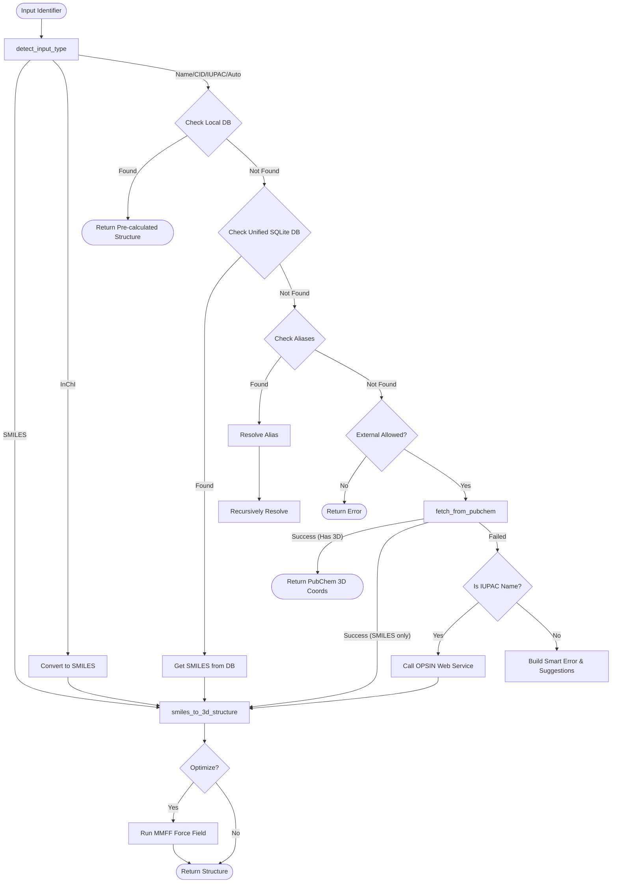
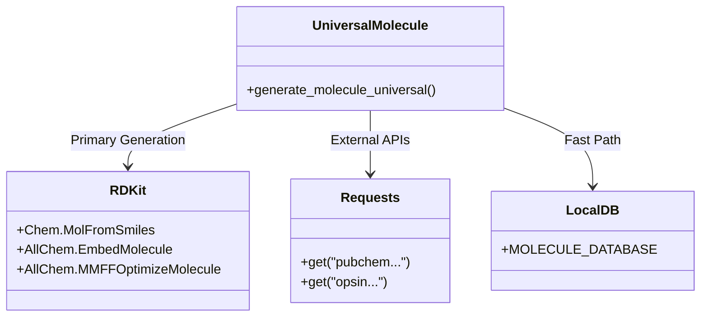

# Universal Molecule Generation
## `universal_molecule.py`

This module is the "Universal Resolver" of the system. Its goal is to take *any* string specifically identifying a molecule—whether it's a common name like "Aspirin", a systematic name, a SMILES string, or a database ID—and return a valid 3D structure.

### 1. Resolution Strategy Flowchart

The following diagram details the complex decision-making process used to resolve an identifier into 3D coordinates.

### 2. Key Components

#### Input Detection (`detect_input_type`)
Before doing any heavy lifting, the system analyzes the input string pattern to guess its type:
- **InChI**: Starts with `InChI=`.
- **CID**: Pure numeric string (e.g., `2244`).
- **SMILES**: Short string containing chemical symbols and `=`, `#`, `(`, `)`, `[`, `]`.
- **IUPAC**: Contains structural morphemes like `oic acid`, `-yl`, numeric locants (`-3,4-`).
- **Name**: Everything else.

#### Resolution Sources
The system queries multiple sources in order of speed and reliability:

1.  **Local Hardcoded DB (`small_molecules.py`)**: Instant access to hand-optimized coordinates for common molecules (Benzenes, Acenes).
2.  **Unified SQLite DB (`molecule_database.py`)**: A local cache of millions of molecules from ChEMBL/PubChem.
3.  **RDKit**: The primary engine for converting 1D SMILES to 3D structures.
    *   Uses `EmbedMultipleConfs` to generate conformers.
    *   Uses `MMFFOptimizeMoleculeConfs` (Merck Molecular Force Field) to relax the structure to a low-energy state.
4.  **PubChem API**: The fallback for names not in the local DB. Can return both 2D SMILES and full 3D SDF records.
5.  **OPSIN**: A specialized web service from Cambridge for parsing complex IUPAC names (e.g., "1,3,5-trinitrobenzene") that RDKit/PubChem might struggle with.

#### Error Handling & "Smart Suggestions"
If resolution fails, `_build_error_response` kicks in:
- **Normalization**: Checks if `BENZENE` was passed (normalizes to `benzene`).
- **Misspelling Correction**: "pyridne" $\rightarrow$ "pyridine".
- **Abbreviation Expansion**: "EtOH" $\rightarrow$ "Ethanol".
- **IUPAC Parser**: Tries to find recognizable fragments (`-ol`, `meth-`) to suggest what kind of molecule the user might have meant.

### 3. Dependencies

### 4. Code Quality

- **Soft Dependencies**: The module uses `importlib` to check for `rdkit` and `requests`. It does not crash if they are missing; it simply disables those features (graceful degradation).
- **Caching**: Successful lookups from PubChem/OPSIN are cached to the local SQLite database to speed up future requests.
- **Robustness**: Handles timeouts, API failures, and 3D embedding failures (falling back to 2D if necessary) without crashing the server.
