# Universal Molecule Generation Architecture

This document describes the architecture of the universal molecule generation system in Crystal MCP Server.

## Overview

The system enables generation of **any molecule** from various input types, removing the limitation of the previous hardcoded database of ~35 molecules.

## Architecture Diagram

```mermaid
flowchart TB
    subgraph Inputs["User Input Types"]
        A[Common Name<br/>e.g., aspirin, PTCDA]
        B[SMILES String<br/>e.g., c1ccccc1]
        C[IUPAC Name<br/>e.g., perylene-3,4,9,10-tetracarboxylic dianhydride]
        D[PubChem CID<br/>e.g., 2244]
        E[InChI String<br/>e.g., InChI=1S/...]
    end
    
    subgraph Detection["Input Detection"]
        F[Auto-Detect Type]
    end
    
    subgraph Resolution["Name Resolution Layer"]
        G[Local Database<br/>~35 molecules<br/>H2O, CO2, NH3...]
        H[Local Aliases<br/>~50 molecules<br/>PTCDA, aspirin...]
        I[PubChem API<br/>~130M compounds]
        J[OPSIN Service<br/>IUPAC → SMILES]
    end
    
    subgraph Generation["3D Structure Generation"]
        K[RDKit ETKDGv3<br/>SMILES Embedding]
        L[Force Field<br/>MMFF94/UFF<br/>Optimization]
    end
    
    subgraph Output["Output"]
        M[pymatgen Molecule]
        N[MCP Structure JSON]
    end
    
    A --> F
    B --> F
    C --> F
    D --> F
    E --> F
    
    F --> G
    G -->|Found| M
    G -->|Not Found| H
    H -->|Found SMILES| K
    H -->|Not Found| I
    I -->|Has 3D SDF| M
    I -->|Has SMILES| K
    I -->|Not Found| J
    J -->|Resolved SMILES| K
    
    K --> L --> M --> N
```



## Resolution Priority

1. **Local Database** (fastest, offline)
   - ~35 hand-crafted small molecules with accurate geometries
   - Examples: H2O, CO2, NH3, CH4, H2, O2, N2, CO, etc.

2. **Local Aliases** (fast, offline)
   - ~50 common molecule aliases with SMILES
   - Examples: PTCDA, aspirin, caffeine, benzene, naphthalene, pyrene

3. **PubChem API** (online, ~130M compounds)
   - Fetches 3D SDF coordinates when available
   - Falls back to SMILES for RDKit generation

4. **OPSIN** (online, IUPAC names)
   - Converts systematic IUPAC names to SMILES
   - Useful for complex organic nomenclature

5. **RDKit** (de-novo generation)
   - Generates 3D conformers from any valid SMILES
   - Uses ETKDG algorithm for initial embedding
   - Optimizes with MMFF94s or UFF force field

## Supported Input Formats

| Format | Example | Detection |
|--------|---------|-----------|
| Common Name | `aspirin`, `PTCDA`, `caffeine` | Default |
| SMILES | `c1ccccc1`, `CCO`, `CC(=O)O` | Contains =, #, @, etc. |
| IUPAC | `perylene-3,4,9,10-tetracarboxylic dianhydride` | Contains position numbers |
| PubChem CID | `2244` | Pure numeric |
| InChI | `InChI=1S/C9H8O4/...` | Starts with "InChI=" |

## Usage Examples

### MCP Tool Call

```json
{
  "name": "build_molecule",
  "arguments": {
    "name": "PTCDA",
    "optimize": true,
    "vacuum": 10.0
  }
}
```

### Python Direct Usage

```python
from generators.molecule import generate_molecule_universal

# By common name
result = generate_molecule_universal("PTCDA")

# By SMILES
result = generate_molecule_universal("c1ccccc1", input_type="smiles")

# By IUPAC name
result = generate_molecule_universal(
    "perylene-3,4,9,10-tetracarboxylic dianhydride",
    input_type="iupac"
)
```

## Dependencies

- **rdkit** - SMILES parsing and 3D conformer generation
- **pubchempy** - PubChem API wrapper
- **requests** - HTTP client for API calls
- **pymatgen** - Molecule data structure

## Files

| File | Description |
|------|-------------|
| `universal_molecule.py` | Core universal generation module |
| `small_molecules.py` | Local database + fallback wrapper |
| `molecule_generator.py` | MCP tool backend |
| `tools.ts` | TypeScript schema definitions |
