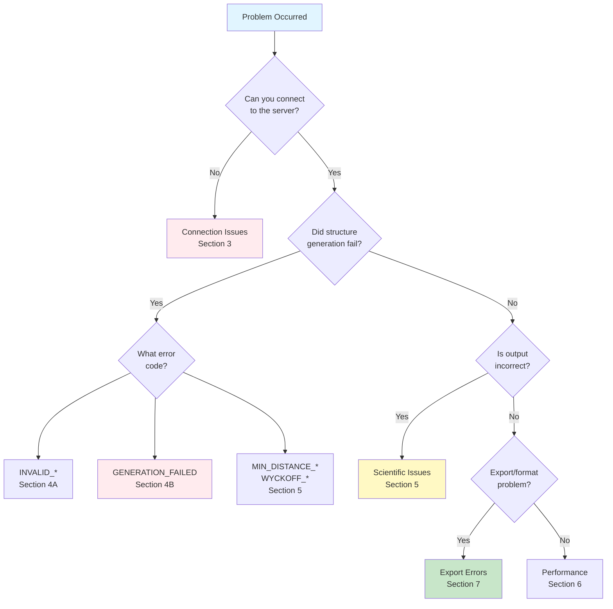
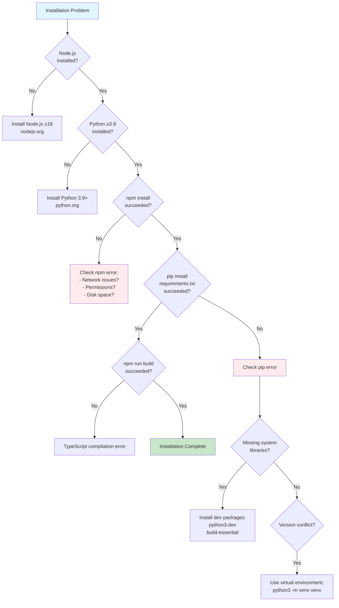
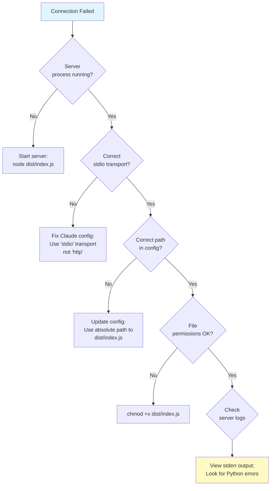
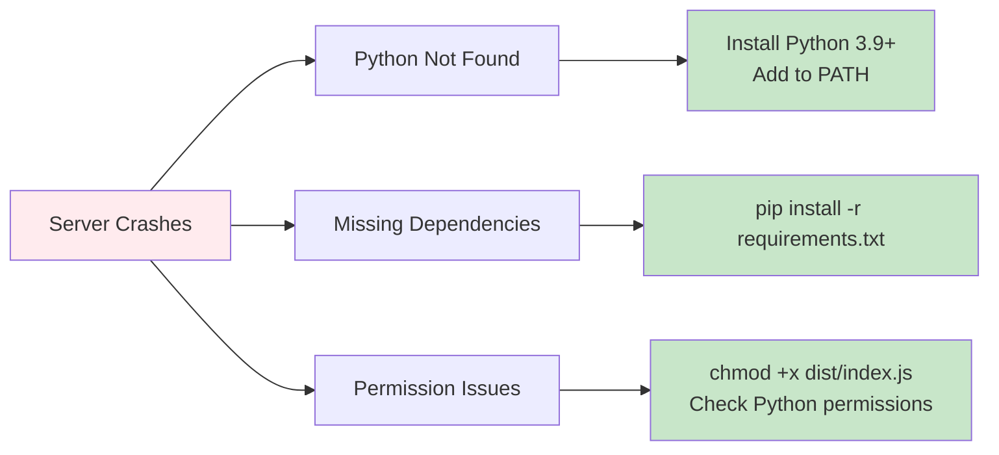
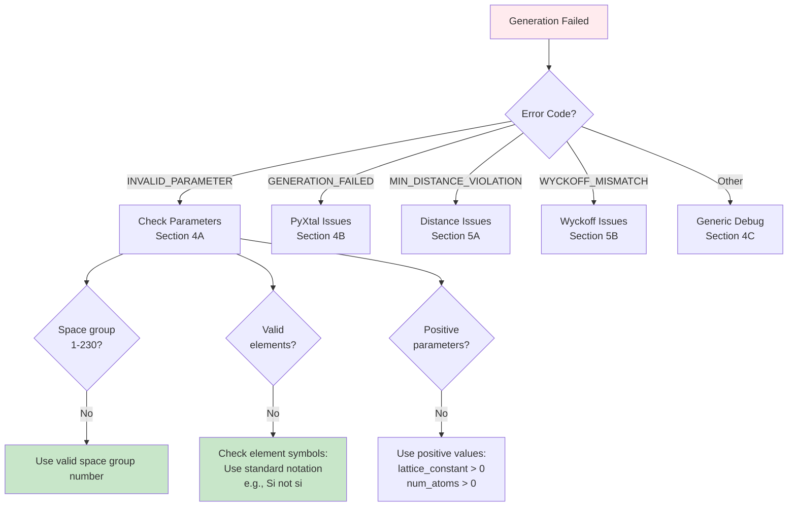
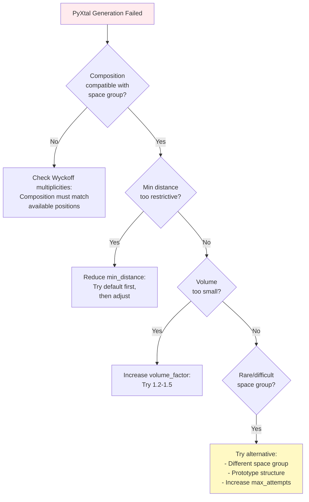
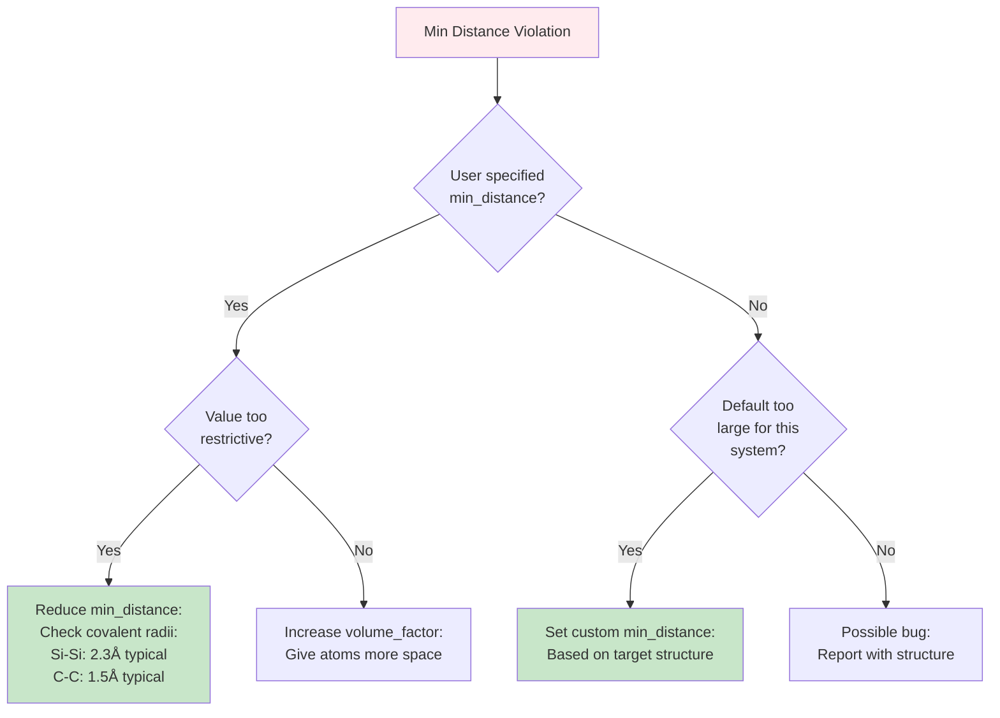
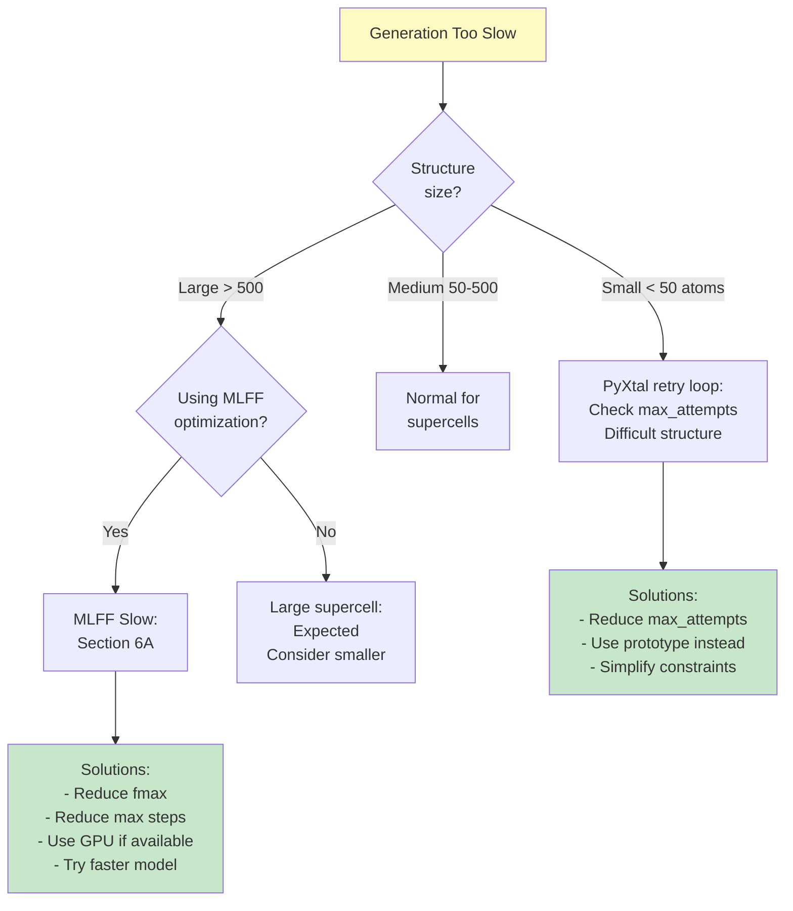
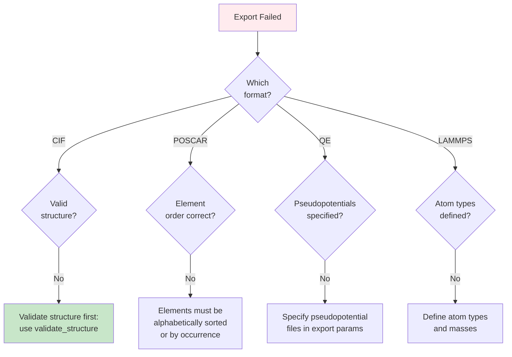

# Troubleshooting Guide

**Comprehensive Debugging Reference with Decision Trees and Visual Flowcharts**

This guide provides systematic troubleshooting procedures for all common issues encountered when using the Crystal MCP Server.

---

## Table of Contents

1. [Quick Diagnostic Flowchart](#quick-diagnostic-flowchart)
2. [Installation Issues](#installation-issues)
3. [Connection Problems](#connection-problems)
4. [Generation Failures](#generation-failures)
5. [Scientific Accuracy Issues](#scientific-accuracy-issues)
6. [Performance Problems](#performance-problems)
7. [Export/Format Errors](#exportformat-errors)
8. [Error Code Reference](#error-code-reference)

---

## Quick Diagnostic Flowchart

Start here to identify your issue category:



---

## Installation Issues

### Decision Tree: Installation Debugging



### Common Installation Errors

#### Error: "gyp ERR! find Python"
**Symptom**: npm install fails with Python-related error

**Solution**:
```bash
# macOS
brew install python3

# Ubuntu/Debian
sudo apt install python3-dev python3-pip

# Set Python path
npm config set python /usr/bin/python3
```

#### Error: "Cannot find module 'pymatgen'"
**Symptom**: Python subprocess fails

**Solution**:
```bash
# Ensure correct Python environment
which python3

# Install in correct environment
pip3 install -r requirements.txt

# If using venv:
source venv/bin/activate
pip install -r requirements.txt
```

#### Error: "Permission denied" during pip install
**Solution**:
```bash
# Option 1: User install
pip3 install --user -r requirements.txt

# Option 2: Virtual environment (recommended)
python3 -m venv venv
source venv/bin/activate
pip install -r requirements.txt
```

---

## Connection Problems

### MCP Connection Diagnostic



### Claude Desktop Connection Issues

#### Symptom: Hammer icon not showing
**Diagnostic Steps**:

1. **Check Config File Location**:
   ```bash
   # macOS
   ~/Library/Application Support/Claude/claude_desktop_config.json

   # Windows
   %APPDATA%\Claude\claude_desktop_config.json

   # Linux
   ~/.config/Claude/claude_desktop_config.json
   ```

2. **Validate JSON**:
   ```json
   {
     "mcpServers": {
       "crystal-gen": {
         "command": "node",
         "args": ["/absolute/path/to/crystal-mcp-server/dist/index.js"]
       }
     }
   }
   ```

3. **Check Logs**:
   ```bash
   # macOS
   tail -f ~/Library/Logs/Claude/mcp*.log

   # Look for:
   # - "Server started" (success)
   # - Python import errors
   # - Path not found errors
   ```

#### Symptom: Server starts then crashes
**Common Causes**:



---

## Generation Failures

### Failure Diagnosis Decision Tree



### 4A. Invalid Parameter Errors

#### Error: "Space group not in range 1-230"
**Cause**: Invalid space group number

**Solution**:
```json
{
  "operation": "generate_from_spacegroup",
  "spacegroup": 227,  // ✓ Valid (1-230)
  // NOT: "spacegroup": 0 or 300 ❌
  "elements": ["Si"],
  "composition": [8]
}
```

**Reference**: See [Crystallography Guide](./crystallography_guide.md) for space group ranges

#### Error: "Invalid element symbol"
**Common Mistakes**:
```json
// ❌ Wrong
"elements": ["si", "Silicon", "SI"]

// ✓ Correct
"elements": ["Si"]

// Element symbol rules:
// - First letter uppercase
// - Second letter lowercase (if present)
// - Use standard IUPAC symbols
```

### 4B. PyXtal Generation Failures

#### Symptom: "Generation failed after 100 attempts"
**Cause**: Impossible or very difficult structure to generate

**Debugging Steps**:



**Example Solutions**:

```json
// Problem: Generation fails for Fe8O12 in space group 227
{
  "operation": "generate_from_spacegroup",
  "spacegroup": 227,
  "elements": ["Fe", "O"],
  "composition": [8, 12],  // ❌ May not match Wyckoff positions
  "max_attempts": 200  // Increase attempts
}

// Solution 1: Adjust composition
{
  "spacegroup": 227,
  "elements": ["Fe", "O"],
  "composition": [8, 16],  // ✓ Matches Wyckoff (8a + 16c)
}

// Solution 2: Use prototype
{
  "operation": "generate_from_prototype",
  "prototype": "spinel",  // FeO₄ spinel structure
  "elements": ["Fe", "O"],
  "a": 8.4
}
```

---

## Scientific Accuracy Issues

### 5A. Minimum Distance Violations

**Symptom**: "MIN_DISTANCE_VIOLATION: Atoms too close"

**Diagnostic Flowchart**:



**Typical Bond Lengths** (for reference):

| Bond | Typical Length (Å) | Min Safe Distance |
|------|-------------------|-------------------|
| C-C | 1.54 | 1.3 |
| Si-Si | 2.35 | 2.0 |
| O-O | 1.48 | 1.2 |
| Metal-O | 1.8-2.2 | 1.5 |
| Au-Au | 2.88 | 2.5 |

**Solution Example**:
```json
{
  "operation": "generate_from_spacegroup",
  "spacegroup": 227,
  "elements": ["Si"],
  "composition": [8],
  "min_distance": {
    "Si-Si": 2.0  // ✓ Reasonable for diamond structure
    // NOT: "Si-Si": 3.0 ❌ Too large, generation will fail
  }
}
```

### 5B. Wyckoff Position Mismatches

**Understanding the Issue**:

```
Space Group 225 (Fm-3m) Wyckoff Positions:
  4a: (0,0,0) + fcc translations → 4 atoms
  4b: (1/2,1/2,1/2) + fcc translations → 4 atoms
  8c: (1/4,1/4,1/4) + fcc translations → 8 atoms
  ...

If you request 6 atoms total:
  ❌ Cannot fit into available multiplicities (4, 8, 12, ...)
  ✓ System adjusts to 8 atoms (nearest valid)
  ⚠️ Warning generated about composition change
```

**Solution Strategies**:

1. **Check Allowed Multiplicities**:
   ```python
   # Use list_category to see requirements
   {
     "operation": "list_category",
     "category": "bulk"
   }
   # Response includes Wyckoff information
   ```

2. **Let System Adjust** (recommended):
   ```json
   {
     "composition": [7]  // System adjusts to [8]
     // Check warnings in response
   }
   ```

3. **Specify Exact Wyckoff Positions**:
   ```json
   {
     "wyckoff_positions": [
       {"element": "Na", "wyckoff": "4a"},
       {"element": "Cl", "wyckoff": "4b"}
     ]
   }
   ```

---

## Performance Problems

### Slow Generation Diagnostic



### 6A. MLFF Optimization Performance

**Typical Times**:
```
Structure Size → CPU Time (CHGNet)
  10 atoms     → 1-2 seconds
  50 atoms     → 5-10 seconds
  100 atoms    → 10-30 seconds
  500 atoms    → 1-5 minutes
  1000 atoms   → 5-15 minutes
```

**Optimization**:

1. **Use GPU** (if available):
   ```bash
   # Check CUDA available
   python3 -c "import torch; print(torch.cuda.is_available())"

   # Install GPU version
   pip install chgnet[cuda]
   ```

2. **Adjust Convergence**:
   ```json
   {
     "operation": "optimize_structure_mlff",
     "fmax": 0.05,  // Less strict (faster)
     // Instead of: "fmax": 0.001 (very strict, slower)
     "steps": 200   // Limit iterations
   }
   ```

3. **Use Faster Model**:
   ```json
   {
     "mlff_model": "m3gnet"  // Generally faster than CHGNet
     // Trade-off: Slightly less accurate
   }
   ```

---

## Export/Format Errors

### Export Failure Decision Tree



### Common Export Issues

#### Issue: POSCAR element order wrong
**Symptom**: VASP reads wrong elements

**Solution**:
```python
# POSCAR requires consistent element ordering
# VASP reads elements in order listed

Correct POSCAR:
Si O        ← Element line
4  8        ← Count line (4 Si, then 8 O)
Direct
<Si coords>  ← First 4 positions are Si
<O coords>   ← Next 8 positions are O
```

#### Issue: CIF export fails with "Invalid symmetry"
**Cause**: Structure doesn't match reported space group

**Solution**:
```json
// Step 1: Verify symmetry
{
  "operation": "analyze_symmetry",
  "structure": "<structure>"
}

// Step 2: If mismatch, either:
// A) Use detected space group
// B) Relax structure to match intended symmetry
{
  "operation": "optimize_structure_mlff",
  "structure": "<structure>",
  "constrain_symmetry": true,  // Preserve symmetry during relax
  "mlff_model": "chgnet"
}
```

---

## Error Code Reference

### Complete Error Code Catalog

| Error Code | Layer | Cause | Solution |
|------------|-------|-------|----------|
| `INVALID_PARAMETER` | Validation | Parameter type/range wrong | Check parameter documentation |
| `INVALID_SPACE_GROUP` | Validation | Space group not 1-230 | Use valid space group number |
| `INVALID_COMPOSITION` | Validation | Elements or counts invalid | Check element symbols, use positive integers |
| `INVALID_INPUT` | Validation | Generic input error | Review all parameters |
| `GENERATION_FAILED` | PyXtal | Could not generate structure | Adjust composition, increase attempts, or use prototype |
| `MIN_DISTANCE_VIOLATION` | Scientific | Atoms too close | Increase volume_factor or reduce min_distance |
| `WYCKOFF_MISMATCH` | Scientific | Composition incompatible | Adjust composition or let system auto-adjust |
| `COMPOSITION_MISMATCH` | Scientific | Stoichiometry impossible | Use valid composition ratios |
| `SYMMETRY_VERIFICATION_FAILED` | Validation | Generated structure doesn't match space group | Should not occur - report as bug |
| `EXPORT_ERROR` | Export | Cannot convert to format | Validate structure first |
| `SCHEMA_CONVERSION_ERROR` | Workflow | Schema incompatible | Check structure has required fields |
| `MISSING_DEPENDENCY` | System | Required library not installed | Install missing Python package |
| `TIMEOUT` | System | Operation took too long | Reduce structure size or complexity |

---

## Debug Mode and Logging

### Enable Debug Output

**For Python Errors**:
```python
# In your generator function, add:
import sys
print(f"DEBUG: parameter_value = {value}", file=sys.stderr)

# stderr output will appear in MCP logs
```

**For MCP Protocol Issues**:
```bash
# Set environment variable
export MCP_DEBUG=1

# Run server
node dist/index.js

# Or in Claude config:
{
  "mcpServers": {
    "crystal-gen": {
      "command": "node",
      "args": ["dist/index.js"],
      "env": {
        "MCP_DEBUG": "1"
      }
    }
  }
}
```

### View Logs

**Claude Desktop Logs**:
```bash
# macOS
tail -f ~/Library/Logs/Claude/mcp-server-crystal-gen.log

# Look for:
# - Server startup messages
# - Python subprocess errors
# - Tool call requests/responses
```

**Server Direct Logs** (when running manually):
```bash
node dist/index.js 2> error.log

# error.log will contain:
# - Python traceback
# - Import errors
# - Runtime exceptions
```

---

## Getting Help

### Before Reporting a Bug

**Checklist**:
- [ ] Reviewed this troubleshooting guide
- [ ] Checked error code in reference table
- [ ] Verified installation (npm install, pip install)
- [ ] Tested with simple example (e.g., Si diamond)
- [ ] Collected error messages and logs

**Information to Include**:
1. **Operation**: Which operation failed
2. **Parameters**: Full JSON parameters used
3. **Error Message**: Complete error text
4. **Error Code**: Error code from response
5. **Environment**:
   - OS (macOS, Linux, Windows)
   - Node.js version (`node --version`)
   - Python version (`python3 --version`)
   - Package versions (`pip list | grep -E "pymatgen|pyxtal"`)
6. **Logs**: Relevant log excerpts

**Report Issue**:
- GitHub Issues: [repository]/issues
- Include minimal reproducible example
- Attach logs if applicable

---

## Quick Fixes Cheat Sheet

```bash
# Server won't start
npm run build
node dist/index.js  # Test directly

# Python import errors
pip3 install -r requirements.txt
which python3  # Check Python path

# Permission errors
chmod +x dist/index.js
pip3 install --user -r requirements.txt

# MCP connection issues
# Check Claude config path is absolute
# Restart Claude Desktop

# Generation failures
# Try with prototype structure first
# Increase max_attempts
# Check space group/composition compatibility

# Slow performance
# Reduce structure size
# Lower fmax for MLFF
# Use GPU if available

# Export errors
# Validate structure first
# Check element ordering
# Verify format requirements
```

---

**Document Version**: 1.0
**Last Updated**: 2025-12-25
**Coverage**: All common issues with visual debugging flowcharts
**Maintainer**: Crystal Structure Generator Team
