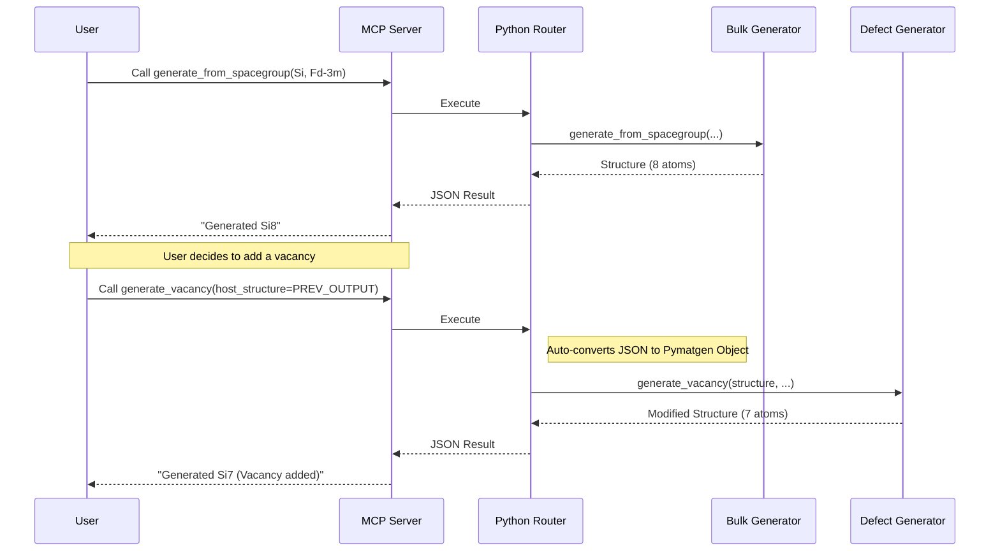
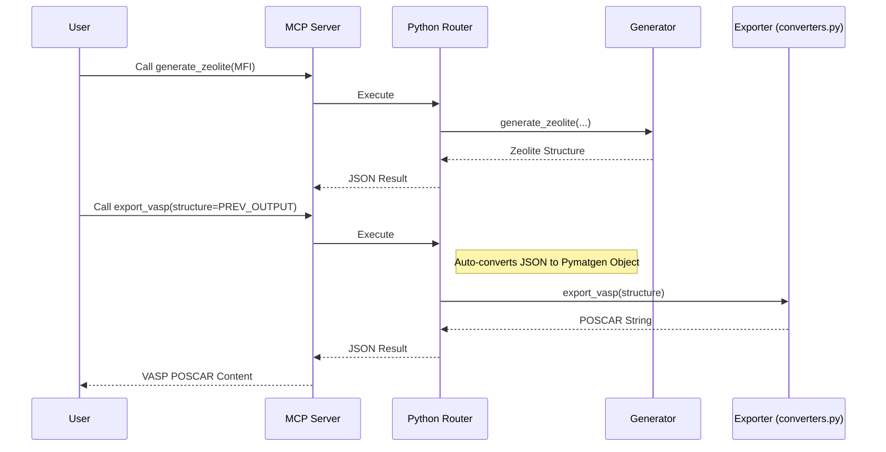
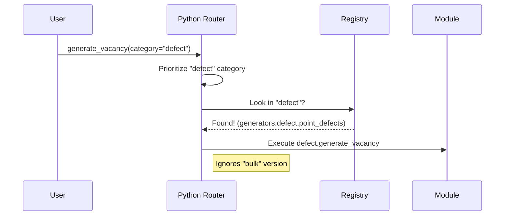

# Workflows & Usage Patterns

This document visualizes common usage patterns for the Crystal MCP Server.

## 1. Iterative Structure Refinement
The system allows output from one tool to be passed directly into the next, enabling complex modification chains without starting from scratch.

## 2. Generation to Export Pipeline
Seamlessly generate a structure and export it to a specific simulation format (VASP, QE, LAMMPS).

## 3. Namespace Collision Resolution
When function names match across categories (e.g., `generate_vacancy` in `bulk` vs `defect`), use `category` to disambiguate.

